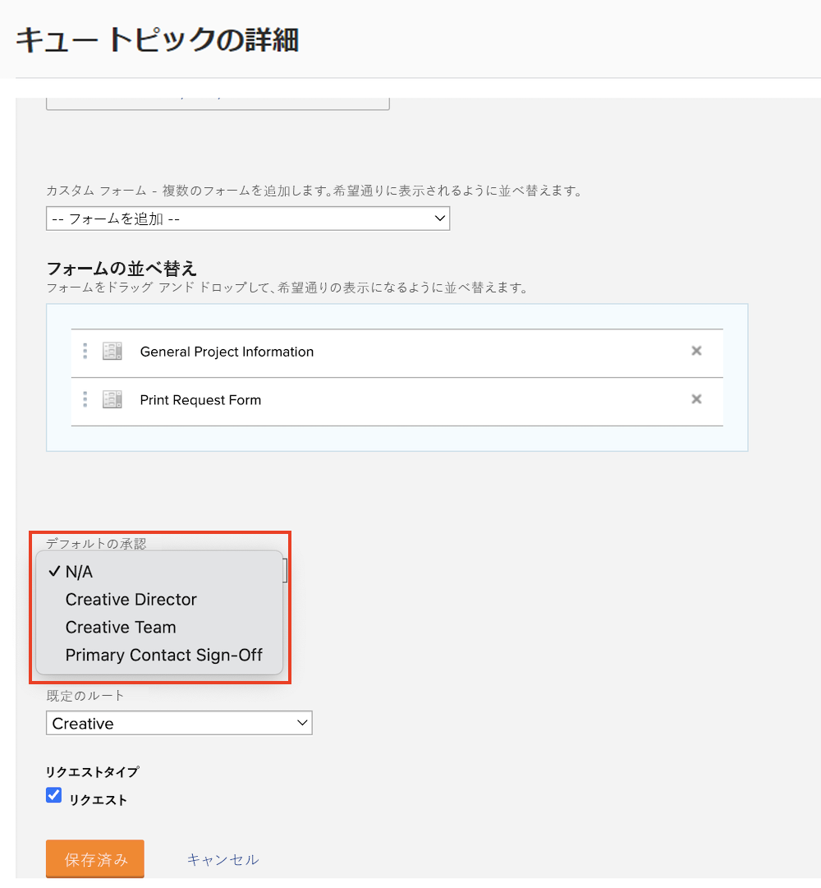
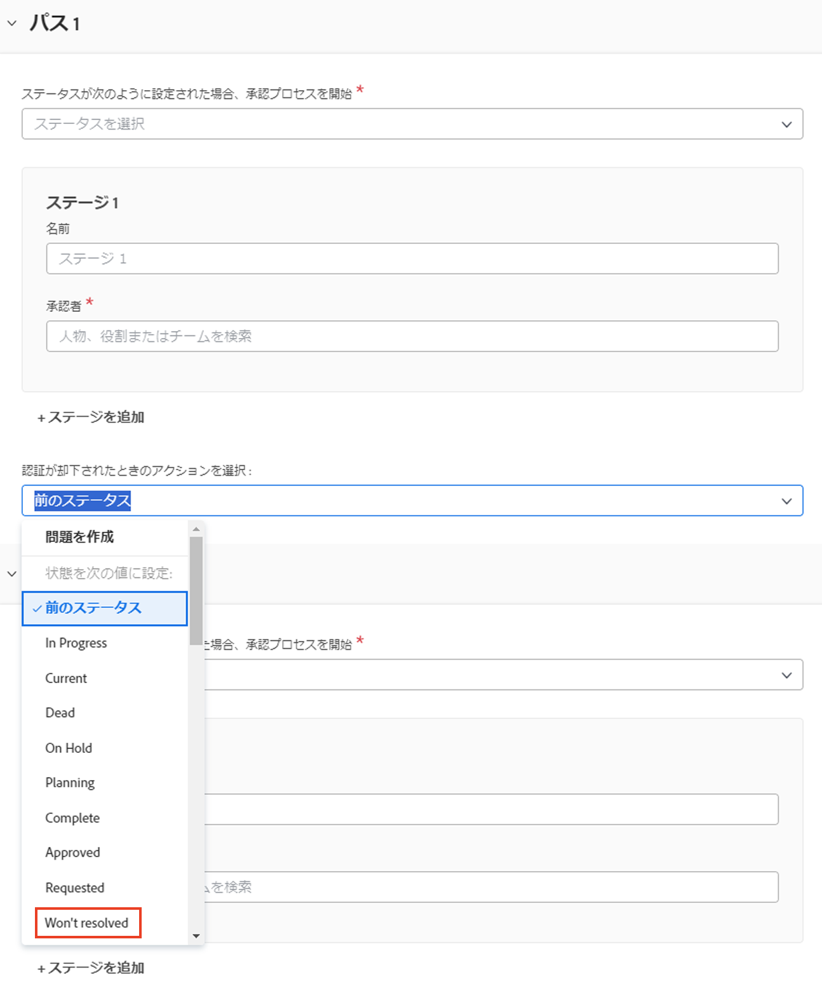

# グローバルおよび単一使用承認プロセスの作成

プロジェクト、タスク、イシューの承認プロセスを使用すると、プロジェクトマネージャーは、作業が完了したことを事前に専門家に確認してから、作業を進めることができます。プロジェクトマネージャーは、状況ごとに承認プロセスを作成したり（単一使用承認プロセスと呼ばれる）、一般的なニーズに合わせて以前に作成した多数の承認プロセスのリストから選択できます（グローバルまたは既存の承認プロセスと呼ばれる）。

どちらの場合も、オブジェクトのステータスが承認プロセスで指定されたステータスに変わると、承認者は作業をレビューして承認または拒否するように、様々な方法で通知されます。承認待ちの状態でプロジェクト全体が一時停止される場合があるので、承認者は、承認を求められる場合があることを事前に認識しておく必要があります。承認者が何らかの理由で不在の場合、適格な代替者に承認をデリゲートできます。詳しくは、[タスク、イシュー、承認のデリゲート](/help/manage-work/approval-processes-and-milestone-paths/delegate-approvals.md)を参照してください。

このビデオでは、プロジェクト、タスクまたはイシューに対して、グローバル承認プロセスと単一使用承認プロセスを作成する方法について説明します。

>[!VIDEO](https://video.tv.adobe.com/v/335225/?quality=12&learn=on)

>[!TIP]
>
>プロジェクトまたはタスクに対して単一使用承認プロセスをプロジェクトテンプレートに追加できます。

>[!NOTE]
>
>ビデオのタスクについて説明したのと同じ方法で、プロジェクトとイシューに対して単一使用の承認を設定できます。

## リクエストキューでのイシューの自動承認の適用方法

リクエストキューでイシューの自動承認を設定する場合は、イシューのグローバル承認プロセスを使用し、[!UICONTROL キューのトピック]に適用する必要があります。

[!UICONTROL キューのトピック]を作成または編集する際に、「**[!UICONTROL デフォルトの承認]**」フィールドでグローバル承認プロセスを選択します。

承認が却下された際にイシューが&#x200B;**[!UICONTROL 前のステータス]**&#x200B;に設定されないように、イシューの承認プロセスを編集する必要がある場合があります。これは、前のステータスが&#x200B;**[!UICONTROL 新規]**&#x200B;で、承認プロセスをトリガーするステータスでもあるので、承認時にはこのステータスに設定されます。イシューの承認が却下された際の混乱を回避するには、ステータスを&#x200B;**[!UICONTROL 解決されない]**&#x200B;などに設定するか、この目的で作成されたカスタムステータスに設定することをお勧めします。

## このトピックに関する推奨チュートリアル

* [タスク、イシュー、承認を委任する](/help/manage-work/approval-processes-and-milestone-paths/delegate-approvals.md)
* [グループ特有の承認プロセスについて](/help/administration-and-setup/approval-processes-and-milestone-paths/group-specific-approval-processes.md)
* [リクエストフローの作成](/help/manage-work/request-queues/create-a-request-flow.md)

