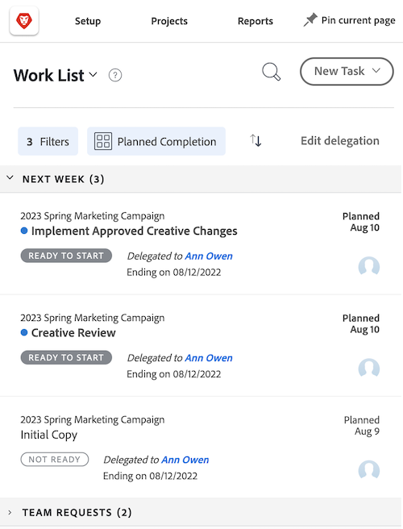
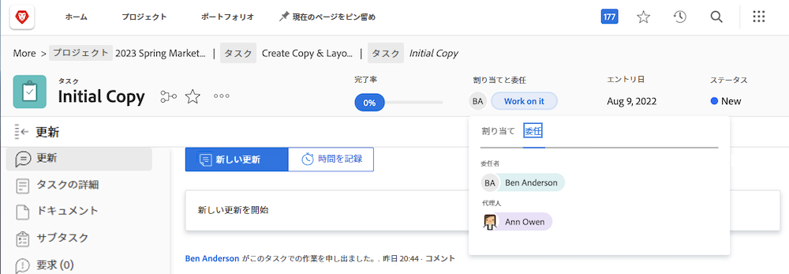
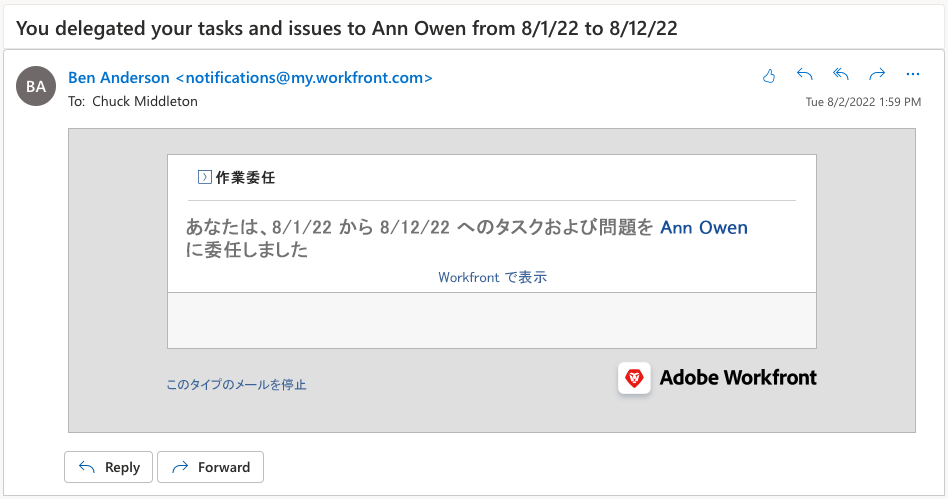

# タスク、イシュー、承認を委任する

プロジェクト、タスク、イシュー、タイムカードの承認を別の Workfront ユーザーに委任する方法について説明します。 タスクとイシューの割り当てを委任する方法についても説明します。

## 承認を委任

プロジェクト、タスク、イシュー、タイムカードの承認を別のユーザーに委任する方法について説明します。

このビデオでは、次の方法を学習します：

* 他のユーザーに承認を割り当てる
* 委任期間を終了する
* 委任された承認を検索する

>[!VIDEO](https://video.tv.adobe.com/v/336094/?quality=12)

<!---
learn more URLS
Delegate approval request
--->

## タスクとイシューの割り当てを委任する

不在になる予定の場合は、自分に割り当てられたタスクやイシューを他のユーザーに委任できます。

### タスクとイシュー割り当ての委任を有効にする方法

タスクとイシューの委任を使用するには、グループまたはシステム管理者が有効にする必要があります。 これは、[!UICONTROL 設定／プロジェクトの環境設定／タスクとイシュー／委任]で行います。有効にすると、レビューまたはそれ以上のライセンスを持つすべてのユーザーが、割り当てられたタスクとイシューを委任できるようになります。

![委任の[!UICONTROL 設定]環境設定を示すスクリーンショット](assets/delegation-1.png)

### タスクとイシューの割り当てを委任する方法

[!UICONTROL ホーム]に移動し、「[!UICONTROL 委任]」をクリックしてから、割り当てられたすべてのタスクを委任するユーザーと日付範囲を指定します。レビュー以上のライセンスを持つユーザーを指定できます。

![[!UICONTROL ホームの「委任」タブを示すスクリーンショット]](assets/delegation-2.png)

### タスクまたはイシューが委任されたかどうかを知る方法

タスクまたはイシューが委任されたことは、[!UICONTROL ホーム]やタスクまたはイシュー表示で確認できます。

### 委任された作業に適用するメール通知

グループまたはシステム管理者は、ユーザーがタスクとイシューを委任した日時や、ユーザーにタスクとイシューが委任された日時を知らせるメール通知を有効にできます。

![委任の[!UICONTROL 設定]メール通知オプションを示すスクリーンショット](assets/delegation-5.png)

