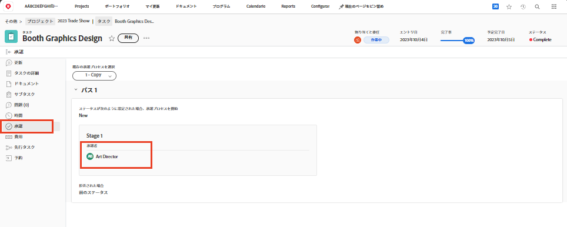

# 承認の完了

タスクとイシューの承認は、多くワークフローに含まれています。ただし、未解決の承認があると、プロジェクトステータスを完了に設定できない場合があります。

プロジェクトの「[!UICONTROL タスク]」セクションで、[!UICONTROL ステータス]列を含む[!UICONTROL ビュー]を選択します。承認が完了していないタスクは、ステータスの名前の後に「[!UICONTROL - 承認保留中]」が付いており、列を見るとすぐに確認できます。

選択できる内容を以下に示します。

* **承認を完了** - 未承認の承認を他のユーザーに思い出させるという意味もあります。タスクを開いて「承認」タブをクリックすると、承認者として割り当てられているユーザーを確認できます。
* **承認を削除** - 承認が必要ない場合は、単に削除する方が簡単な場合があります。これを実行できるかどうかは、[!DNL Workfront] の権限によって異なります。
* **ステータスを変更 -**&#x200B;承認が必要ない場合は、承認が添付されていないステータスを選択します。ステータスが完了になっていることを確認します。

組織がイシューを使用してプロジェクト中の問題、変更指示、その他のイベントなどを追跡する場合は、プロジェクトの「[!UICONTROL イシュー]」セクションで同じ手順に従います。
