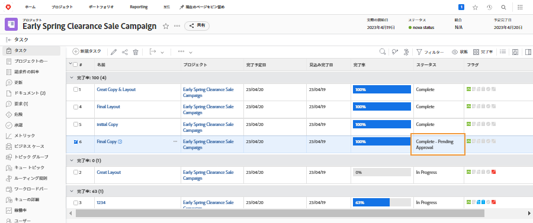

# 承認の完了

タスクとイシューの承認は、多くワークフローに含まれています。ただし、承認が未解決の場合、プロジェクトのステータスを完了に設定できない場合があります。

プロジェクトの「[!UICONTROL タスク]」セクションで、[!UICONTROL ステータス]列を含む[!UICONTROL ビュー]を選択します。ステータスの名前の後に「[!UICONTROL 承認保留]」が付いているタスクに不完全な承認があるかどうかは、その列を一目で確認できます。

選択できる内容を以下に示します。

* **承認を完了** - 未承認の承認を他のユーザーに思い出させるという意味もあります。これを行うには、[!DNL Workfront] を使用したアップデートを使用します。[!DNL Workfront] の権限によっては、自分で承認を完了できる場合があります。
* **承認を削除** - 承認が必要ない場合は、単に削除する方が簡単な場合があります。これを実行できるかどうかは、[!DNL Workfront] の権限によって異なります。
* **ステータスを変更** - 承認が添付されていないステータスを選択します。ステータスが「完了」と同じであることを確認します。

組織がイシューを使用してプロジェクト中の問題、変更指示、その他のイベントなどを追跡する場合は、プロジェクトの「[!UICONTROL イシュー]」セクションで同じ手順に従います。
