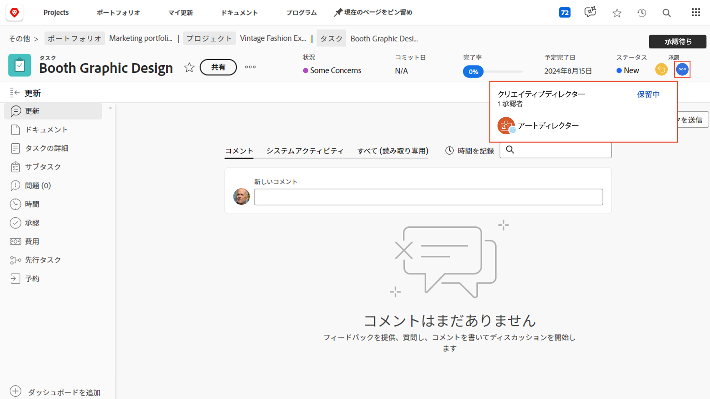

# 承認の完了

タスクと問題の承認は、多くのプロジェクトに含まれています。 ただし、未解決の承認があると、プロジェクトステータスを完了に設定できない場合があります。

それらを見つけて対処する方法を次に示します。

プロジェクトの「[!UICONTROL  タスク ]」セクションで、[!UICONTROL  ステータス ] ビューなど、[!UICONTROL  ステータス ] 列を含む [!UICONTROL  ビュー ] を選択します。 ステータスの名前の後に「[!UICONTROL  – 承認待ち ]」という単語が付いたタスクに不完全な承認があるかどうかは、その列を一目で確認できます。

まだ承認待ちのタスクを見つけたら、次の 2 つの方法から選択できます。

## 承認の完了

これは、割り当てられた人物に未承認の承認を思い出させるという意味かもしれません。 タスクを開いて「承認」領域の 3 ドットメニューをクリックすると、承認者が誰であるかを確認できます。

割り当てられた承認者を示すボックスが表示されます。

## 承認を削除

承認が必要ない場合は、削除できます。 これを行うには、まず承認を呼び出します。 承認エリアの [!UICONTROL  リコール ] ボタンをクリックします。 これにより、ステータスが以前のステータスに戻り、承認プロセスを削除できます。

次に、左側の [!UICONTROL  承認 ] タブをクリックしてから、右上の [!UICONTROL  削除 ] ボタンをクリックします。

## イシューの承認の処理

組織がイシューを使用してプロジェクト中の問題、変更指示、その他のイベントなどを追跡する場合は、プロジェクトの「[!UICONTROL イシュー]」セクションで同じ手順に従います。
