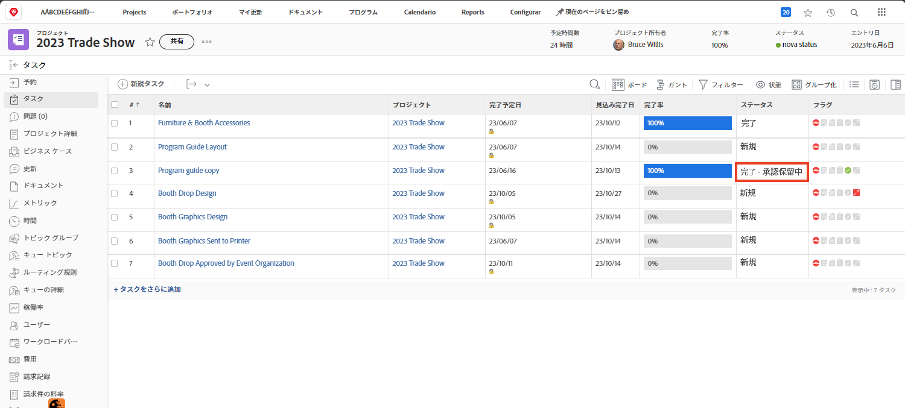

# 承認の完了

タスクとイシューの承認は、多くワークフローに含まれています。ただし、未解決の承認を行うと、プロジェクトのステータスを「完了」に設定できなくなります。

プロジェクトの「[!UICONTROL タスク]」セクションで、[!UICONTROL ステータス]列を含む[!UICONTROL ビュー]を選択します。この列をすばやく見ると、「[!UICONTROL  — 承認待ち]」と入力します。

選択できる内容を以下に示します。

* **承認を完了** - 未承認の承認を他のユーザーに思い出させるという意味もあります。タスクを開き、「承認」タブをクリックすると、誰が承認者として割り当てられているかを確認できます。
* **承認を削除** - 承認が必要ない場合は、単に削除する方が簡単な場合があります。これを実行できるかどうかは、[!DNL Workfront] の権限によって異なります。
* **ステータスの変更 —** 承認が必要ない場合、承認が添付されていないステータスを選択できます。 ステータスが「完了」と同じであることを確認します。

組織がイシューを使用してプロジェクト中の問題、変更指示、その他のイベントなどを追跡する場合は、プロジェクトの「[!UICONTROL イシュー]」セクションで同じ手順に従います。
