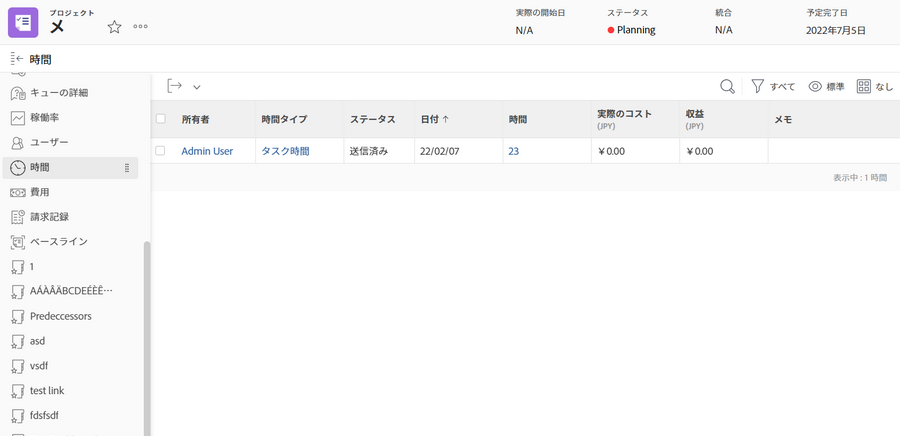

# 時間のログ記録とレビュー

実際の作業時間のログが組織のワークフローの一部である場合は、 [!UICONTROL 時間] プロジェクト上のセクション（左のパネルメニューから選択）に表示されます。 これにより、個々のタスクとプロジェクト自体にログオンしたすべての時間が表示されます。このページから時間を記録することもできます。

>[!NOTE]
>
>組織から、[!DNL Workfront] タイムシートで時間の承認を求められる場合があります。社内 [!DNL Workfront] チームに問い合わせて、どのプロセスを使用する必要があるかを確認してください。

<!---
learn more url
Log time
--->
