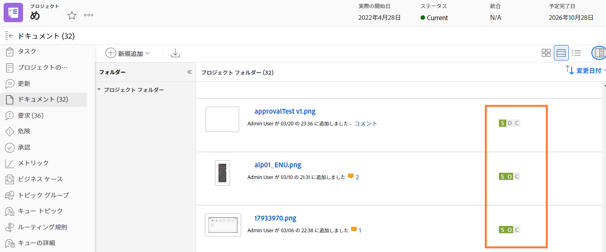
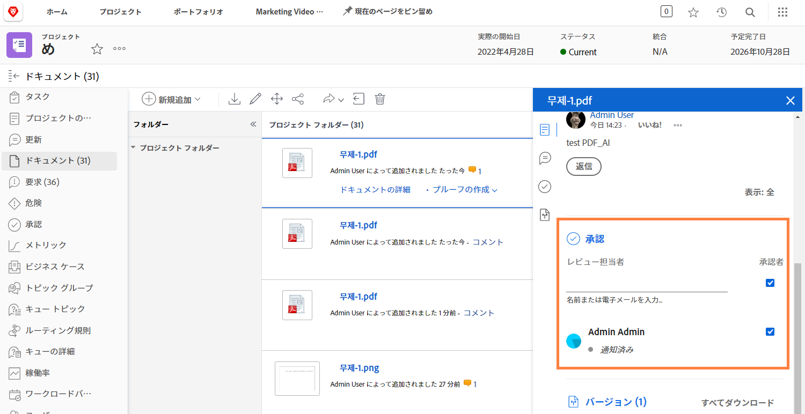

# アセットのアップロード

閉じる前に [!DNL Workfront] プロジェクトで、関連するすべてのファイルが [!UICONTROL ドキュメント] 」セクションに入力します。 組織のガイドラインに従って、これらをドキュメントまたは配達確認としてアップロードします。

ドキュメントまたは配達確認を既存のファイルのバージョンとしてアップロードする必要が生じる場合があります。

組織で配達確認の承認を使用している場合、すべての承認が進行状況アイコンですばやく概要表示されて完了していることを確認します。

また、組織がドキュメント承認を使用している場合は、リストの各項目を選択し、ドキュメントの詳細をチェックして承認が完了しているかどうかを確認します。

<!---
learn more urls
Create proofs
Add new documents to Workfront
--->
