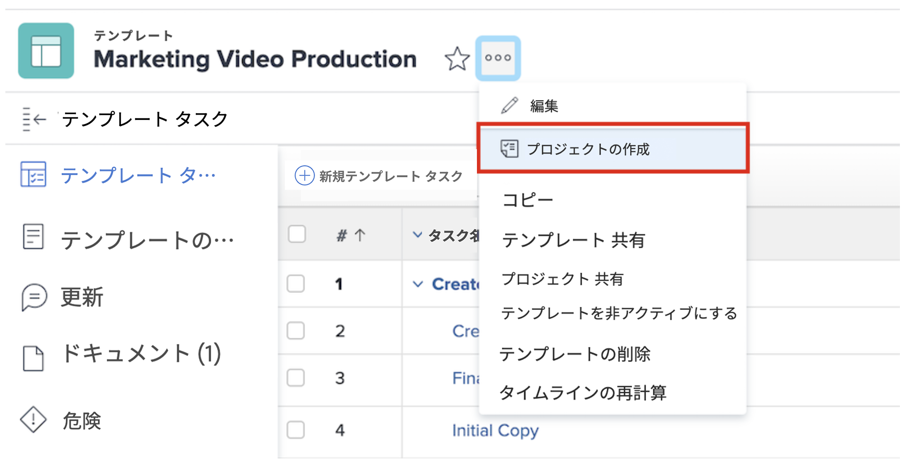
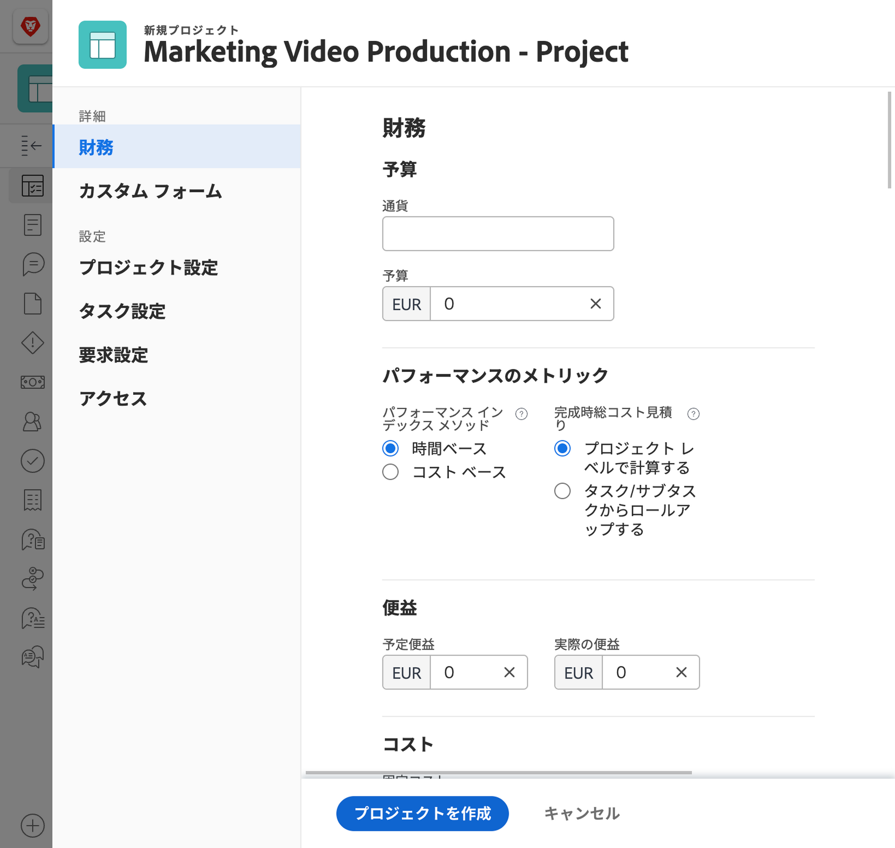
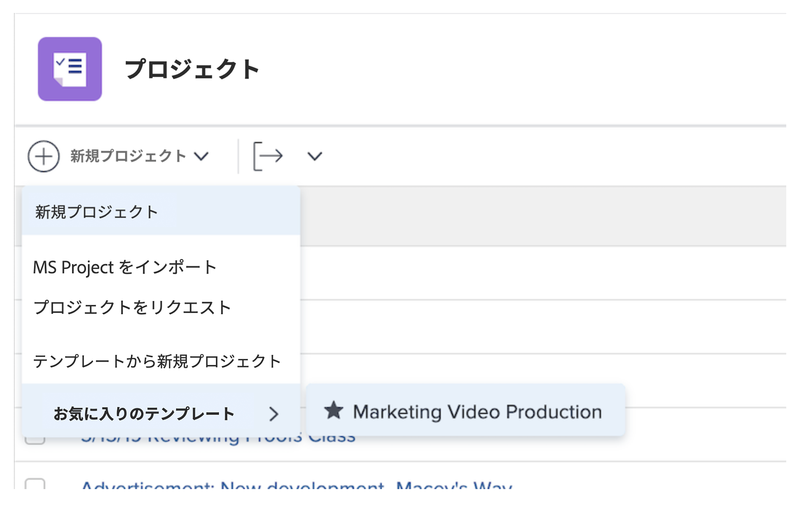

# プロジェクトをテンプレートから直接作成する

テンプレートで作業中に、そのテンプレートを使用してプロジェクトを作成する必要がある場合は、テンプレート名の横にある「...」メニューをクリックします。次に「プロジェクトを作成」を選択します。

詳細ウィンドウでは、新しいプロジェクトの設定を変更できます。

>[!NOTE]
>
>この方法でプロジェクトを作成するには、Workfront のテンプレートエリアにアクセスする必要があります。テンプレートにアクセスできない場合でも、プロジェクトエリアから、またはイシューやタスクを変換する際に、テンプレートを使用してプロジェクトを作成することができます。

>[!TIP]
>
>頻繁に使用するテンプレートがある場合は、お気に入りに追加します。お気に入りに追加したテンプレートは、ナビゲーションバーのお気に入りメニューの下に表示されるだけでなく、新規プロジェクトメニューにも表示されます。

## このトピックに関する推奨チュートリアル

* [プロジェクトテンプレートの作成と、ブループリントの詳細](/help/manage-work/create-and-manage-project-templates/create-a-project-template.md)
* [プロジェクトテンプレートの共有](/help/manage-work/create-and-manage-project-templates/share-a-project-template.md)
* [既存のプロジェクトのコピー](/help/manage-work/manage-projects/copy-an-existing-project.md)
* [プロジェクトテンプレートの非アクティブ化](/help/manage-work/create-and-manage-project-templates/deactivate-a-project-template.md)
* [プロジェクトテンプレートでのプロジェクトチームの編集](/help/manage-work/create-and-manage-project-templates/edit-the-project-team-in-a-project-template.md)
