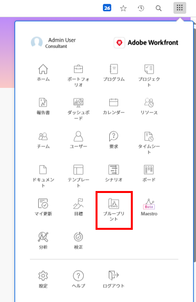
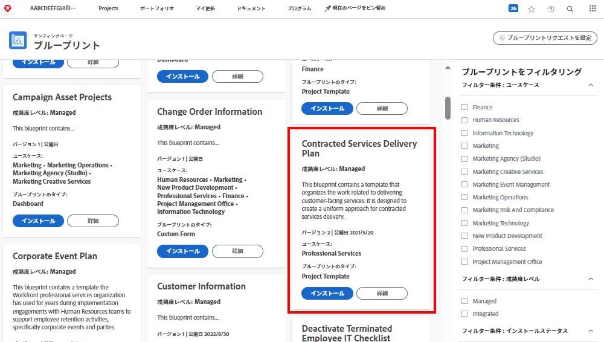
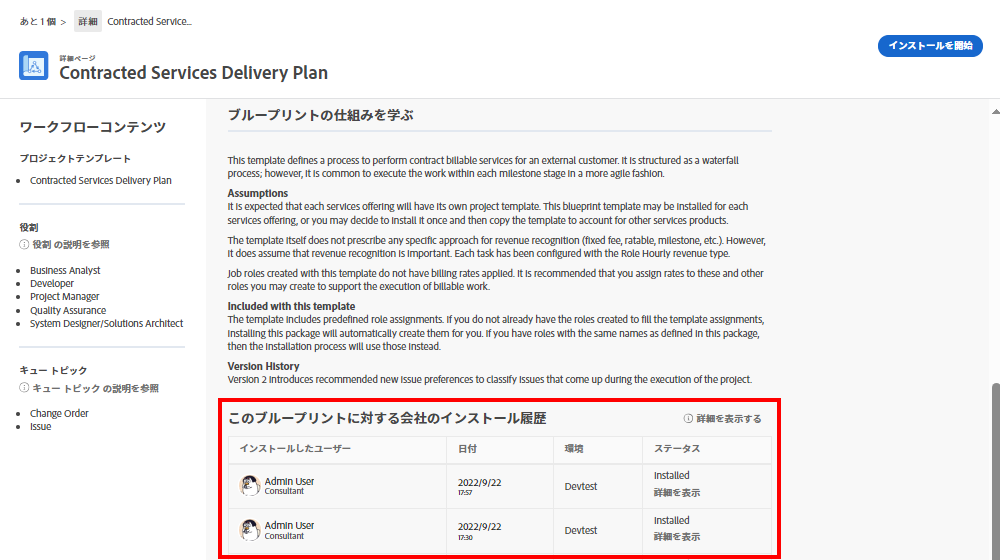
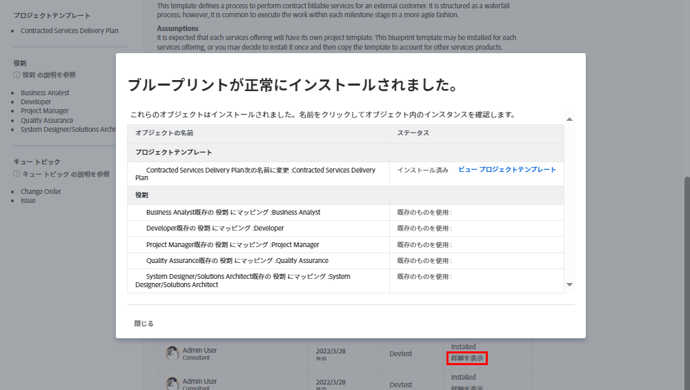

# プロジェクトテンプレートの作成とブループリントの探索

プロジェクトテンプレートを最初から作成する方法と、既存のプロジェクトから作成する方法を説明します。また、[!UICONTROL ブループリント]を使用して Workfront のエキスパートが作成した便利なプロジェクトテンプレートを利用する方法を紹介します。

## プロジェクトテンプレートの作成

* このビデオでは、マーケティングビデオ制作のためのテンプレートの作成と使用に関するステップバイステップガイドを提供します。初めに、新しいテンプレートをゼロから作成し、名前を付けて保存する方法を説明します。&#x200B;このプロセスには、タスクの作成、期間と先行タスクを使用したタイムラインの設定、個々のユーザーではなくジョブロールの割り当てという3つの主要なステップが含まれます。&#x200B;この動画では、親子関係を利用してタスクを整理し、要約と効率性を高めることを強調して&#x200B;ます。
* テンプレートを作成したら、新しいプロジェクトの作成に使用できます。このビデオでは、テンプレートから新しいプロジェクトを作成し、必要な調整をおこない、必要に応じてタスクを追加したり、期間を変更したりする方法を説明します。&#x200B; リソーススケジューリング機能とプランニング機能を使用して、タスクに担当業務を割り当てる方法も示&#x200B;ます。
* このビデオでは、既存のプロジェクトを新しいテンプレートとして保存し、ワークフローの更新と改善を可能にする方法について説明します。&#x200B; テンプレートを管理して混乱を避け、プロジェクトを効率的に実行することの重要性を強調して&#x200B;ます。

>[!VIDEO](https://video.tv.adobe.com/v/335210/?quality=12&learn=on&enablevpops=0)

## 主な要点

* **テンプレートの作成：**&#x200B;新しいテンプレートに名前を付け、タスクとタイムラインを設定し、担当業務に割り当てて、最初から新しいテンプレートを作成する方法について説明します。
* **タスク組織：**&#x200B;親子タスク関係を使用してタスクを効率的に整理し、プロジェクトの概要と構造を明確にします。
* **タイムラインの設定：**&#x200B;期間と先行タスクを使用してタスクのタイムラインを設定し、タスクの時間枠と順序付けを正確に見積もります。
* **役割ベースの割り当て：**&#x200B;リソースのスケジュール設定と計画機能を効果的に活用するには、個々のユーザーではなく担当業務にタスクを割り当てます。
* **テンプレート管理：**&#x200B;既存のプロジェクトを新しいテンプレートとして保存して改善を組み込み、テンプレートを管理して、混乱を回避し、効率的なプロジェクトの実行を確保します。

## [!UICONTROL ブループリント]で作成されたテンプレート

Workfront ユーザーは、[!UICONTROL ブループリント]を使用してプロジェクトテンプレートを作成できます。 この機能はメインメニューにあり、部門や特定の成熟度レベルをターゲットとした、すぐに使用できる事前定義済みのテンプレートにアクセスできます。 これらのテンプレートを使用すると、繰り返し可能なプロジェクトの作成を素早く開始でき、範囲が同じプロジェクト間で一貫性を維持できます。

ライセンスを付与されたユーザーは、Workfront で使用可能なブループリントのリストを参照できます。 プロジェクトを新規作成する場合（タスクやリクエストのプロジェクトへの変換など）は、ブループリントを直接適用できません。 ブループリントとプロジェクトテンプレートの主な違いは、ブループリントはテンプレートの作成に使用されるのに対し、テンプレートはプロジェクトの作成に使用される点です。 **対応するテンプレートを作成するには、システム管理者がブループリントをインストールする必要があります。**

関心のあるブループリントを見つけたら、「**[!UICONTROL 詳細]**」をクリックすると、詳細情報を確認できます。

[!UICONTROL 詳細]画面では、ブループリントがインストールされている場合は、インストール履歴などのブループリントの詳細が説明されます。

ブループリントがインストールされている場合は、「**[!UICONTROL 詳細を表示]**」をクリックすると、作成されたテンプレートおよびそのテンプレートをサポートするために作成されたその他のオブジェクトへのリンクを取得できます。

ブループリントがまだインストールされていない場合は、システム管理者にリクエストできます。

## このトピックに関する推奨チュートリアル

* [プロジェクトをテンプレートから直接作成する](/help/manage-work/create-and-manage-project-templates/create-a-project-directly-from-a-template.md)
* [プロジェクトテンプレートの効果的な共有](/help/manage-work/create-and-manage-project-templates/share-a-project-template.md)
* [既存のプロジェクトを効率的にコピー](/help/manage-work/manage-projects/copy-an-existing-project.md)
* [プロジェクトテンプレートの非アクティブ化](/help/manage-work/create-and-manage-project-templates/deactivate-a-project-template.md)
* [テンプレートでのプロジェクトチームの編集](/help/manage-work/create-and-manage-project-templates/edit-the-project-team-in-a-project-template.md)
