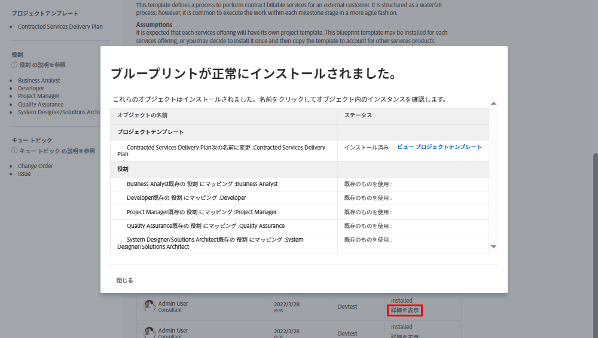

# プロジェクトテンプレートの作成と、[!UICONTROL ブループリント]の詳細

プロジェクトテンプレートを最初から作成する方法と、既存のプロジェクトから作成する方法を説明します。また、[!UICONTROL ブループリント]を使用して Workfront のエキスパートが作成した便利なプロジェクトテンプレートを利用する方法を紹介します。

## プロジェクトテンプレートの作成

* このビデオでは、マーケティングビデオ制作用のテンプレートを作成して使用する手順を説明します。 まず、新しいテンプレートをゼロから作成し、名前を付けて保存する方法を説明します。&#x200B; このプロセスには、タスクの作成、期間と先行タスクを使用したタイムラインの設定、個々のユーザーではなく担当業務への割り当てという 3 つの主なステップが含まれます。&#x200B; このビデオでは、要約と効率を向上させるために、親子関係を使用したタスクの整理に重点を置いています。&#x200B;
* テンプレートを作成したら、新しいプロジェクトの作成に使用できます。 このビデオでは、テンプレートから新しいプロジェクトを作成し、必要な調整を行い、必要に応じてタスクを追加したり期間を変更したりする方法を説明します。&#x200B; また、リソーススケジュールおよび計画機能を使用して、担当業務をタスクに割り当てる方法についても説明します。&#x200B;
* このビデオでは、既存のプロジェクトを新しいテンプレートとして保存し、ワークフローを更新および改善する方法を説明します。&#x200B; ここでは、混乱を避け、プロジェクトを効率的に実行するためにテンプレートを管理することが重要であると強調しています。&#x200B;

>[!VIDEO](https://video.tv.adobe.com/v/335210/?quality=12&learn=on)

## 重要ポイント

* **テンプレートの作成：** テンプレートに名前を付け、タスク、タイムラインを設定し、担当業務に割り当てを行うことで、ゼロから新しいテンプレートを作成する方法を説明します。&#x200B;
* **タスクの編成：** 親子タスクの関係を使用して、タスクを効率的に整理し、プロジェクトの明確な概要と構造を提供します。&#x200B;
* **タイムラインの設定：** 期間と先行タスクを使用してタスクのタイムラインを設定し、タスクの時間枠とシーケンスを正確に見積もります。&#x200B;
* **ロールベースの割り当て：** 個々のユーザーではなく担当業務にタスクを割り当てて、リソースのスケジュール設定と計画の機能を効果的に活用します。&#x200B;
* **テンプレート管理：** 既存のプロジェクトを新しいテンプレートとして保存し、改善を組み込み、テンプレートを管理して混乱を回避し、効率的なプロジェクトの実行を確保します。&#x200B;

## [!UICONTROL ブループリント]で作成されたテンプレート

Workfront ユーザーは、[!UICONTROL ブループリント]を使用してプロジェクトテンプレートを作成できます。この機能はメインメニューにあり、部門や特定の成熟度レベルをターゲットとした、すぐに使用できる事前定義済みのテンプレートにアクセスできます。これらのテンプレートを使用すると、繰り返し可能なプロジェクトの作成を素早く開始でき、範囲が同じプロジェクト間で一貫性を維持できます。

ライセンスを付与されたユーザーは、Workfront で使用可能なブループリントのリストを参照できます。プロジェクトを新規作成する場合（タスクやリクエストのプロジェクトへの変換など）は、ブループリントを直接適用できません。ブループリントとプロジェクトテンプレートの主な違いは、ブループリントはテンプレートの作成に使用されるのに対し、テンプレートはプロジェクトの作成に使用される点です。**対応するテンプレートを作成するには、システム管理者がブループリントをインストールする必要があります。**

関心のあるブループリントを見つけたら、「**[!UICONTROL 詳細]**」をクリックすると、詳細情報を確認できます。

[!UICONTROL 詳細]画面では、ブループリントがインストールされている場合は、インストール履歴などのブループリントの詳細が説明されます。

ブループリントがインストールされている場合は、「**[!UICONTROL 詳細を表示]**」をクリックすると、作成されたテンプレートおよびそのテンプレートをサポートするために作成されたその他のオブジェクトへのリンクを取得できます。

ブループリントがまだインストールされていない場合は、システム管理者にリクエストできます。

## このトピックに関する推奨チュートリアル

* [プロジェクトをテンプレートから直接作成する](/help/manage-work/create-and-manage-project-templates/create-a-project-directly-from-a-template.md)
* [プロジェクトテンプレートの共有](/help/manage-work/create-and-manage-project-templates/share-a-project-template.md)
* [既存のプロジェクトをコピー](/help/manage-work/manage-projects/copy-an-existing-project.md)
* [プロジェクトテンプレートの非アクティブ化](/help/manage-work/create-and-manage-project-templates/deactivate-a-project-template.md)
* [プロジェクトテンプレートでのプロジェクトチームの編集](/help/manage-work/create-and-manage-project-templates/edit-the-project-team-in-a-project-template.md)
