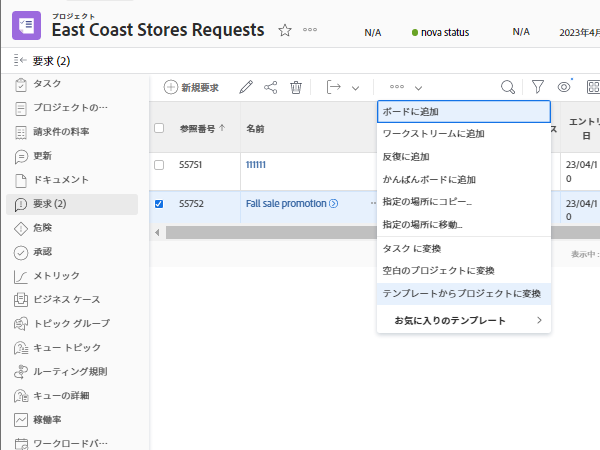

# イシューを他の作業アイテムに変換

## イシューのタスクへの変換

イシューは、解決するための時間と労力をプロジェクトタイムラインで考慮し、適切なリソースを割り当てる必要があるほど重要な場合があります。この場合、イシューをタスクに変換できます。

![[!UICONTROL Workfront] のイシューの「[!UICONTROL タスクに変換]」オプションの画像。](assets/15-convert-issue-to-task-menu-option.png)

1. イシューがログ記録されているプロジェクトまたはタスクの「[!UICONTROL イシュー]」セクションに移動します。または、アクセス権のあるレポートでイシューを見つけます。
1. イシュー名をクリックして開きます。
1. イシュー名の右側にある 3 ドットメニューから、「**[!UICONTROL タスクに変換]**」を選択します。
1. [!UICONTROL タスクに変換]フォームに入力します。最初に、新しいタスクに名前と説明を付けます。
1. 新しいタスクが別のプロジェクトの一部である必要がある場合は、プロジェクト名を入力します。
1. 「[!UICONTROL オプション]」セクションで、チェックボックスをオンにして元のイシューを保持し、新しいタスクへのアクセス権を付与し、完了日を保持します。これらの選択を行う際は、組織のワークフローに従います。イシューからタスクにカスタムフォームデータを転送する場合は、カスタムフォームを添付します（イシューフォームとタスクフォームの両方に存在するすべてのフィールドは、タスクフォームに自動的に転送されます）。
1. カスタムフォームが添付されている場合は、そのフォームに入力します。
1. 「**[!UICONTROL タスクに変換]**」をクリックして終了します。

![[!UICONTROL Workfront] のイシューの [!UICONTROL タスクに変換]フォームの画像。](assets/16-convert-to-task-options.png)

組織の [!DNL Workfront] システム設定によっては、タスクを変換する際に「オプション」セクションの設定を変更できる場合とできない場合があります。これらのオプションは、元のイシューと新しいタスクの両方に影響します。

* 「**元のイシューを保持して、その解決をこのタスクに結び付ける**」では、元のイシューと関連情報（時間、ドキュメントなど）が保持されます。ここのオプションを選択して、タスクが完了すると、イシューは解決済みとマークされます。このオプションを選択しない場合、元のイシューはタスクの完了時に削除されます。これは、組織がイシューを追跡および報告する方法に影響を与える可能性があります。
* 「**（ユーザー名）にこのタスクへのアクセス権を付与**」オプションは、イシューを作成したユーザーがこの新しいタスクにアクセスできるようにします。
* 「**イシューの予定完了日を保持**」オプションを使用すると、既にイシューに設定されている予定完了日を保持できます。これにより、タスクの制約が[!UICONTROL 指定日までに終了]に設定されます。チェックボックスをオフにすると、タスクの日付が、プロジェクト内に新しいタスクが作成されるかのように設定されます。

新しいタスクは、プロジェクトのタスクリストの下部に配置されます。タスクを目的の場所に移動し、ユーザーまたはチームを作業に割り当て、予定時間数と期間を追加します。

>[!NOTE]
>
>イシューは「予定外作業」を表すので、プロジェクトタイムラインに追加することはできません。プロジェクトタイムラインは、タスクを意味する「予定作業」のためのものです。

## イシューのプロジェクトへの変換

イシューを解決するプロセスはより複雑に調整する必要があるので、イシュー自体に対処したり、タスクに変換したりしても、イシューを解決できない場合があります。この場合、イシューをプロジェクトに変換できます。

1. イシューがログ記録されているプロジェクトまたはタスクの「イシュー」セクションに移動します。または、アクセス権のあるレポートでイシューを見つけます。
1. イシュー名をクリックして開きます。
1. イシュー名の右側にある 3 ドットメニューをクリックして、詳細メニューを表示します。
1. 次に、完全に空白の新しいプロジェクトを作成するか、タスクとタイムラインの情報を事前入力するプロジェクトテンプレートを使用するかを選択します。
1. プロジェクトに変換ウィンドウに、プロジェクトの名前から始まる情報を入力します。
1. チームまたは組織の必要に応じて、その他のプロジェクトの詳細を入力します。
1. 「オプション」セクションで、元のイシューを保持し、新しいプロジェクトへのアクセス権を付与するチェックボックスをオンにします。 これらの選択を行う際は、組織のワークフローに従います。
1. カスタムフォームが添付されている場合は、そのフォームに入力します。イシューからプロジェクトにカスタムフォームデータを転送する場合は、カスタムフォームを添付します（イシューフォームとプロジェクトフォームの両方に存在するすべてのフィールドは、プロジェクトフォームに自動的に転送されます）。
1. 「**プロジェクトに変換**」をクリックして終了します。

プロジェクトに変換ウィンドウに表示されるプロジェクトの詳細フィールドは、プロジェクトの作成方法によって異なります。 「テンプレートからプロジェクトに変換」オプションを使用した場合は、左側のメニューに詳細が表示されます。

>[!NOTE]
>
>「オプション」セクションなどの一部のセクションは、組織の Workfront システム設定によっては、表示されているにもかかわらず、アクセスできない場合があります。

* 「**元のイシューを保持し、その解決策をこのプロジェクトに結び付ける**」オプションをクリックします。このオプションでは、元のイシューと関連情報（時間、ドキュメントなど）が保持されます。 新しいプロジェクトが完了すると、イシューは解決済みとマークされます。 このオプションを選択しない場合、元のイシューはプロジェクトの完了時に削除されます。 これは、組織のイシューの追跡および報告方法に影響を与える場合があります。
* 「**（ユーザー名）にこのプロジェクトへのアクセスを許可**」オプションを使用すると、イシューを作成したユーザーは、作成中のプロジェクトにアクセスできます。

## 変換プロセス中の情報管理

<!-- Need link to wf one doc article below 

To learn about what information transfers when you convert an issue to a task or project, we recommend you read through the conversion considerations in the article, Convert issues. This lists what information is kept when converting issues and what isn’t. Workfront recommends you become familiar with these considerations so you don’t lose important information when converting issues to tasks or projects.

-->

カスタムフォームデータを転送するには、次のいずれかが必要です。

* 同じカスタムフォームの複数のコピー（1 つはイシュー用、1 つはタスクまたはプロジェクト用）。 これらのカスタムフォームのフィールドは、完全に一致している必要があります。これにより、あるカスタムフォームから別のカスタムフォームに情報を転送できます。

* または、イシュー、タスク、プロジェクトの各オブジェクトが選択された単一のカスタムフォーム。 この方法を使用すると、1 つのカスタムフォームでカスタムフィールドを作成して管理するだけで済みます。これは最近の機能強化で、同じフォームを複数コピーするよりもはるかに簡単ですが、どちらの方法でも機能します。

<!-- Need link to wf one doc article below

Learn more in the article, Transfer custom form data to a larger work item.

-->

<!-- Pro tips graphic -->

プロジェクトテンプレートにカスタムフォームを含めると、変換プロセスでテンプレートが選択されたときに自動的に割り当てられます。

<!-- Learn more graphic and documentation article links 

* Convert issues
* Transfer custom form data to a larger work item
* Overview of resolving and resolvable objects
* Understanding resolving and resolvable objects
* Unlink issues from their resolvable objects

-->

## イシューリストからイシューをタスクまたはプロジェクトへ変換

作業効率を高め、ペースの速い環境でイシューを簡単に変換できるように、プロジェクト、レポート、ダッシュボードのイシューリストからイシューをタスクまたはプロジェクトに変換する機能があります。イシューを選択し、表示される 3 つのドットのメニューをクリックするだけです。

