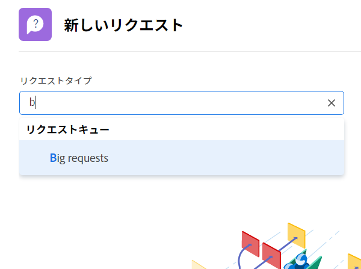
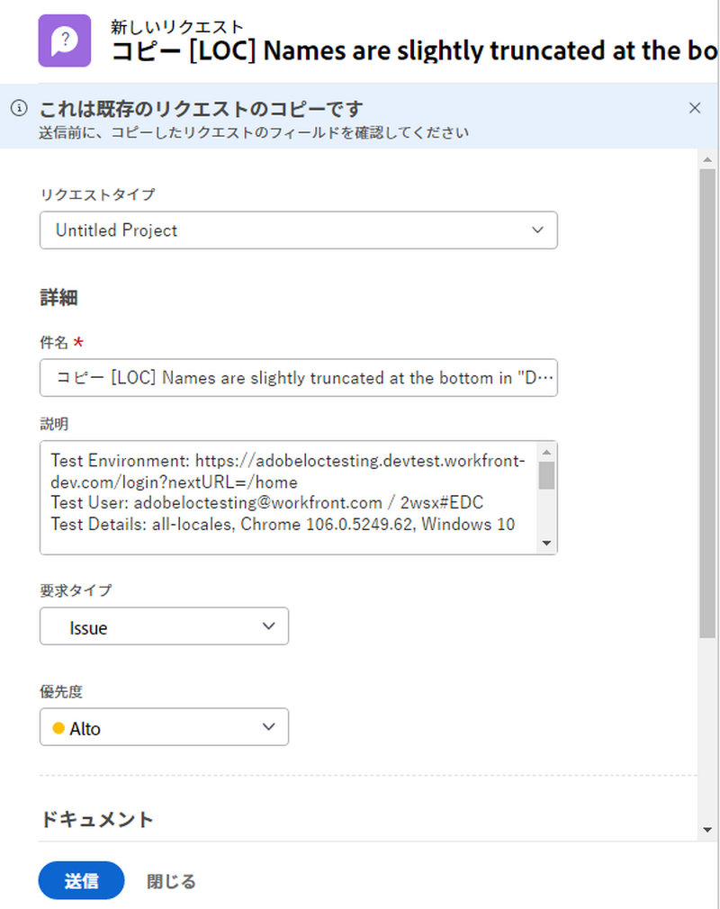

# リクエストする

多くの組織では、新しいプロジェクトの立ち上げ、新製品の開発、成果物の作成などの第一歩は、[!DNL Workfront] でリクエストを行うことです。リクエストの進行状況を追跡し、必要に応じて追加情報を提供できます。

このビデオでは、次の方法を学習します：

* リクエストエリアに移動する
* リクエストする
* 送信されたリクエストを表示する
* リクエストの下書きを検索する

>[!VIDEO](https://video.tv.adobe.com/v/336092/?quality=12)

## リクエストキューのパスに迅速かつ容易にアクセスする

「[!UICONTROL リクエストタイプ]」フィールドをクリックすると、最近送信した 3 つのリクエストパスが自動的にリストの一番上に表示されます。同じキューに別のリクエストを送信するオプションを選択します。

リストの下部には、アクセス権のあるすべてのリクエストキューが表示されます。リクエストにどのキューを使用するか不明な場合は、キーワード検索を使用すると、必要なキューをすばやく簡単に見つけることができます。

キーワードを入力すると、[!DNL Workfront] に一致するものが表示されるので、ニーズに合ったリクエストキューのパスを見つけることができます。例えば、ソーシャルメディアへの投稿をリクエストするには、「[!UICONTROL リクエストタイプ]」フィールドに「ソーシャルメディア」と入力し始めると、リストが動的に更新されて一致するものが表示されます。

必要なオプションを選択し、リクエストフォームに入力して、リクエストを送信します。

## 送信されたリクエストをコピーして新しいリクエストを作成

同じタイプのリクエストを頻繁に送信する場合、新しいリクエストを作成して同じ情報を何度も繰り返し入力するのには時間がかかります。既存のリクエストをコピーし、更新する必要のある情報のみを変更し、新しいリクエストとして送信することで、プロセスを高速化できます。

1. メインメニューの「リクエスト」をクリックします。
1. 左側のパネルメニューを確認して、「送信済み」セクションにいることを確認します。
1. コピーするリクエストを検索して選択します。コピーできるリクエストは一度に 1 つだけです。
1. リクエストリストの左上にある「新規としてコピーして送信」アイコンをクリックします。
1. 「新しいリクエスト」ウィンドウが開き、「件名」フィールドがハイライト表示され、新しいリクエストに名前を付けることができます。
1. 必要に応じて、リクエスト内の他の情報を更新します。
1. 「送信」をクリックして終了します。
1. コピーされたリクエストは、新しいリクエストとして送信され、「送信済み」リストに表示されます。

以前に送信したリクエストをコピーすることはできますが、リクエストの下書きをコピーすることはできません。他のユーザーが送信したリクエストをコピーできるのは、そのリクエストに対する表示アクセス権がある場合に限られます。

<!---
Learn more
Requests area overview
Create and submit Workfront requests
Guides
Make a work request
--->
