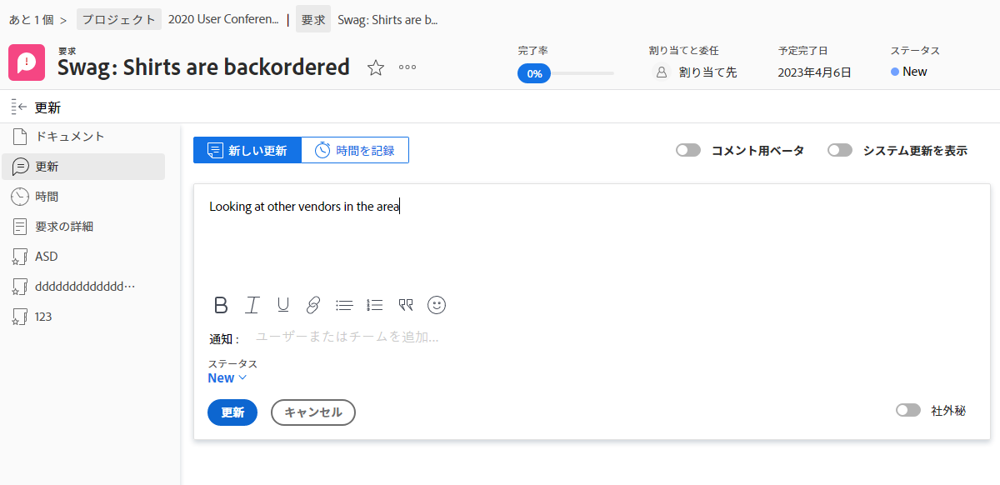
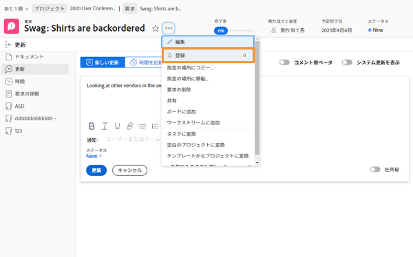
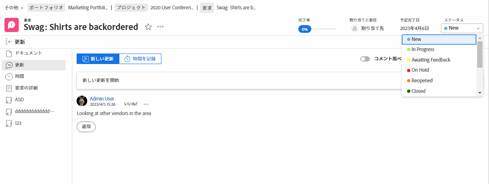
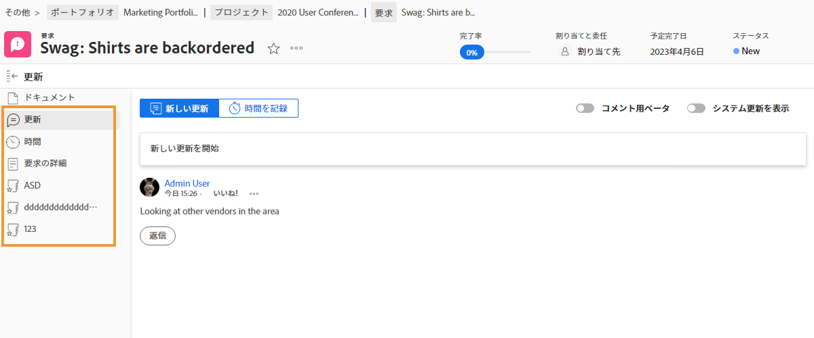

# 問題の割り当てを管理

## イシューの割り当て

問題のログイン [!DNL Workfront] は、発生する問題を解決する最初のステップです。 次の手順では、個々のユーザー、複数のユーザーまたはチームに問題を割り当て、関連する作業を完了して問題を解決できるようにします。

問題の割り当ては、タスクの割り当てと同じです。 [!UICONTROL 割り当て] フィールドに入力します。 問題は担当者の [!UICONTROL 作業用リスト] in [!DNL Workfront] [!UICONTROL ホーム]. チームに割り当てられた場合、そのチームは [!UICONTROL チームリクエスト] セクション [!UICONTROL チーム] ページ。

ログオンしたタスクとプロジェクト自体に関するすべての問題は、 [!UICONTROL 問題] 」セクションに表示されます。 これにより、プロジェクトマネージャやプランナなどが、プロジェクトに関連する問題を簡単に割り当てることができます。

で問題を割り当てる方法はいくつかあります [!DNL Workfront].

* 次に移動： [!UICONTROL 問題] セクションが表示されます。 をクリックして、 [!UICONTROL 割り当て] 「 」フィールドをクリックしてインライン編集を有効にし、作業を完了する必要のあるユーザー、ユーザーまたはチームの名前を入力します。
また、 [!DNL Workfront] レポート。

* レポートまたは **[!UICONTROL 問題]** プロジェクトまたはタスクのセクション 次に、 **[!UICONTROL 割り当て]** セクションを選択します。 忘れずに **[!UICONTROL 保存]** 」ボタンをクリックして、ユーザー名またはチーム名を入力します。

![インライン編集オプションの画像 ( [!UICONTROL 割り当て] 問題のフィールド](assets/04-issue-assign-issue-list-assignments-field.png)

<!--
Learn more graphic and documentation article links
Assign issues
Edit user assignments for multiple issues
-->

## 問題の割り当ての受信

割り当てられている問題は、 [!UICONTROL 作業用リスト] in [!UICONTROL ホーム].

![問題の割り当ての画像 ( [!UICONTROL 作業用リスト] in [!UICONTROL ホーム]](assets/05-workfront-home-work-list.png)

以下を使用： [!UICONTROL フィルター] メニューを使用してリストを絞り込み、必要に応じて問題のみを表示します。

![画像 [!UICONTROL フィルター] メニュー [!UICONTROL 作業用リスト] in [!UICONTROL ホーム]](assets/06-workfront-home-issue-filter.png)

問題がチームに割り当てられると、その問題は [!UICONTROL チームリクエスト] セクション [!UICONTROL チーム] ページ。 チームメンバーは、 [!UICONTROL 作業] 割り当てを承認するボタン、またはチームのリードが [!UICONTROL 再割り当て] アイコンをクリックして、特定のユーザーにリクエストを送信します。

![画像 [!UICONTROL チームリクエスト] セクション [!UICONTROL チーム] ページ](assets/07-team-page-work-on-it.png)

チームに割り当てられた問題も [!UICONTROL スケジュール] 」セクションに入力します。 これにより、チームリードや他のユーザーは、チームメンバーが作業を割り当てる前に、作業中のチームメンバーを確認できます。 イシューバーを [!UICONTROL 未割り当て] 割り当てるチームメンバーのカレンダーに領域を追加します。

![内のチーム割り当ての画像 [!UICONTROL スケジュール] 」セクションに入力します。](assets/08-issue-assignment-team-schedule.png)

組織の [!DNL Workfront] を設定すると、ダッシュボードに含まれるレポートに自分や自分のチームに割り当てられている問題が表示される場合もあります。

<!-- Learn more graphic and documentation article links

* Display items in the [!UICONTROL Work List] in the [!UICONTROL Home] area
* Manage work and team requests in the [!UICONTROL Home] area

-->

## 問題に関する進行状況の更新

自分とチームメンバーは、更新を投稿し、問題に関するログを記録して、実行中の作業を可視化し、関係者全員が作業の進行状況を更新し続けることができます。

更新をに投稿する方法は複数あるので、 [!DNL Workfront]では、システム設定およびワークフローでの推奨される方法に関して、チームの具体的な指示に従います。

問題に関する更新と時間は、次の場所から投稿できます： [!UICONTROL ホーム]. クリック **[!UICONTROL 新しい更新]** コメントを投稿する場合。

![からのイシューに更新を投稿する画像 [!UICONTROL ホーム].](assets/09-workfront-home-update.png)

問題にコメントする場合、ソーシャルメディアでの場合と同様に、@name機能を使用して、他のユーザーやチームにメッセージを送信できます。

次をクリック： **[!UICONTROL ログ時間]** ボタンをクリックして、問題に関する作業時間を記録します。

![問題に関するログ記録時間の画像 [!UICONTROL ホーム].](assets/10-workfront-home-log-hours.png)

または、イシューを開き（名前をクリック）、そこに情報を記録できます。

## 問題を購読

問題に対する表示アクセス権を持つユーザーは誰でも、 [!UICONTROL 購読] これにより、問題に対して更新/コメントがおこなわれるたびに通知が送信されます。 時間が記録されたり、ステータスが変更されたり、その他の編集が行われた場合は、通知を受け取りません。

購読は、他のチームメンバーやプロジェクトマネージャーが関心を持っているが、割り当てられていない、または積極的に作業を行っていない作業を追跡するのに最適な方法です。

<!-- Learn more graphic and link to documentation article

* Update or edit a work item in the Home area

-->

## 問題ステータスの更新

コメントの投稿やログの作成時間に加えて、問題のステータスを変更して、作業中であることを示すことを忘れないでください。 次に、作業が完了したことを示すために再度変更します。

ヘッダーのステータスを次のように変更します。 [!UICONTROL ホーム] または問題ページを開いたとき。

### 未解決の問題

ステータスが完了または同等に更新されていない場合、問題は「未解決」と見なされます。

未解決の問題により、関連するタスクが実行済みとしてマークされず、また、プロジェクトのステータスが完了に設定されません。

<!-- Learn more graphic and documentation article link

* Mark a work item as done in the Home area

-->

## 問題に関するその他の機能

問題ページでは、チームメンバーやプロジェクトマネージャーが問題を適切に記録し、解決するために管理する必要がある追加の情報や機能にアクセスできます。

に加えて [!UICONTROL 更新] および [!UICONTROL 時間]を使用すると、その他の情報は、イシューを開いた後で左のパネルメニューからアクセスできます。

* **[!UICONTROL ドキュメント]** — 問題に関連するドキュメントをアップロードして確認します。
* **[!UICONTROL 問題の詳細]** — 説明、優先度、重大度、計画完了日などの問題情報を変更します。
* **[!UICONTROL 承認]** — 問題に対して単一使用の承認プロセスを設定するか、グローバル承認プロセスを適用します。 このセクションでも、承認の進行状況をトラッキングできます。

イシュー名の右側にある 3 ドットメニューで、イシューのコピー、削除、共有のオプションを見つけます。

<!-- Learn more graphic and documentation article links

* Edit issues
* Copy issues
* Share an issue
* Move issues
* Grant access to an issue

-->
