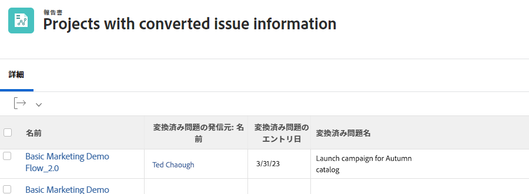

# 問題のレポート

## レポートを作成して問題を一元化

多くのトラフィックおよびプロジェクトマネージャーは、 [!UICONTROL Workfront] カスタムレポートを使用して、すべての着信問題を一元化できます。 これにより、新機能や注意が必要な機能を簡単に追跡できます。

その後、レポートをダッシュボードに追加して、作業に必要なすべてを 1 つにまとめることができます [!UICONTROL Workfront] ウィンドウ

![画像 [!UICONTROL オブジェクトの解決] 問題レポートの列。](assets/18-resolving-object-report.png)

イシューが変換されたタスクまたはプロジェクトの名前を表示するには、[!UICONTROL オブジェクトの解決]」列が表示されます。 A &quot;[!UICONTROL オブジェクトの解決]「 」は、イシューを変換する際に作成されたタスクまたはプロジェクトです。 問題が変換されていない場合、 [!UICONTROL オブジェクトの解決] フィールドは空白になります。 このレポートを使用すると、コンバージョン済みの問題をすばやく確認できるので、重複が発生することはありません。 解決オブジェクト名をクリックして開き、実行中の作業の進行状況を追跡できます。

## レポートに元の問題情報を表示

問題がタスクまたはプロジェクトに変換され、解決に必要な作業を組織のワークフローに従って追跡し、監視できる場合があります。

プロジェクトまたはタスクレポートには、元の問題に関する有用な情報を表示できます。 これらの列は、テキストモードのレポートでカスタムビューに追加できます。

* [!UICONTROL 元の発行日]
* [!UICONTROL 元の問題名]
* [!UICONTROL 元の発行者名]

<!-- Need wf one documentation article link below

For the text mode used to create this report, see the article titled View: Display original issue information on task and project list.

-->

<!--  Learn more graphic and documentation article links

* Create and customize views
* Overview of resolving and resolvable objects
* Understanding resolving and resolvable objects

-->
