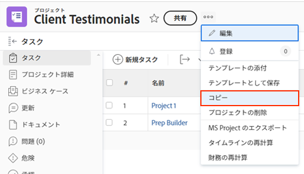

# 既存のプロジェクトのコピー

テンプレートを使用してプロジェクトを作成する代わりに、1 回だけ使用するためにプロジェクトをコピーするだけで済む場合があります。 これをおこなうには、プロジェクトの編集と作成のアクセス権を持つプランライセンスが必要です。

コピーするプロジェクトに移動し、プロジェクト名の横にある 3 ドットメニューをクリックします。 次に、「コピー」を選択します。

「プロジェクトのコピー」ウィンドウでは、タイトルとステータスを変更したり、割り当て、ドキュメント、カスタムデータなどのオプションを使用して、プロジェクトに関連付けられた様々なデータを消去したりできます。

「割り当てをクリア」を選択したり、ステータスを「計画」に設定したりすると、コピーされたプロジェクトはコピー直後にタスクの割り当て通知を送信できなくなります。
