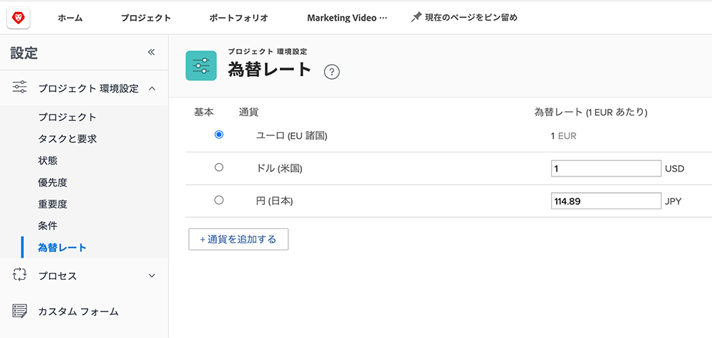
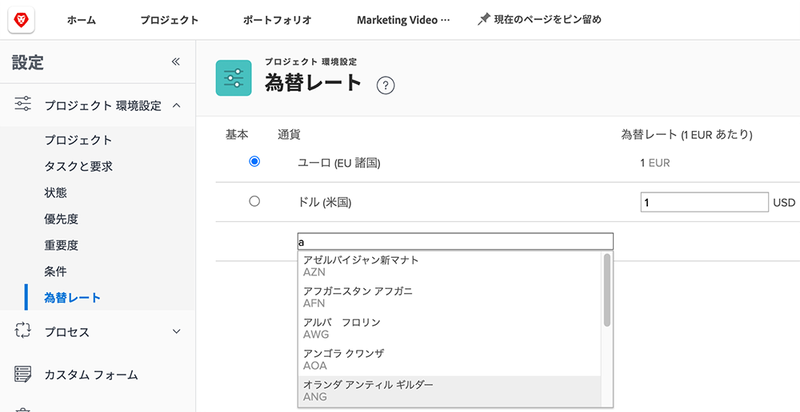

# 為替レートの設定

[!DNL Workfront] は、多国籍企業の顧客組織に対して様々な通貨をサポートしています。 為替レートは、プロジェクトやレポートで使用して、世界中の様々な通貨で財務情報を反映させることができます。

為替レートは、システム管理者が管理します。 組織の必要に応じて、追加の通貨を設定できます。

[!DNL Workfront]のベース（デフォルト）通貨は、米ドルです。 個々のプロジェクトで異なる通貨が指定されていない限り、これはデフォルトで財務情報が計算される通貨です。

## 通貨と為替レートの設定

**選択 [!UICONTROL 設定] を選択します。**

1. 展開 **[!UICONTROL プロジェクト環境設定]** をクリックします。
1. クリック **[!UICONTROL 為替レート]**.
1. 次をクリック： **[!UICONTROL 通貨を追加]** 」ボタンをクリックします。
1. ドロップダウンから国の通貨を選択します。
1. 通貨の為替レートを入力します。
1. 米ドル以外の通貨が [!DNL Workfront] システムの基本（デフォルト）通貨を選択し、通貨名の横にあるボタンをクリックします。
1. クリック **[!UICONTROL 保存]** すべての通貨が追加されたとき。

>[!NOTE]
>
>Workfrontは、為替レートの現在の市場価値を更新したり、追跡したりはしません。 更新は、必要に応じて手動でおこなう必要があります。
