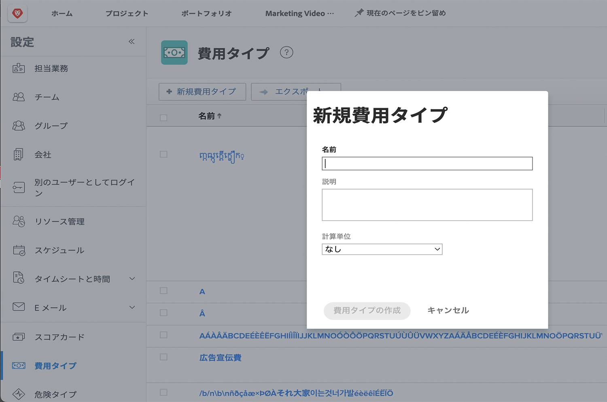
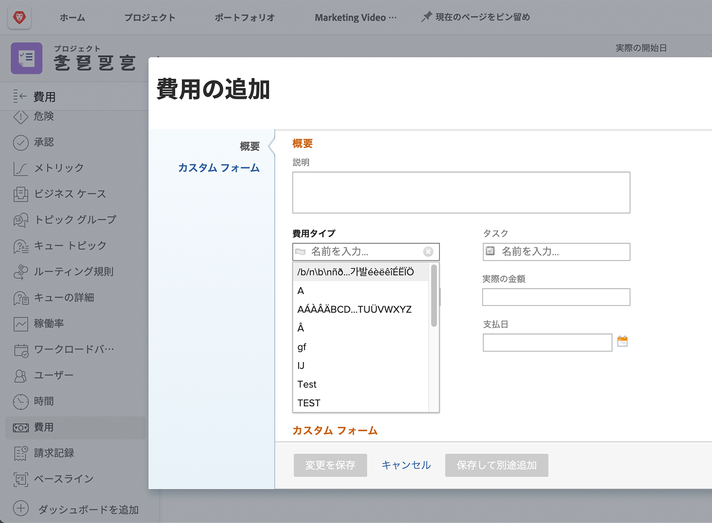

# 費用タイプを設定する

[!DNL Workfront] の費用は、プロジェクトや他の作業に関連する非労務費を表します。例えば、クライアントを訪問する際の旅費や、撮影した写真を完了するために必要な補給品の購入などの費用が発生します。これらの費用はプロジェクト内に記録する必要があるので、任意のプロジェクトに対して計画コストと実際のコストを計算し、レポートできます。

[!DNL Workfront] には、費用の入力時に使用できる事前定義済みの費用タイプがあります。 デフォルトは削除または変更できませんが、新しいデフォルトは追加できます。

* 広告宣伝費
* コンサルティング
* 接待交際費
* 一般
* 部材費
* 印刷
* 送料
* 交通費

システム管理者は、組織に必要な費用タイプを追加できます。 組織で必要な財務報告をサポートするために、これらの追加の費用タイプを変更、非表示または削除できます。

プロジェクトマネージャーやエグゼクティブなどは、[!DNL Workfront] 内のタスク、プロジェクト、プログラム、ポートフォリオについて、必要に応じて個々の費用をタイプ別にグループ化した費用レポートを生成できます。費用タイプを使用すると、プロジェクトの財務管理がはるかに容易になります。

## 費用タイプを作成する

**メインメニューから、[!UICONTROL 設定]を選択**

1. 左側のパネルメニューで、**[!UICONTROL 費用タイプ]**&#x200B;をクリックします。
1. 「**[!UICONTROL 新規費用タイプ]** 」ボタンをクリックします。
1. 費用タイプに名前を付けます。
1. 必要に応じて、説明を追加します。
1. 「**[!UICONTROL 保存]** 」ボタンをクリックします。

## 費用タイプの使用

ユーザーが [!DNL Workfront] でプロジェクトまたはタスクの費用を作成すると、**[!UICONTROL 費用タイプ]**&#x200B;ドロップダウンに費用オプションが表示されます。

