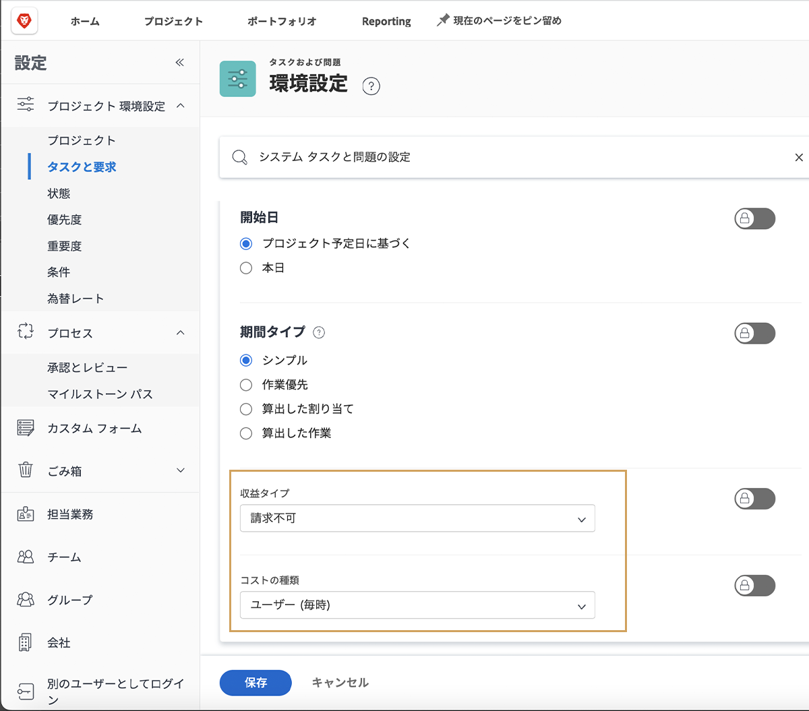

# タスクの売上高とコストのデフォルトを設定します

収益タイプとコストタイプは、タスクの計画財務情報と実績財務情報の計算に使用されます。 これらの各タスクのデフォルト情報は、システム全体に設定できるので、作成される各新規タスクに適用されます。 この情報は、個々のプロジェクトで変更することも、プロジェクトテンプレートで設定することもできます。

**次の 5 つのデフォルトの売上高タイプを使用できます。**

* 請求不可
* ユーザー (毎時)
* 役割 (毎時)
* 固定 (毎時)
* 固定収益

**デフォルトでは、次の 4 種類のコストタイプを使用できます。**

* コストなし
* 固定 (毎時)
* ユーザー (毎時)
* 役割 (毎時)

>[!NOTE]
>
>収益またはコスト・タイプが「請求不可」または「コストなし」に設定されている場合、収益およびコスト見積もりはタスクに対して生成されません。 したがって、タスクの作業はプロジェクトレベルの売上高やコストには影響しません。

## 売上高とコストのデフォルトを設定

選択 **[!UICONTROL 設定]** を選択します。

1. クリック **[!UICONTROL プロジェクト環境設定]** をクリックします。
1. 次に、 **[!UICONTROL タスクと問題]**.
1. 内 [!UICONTROL 新規タスクのデフォルト] セクションで、目的の [!UICONTROL 売上高タイプ] および [!UICONTROL コストタイプ].
1. 終了したら「保存」をクリックします。

