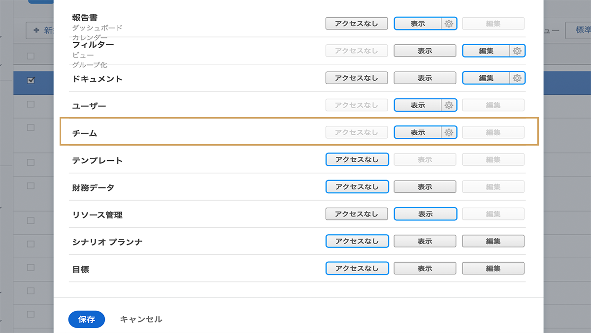
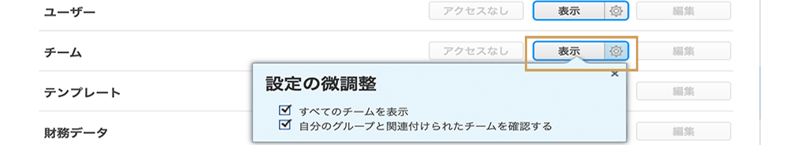

# 財務アクセスについて

組織が [!DNL Workfront] で財務データを取得している場合、その情報を表示、編集できるユーザーを保護、管理する責任はシステム管理者にあります。

ユーザーが財務情報を表示または編集するには、次の 2 つが必要です。

1. アクセス権限は、[!UICONTROL アクセスレベル]で有効にする必要があります。
2. これらのアクセス権を使用する権限は、オブジェクト単位で付与する必要があります。

例えば、あるユーザーが財務データを閲覧する権限をアクセスレベルで与えられていても、財務データを閲覧できるのは、そのユーザーと共有され、そのタスクの共有で財務閲覧が有効になっているタスクに限られます。

そのため、[!UICONTROL アクセスレベル]の財務情報を表示する権限を持つユーザーは、オブジェクトの個々の共有オプションによって、あるオブジェクトでは財務情報を表示でき、他のオブジェクトでは表示できないということがありえます。ただし、[!UICONTROL アクセスレベル]で権限が与えられていないユーザーは、どのオブジェクトの財務情報も参照できません。

## [!UICONTROL アクセスレベル]設定

財務データへの全体的なアクセスは、まず [!DNL Workfront] のライセンスタイプを基に付与されます。

**[!UICONTROL プラン]ライセンスでは次のことができます。**

* 請求レコードの管理
* 役割の請求とコスト率の管理と表示
* ユーザーの請求とコスト率の管理と表示
* 費用の管理
* 財務情報の表示と編集

**[!UICONTROL ワーク]ライセンスでは次のことができます。**

* 費用の管理
* 財務情報の表示

**[!UICONTROL レビュー]ライセンスでは次のことができます。**

* 財務情報の表示

**権限は[!UICONTROL アクセスレベル]で修正できます。財務データへのアクセスには、次の 3 つのオプションがあります。**

* [!UICONTROL アクセス権限なし] - ユーザーは、財務情報を参照できません。
* [!UICONTROL 表示] - ユーザーは、情報を確認し、共有できます。
* [!UICONTROL 編集] - ユーザーは、情報を作成、編集、削除、共有できます。 （「プラン」ライセンスでのみ利用可能）

「[!UICONTROL プラン]」ライセンスの場合、「[!UICONTROL 表示]」オプションと「[!UICONTROL 編集]」オプションには追加設定があることに注意が必要です。「[!UICONTROL 表示]」ボタンの歯車をクリックすると、これらのオプションが表示されます。

**[!UICONTROL ビュー]**

* 役割請求率と役割コスト率を表示
* ユーザー請求率とユーザーコスト率を表示

**[!UICONTROL 編集]**

この 2 つのオプションは、「[!UICONTROL 編集]」オプションで一緒に利用することができます。

* 役割請求率と役割コスト率を編集
* ユーザー請求率とユーザーコスト率を編集

>[!NOTE]
>
>費用を追加できるアクセス権を持つユーザーは、追加した費用と、直属の部下が追加した費用も表示できます。
