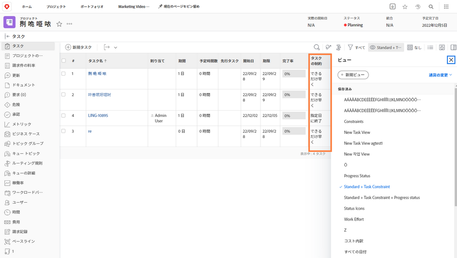

# プロジェクトタイムラインからの進行状況の追跡

タスクがプロジェクトの期限に達する前に、適切な方法で進行していることを確認します。 次の項目をスキャンすると、 [!UICONTROL タスク] リストには、次のようないくつかの機能があります。 [!DNL  Workfront] これは、作業の進行状況とステータスを監視するのに役立ちます。

## 完了率

各タスクの完了率は、作業の進行状況を測定するために使用される場合があります。 注意が必要な点は…このフィールドは、担当者がどれくらいの範囲に沿っているかを推定するので、手動で調整する必要があります。

![表示するプロジェクトタスクリスト [!UICONTROL 完了率] 列](assets/planner-fund-task-percent-complete.png)

完了率が自動的に変更される場合は、次の 2 つの点があります。

タスクの実行時 [!UICONTROL ステータス] が「完了」に設定され、完了率が 100 に変わります。
タスクの場合 [!UICONTROL ステータス] は「新規」に戻り、完了率は 0 にリセットされます。

## ステータス

次を含める： [!UICONTROL ステータス] 列 [!UICONTROL 表示] を使用して、開始されたタスク、進行中のタスク、完了したタスクをすばやく確認できます。 条件付き書式を [!UICONTROL 表示] を使用して各ステータスを色分けし、情報を解読しやすくします。

## タスクの割り当て

プロジェクトをレビューする際に、タスクの割り当てをレビューします。 誰もタスクに割り当てられなかったので、作業が遅れた可能性があります。 または、割り当てられた人には、作業を完了するための適切なスキルが設定されていない可能性があります。 タスクに担当者を追加するか、タスクを再割り当てして作業を確実に完了させます。

## タスク制約

タスクの制約が変わり、気付かない場合があります。 コンストレインは、タイムラインの動作に影響を与える可能性があるので、コンストレインの動作を設定したいかどうかを確認できます。

を含むカスタムビューの作成 [!UICONTROL タスク制約] 列を使用して、タスクリストのこの情報を確認します。 開始日からプロジェクトを計画した場合、タスクに [!UICONTROL できるだけ早く] ([!UICONTROL ASAP]) 制約を使用します。
