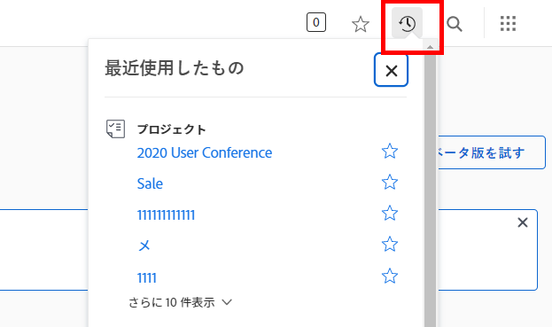

# プロジェクトの検索

Workfront はプロジェクトを管理することはできませんが、実行中の作業に必要な可視性を提供できます。[!DNL Workfront] を使用すると、作業の進捗の監視、チームとのコミュニケーション、タイムラインの調整などが簡単になります。

<!---
In this section, you will learn how to:

Find your projects in [!DNL Workfront]
Make your project visible to stakeholders
Find project communications
Use [!DNL Workfront] features when reviewing the task list to monitor project progress
--->

## 最近のプロジェクトを検索

最近のプロジェクト（および他のオブジェクト）を素早く見つけるには、「[!UICONTROL 最近]」アイコンをクリックします。

>[!NOTE]
>
>次のビデオにはオーディオが含まれていません。 これらは、前述の [!DNL Workfront] 機能のデモンストレーションです。

## プロジェクトのピン留め

プロジェクトの作業中には、プロジェクトをピン留めしてメニューバーが見つけやすくなるようにし、ワンクリックで開くことができるようにします。

>[!VIDEO](https://video.tv.adobe.com/v/335038/?quality=12)

## プロジェクトをお気に入りに登録

複数のプロジェクトを管理する場合は、星形アイコンをクリックして「お気に入り」に設定することできます。 そうすると、メインメニューバーの「[!UICONTROL お気に入り]」アイコンの下にリストが表示されます。

>[!VIDEO](https://video.tv.adobe.com/v/335039/?quality=12)

## ダッシュボードからプロジェクトを開く

多数の [!DNL Workfront] の顧客は、ダッシュボード上に集めたレポートを使用して、作業中のレポートを検索します。

>[!VIDEO](https://video.tv.adobe.com/v/335041/?quality=12)

## プロジェクトページからプロジェクトを開く

そしてもちろん、プロジェクトは常にメインの[!UICONTROL プロジェクト]領域で利用することができます。プロジェクト名をクリックすれば開きます。

>[!VIDEO](https://video.tv.adobe.com/v/335040/?quality=12)
