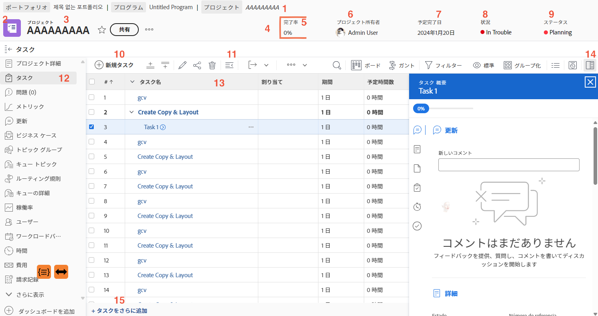

# プロジェクトページの移動

このビデオでは、次の内容を説明します。

* プロジェクトの詳細の表示方法
* どのような情報がタスクリストに表示されるか
* ドキュメントをアップロードする場所
* 更新履歴の表示方法

>[!VIDEO](https://video.tv.adobe.com/v/335085/?quality=12&learn=on&enablevpops)

## プロジェクトページの主要な部分

プロジェクトページには、作業を管理するのに役立つ多くの機能が用意されています。必要なオプションが [!DNL Workfront] のインスタンスに表示されない場合は、システム管理者にお問い合わせください。注目すべきメインのプロジェクトページの機能の一部を以下に示します。

1. **パンくずリスト：**&#x200B;プロジェクトの背後にあるプログラムとポートフォリオの階層を移動します。
2. **オブジェクトタイプ：**&#x200B;ランディングページにオブジェクトタイプを表示すると、[!DNL Workfront] で表示されているものを識別するのに役立ちます。「プロジェクト」という用語は、[!DNL Workfront] システム管理者がカスタマイズできます。
3. **プロジェクト名：**&#x200B;表示しているプロジェクトの名前です。名前をクリックして編集します。
4. **プロジェクトヘッダー：**&#x200B;すべてのプロジェクトページで使用できる標準情報です。
5. **[!UICONTROL 完了率]：**&#x200B;これは、プロジェクトで完了したタスクに基づいて自動的に更新されます。
6. **[!UICONTROL プロジェクト所有者]：**&#x200B;ほとんどの組織では、これはプロジェクト管理者です。これは、[!DNL Workfront] でプロジェクトを管理し、確実に完了する担当者です。
7. **[!UICONTROL 予定完了日]：**&#x200B;プロジェクトの予定完了日は、プロジェクトタイムラインを通じてプロジェクト管理者が設定します。
8. **[!UICONTROL 条件]：**[!UICONTROL 条件]は、プロジェクトの進捗を視覚的に表現したものです。[!DNL Workfront] は、プロジェクト内のタスクの進捗ステータスに基づいて[!UICONTROL 条件]を自動的に設定できます。または[!UICONTROL 条件]は、プロジェクトの詳細から手動で設定できます。
9. **[!UICONTROL ステータス]：**[!UICONTROL ステータス]は、プロジェクトがプロセスのどの段階にあるかを示します。つまり、プロジェクトがまだ予定段階か、処理中か、完了しているかを示します。
10. **[!UICONTROL 新規タスク]：**&#x200B;クリックして、プロジェクトにタスクを作成します。タスクがリストの下部に生成されます。
11. **[!UICONTROL 書き出し]：**&#x200B;タスクリストまたは選択したタスクを PDF、スプレッドシート、タブ区切りのファイルに書き出します。
12. **左側のパネルメニュー：** 左側のパネルを使用して、プロジェクトに関する別の情報に移動します。画面にもう少しスペースが必要な場合は、上部のタスクアイコンをクリックしてパネルを折りたたみます。アイコンをドラッグ＆ドロップすると、効率的に作業できるようになります。表示されるオプションは、[!DNL Workfront] システム管理者が設定します。
13. **タスクリスト：**&#x200B;タスクリストには、プロジェクトプランを構成するすべてのタスクが表示されます。各タスクについて表示される情報は、選択したビューによって決まります。
14. **概要パネル：**&#x200B;概要パネルでは、選択したタスクに関する情報を素早く確認できます。概要パネルのアイコンをクリックして、開いたり、閉じたりします。
15. **さらにタスクを追加** インライン編集を使用してタスクリストの最後に別のタスクを追加するには、ここをクリックします。

## このトピックに関する推奨チュートリアル

* [基本的なプロジェクト作成について](/help/manage-work/projects/understand-basic-project-creation.md)
* [プロジェクトを作成する 4 つの方法を学ぶ](/help/manage-work/projects/understand-other-ways-to-create-projects.md)
* [プロジェクト詳細の入力](/help/manage-work/projects/fill-in-the-project-details.md)

