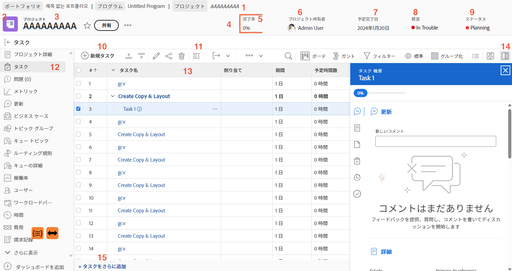

# プロジェクトページのナビゲーション

このビデオでは、Workfrontでのプロジェクトページの操作と管理の概要を説明します。 主&#x200B;機能は次のとおりです。

* **プロジェクトヘッダー：**&#x200B;完了率、プロジェクトマネージャー、予定完了日、プロジェクトの状況、ステータスなどの重要な情報を表示します。&#x200B; ステータスは、プロジェクトのステージとトリガー通知を追跡するのに役立ちます。&#x200B;
* **パンくずナビゲーション：**&#x200B;組織のプログラムおよびポートフォリオ内でのプロジェクトの配置を表示し、クリック可能なリンクで簡単なナビゲーションを実現します。
* **お気に入りとメニュー：**&#x200B;お気に入りのスターを使用すると、プロジェクトをブックマークしてクイックアクセスできます。一方、メニューには詳細の編集、プロジェクトのコピー、タイムラインの再計算などのオプションが用意されています。
* **タスク リスト：** プロジェクト計画の手順を表します。&#x200B; クイックフィルターを使用してタスクを検索し、インライン編集を使用してクイック変更を行い、タスク概要パネルを使用して詳細を確認します。&#x200B; タスク名をクリックすると、その専用ページが開きます。&#x200B;
* **左パネル：**&#x200B;詳細、更新、ドキュメントなど、様々なプロジェクトセクションにアクセスできます。&#x200B; パネルは、システム管理者がカスタマイズできます&#x200B;。
* **更新セクション：**&#x200B;プロジェクトに関するコミュニケーションを一元化し、ユーザーのタグ付け、コメントへの返信、タスク、イシュー、ドキュメントからのロールアップされた更新の表示を可能にします。
* **ドキュメント セクション：** プロジェクト関連のファイルとプルーフのアップロードと管理を有効にします。タスクに添付された&#x200B;ドキュメントは、プロジェクトレベルにロールアップされ、簡単にアクセスできます。&#x200B;

>[!VIDEO](https://video.tv.adobe.com/v/335085/?quality=12&learn=on&enablevpops=1)

## 重要な留意点

* **プロジェクトヘッダーの概要：**&#x200B;完了率、プロジェクトマネージャー、期日、ステータス、条件など、主要なプロジェクトの詳細にすばやくアクセスできます。&#x200B; ステータスは、通知とワークフローのステージも制御&#x200B;ます。
* **タスク管理：** タスクリストを使用して、プロジェクトの手順を追跡し、クイックフィルターを適用してタスクを検索し、インライン編集を行います。&#x200B; サマリーパネルまたはタスクページから詳細なタスク情報にアクセスする&#x200B;
* **パンくずナビゲーション：**&#x200B;パンくずリスト内のクリック可能なリンクを使用して、組織内のプロジェクトの階層を移動します。
* **一元化された更新：**&#x200B;タスク、イシュー、ドキュメントからのすべての更新は、プロジェクトの更新セクションにロールアップされます。これにより、コミュニケーションとトラッキングを簡素化できます。
* **ドキュメントの整理：**&#x200B;ドキュメントセクションでプロジェクト関連のファイルとプルーフをアップロードおよび管理し、関連ドキュメントをタスクに添付して、共同作業を効率化します。

## プロジェクトページの主要な部分

このページの PDF をダウンロードするには、[こちらをクリック](/help/assets/key-parts-of-the-project-page.pdf)してください。

プロジェクトページには、作業を管理するのに役立つ多くの機能が用意されています。 必要なオプションが [!DNL Workfront] のインスタンスに表示されない場合は、システム管理者にお問い合わせください。 注目すべきメインのプロジェクトページの機能の一部を以下に示します。

1. **パンくずリスト：**&#x200B;プロジェクトの背後にあるプログラムとポートフォリオの階層を移動します。
2. **オブジェクトタイプ：**&#x200B;ランディングページにオブジェクトタイプを表示すると、[!DNL Workfront] で表示されているものを識別するのに役立ちます。 「プロジェクト」という用語は、[!DNL Workfront] システム管理者がカスタマイズできます。
3. **プロジェクト名：**&#x200B;表示しているプロジェクトの名前です。 名前をクリックして編集します。
4. **プロジェクトヘッダー：**&#x200B;すべてのプロジェクトページで使用できる標準情報です。
5. **[!UICONTROL 完了率]：**&#x200B;これは、プロジェクトで完了したタスクに基づいて自動的に更新されます。
6. **[!UICONTROL プロジェクト所有者]：**&#x200B;ほとんどの組織では、これはプロジェクト管理者です。 これは、[!DNL Workfront] でプロジェクトを管理し、確実に完了する担当者です。
7. **[!UICONTROL 予定完了日]：**&#x200B;プロジェクトの予定完了日は、プロジェクトタイムラインを通じてプロジェクト管理者が設定します。
8. **[!UICONTROL 条件]：**&#x200B;[!UICONTROL 条件]は、プロジェクトの進捗を視覚的に表現したものです。 [!DNL Workfront] は、プロジェクト内のタスクの進捗ステータスに基づいて[!UICONTROL 条件]を自動的に設定できます。 または[!UICONTROL 条件]は、プロジェクトの詳細から手動で設定できます。
9. **[!UICONTROL ステータス]：**&#x200B;[!UICONTROL ステータス]は、プロジェクトがプロセスのどの段階にあるかを示します。つまり、プロジェクトがまだ予定段階か、処理中か、完了しているかを示します。
10. **[!UICONTROL 新規タスク]：**&#x200B;クリックして、プロジェクトにタスクを作成します。 タスクがリストの下部に生成されます。
11. **[!UICONTROL 書き出し]：**&#x200B;タスクリストまたは選択したタスクを PDF、スプレッドシート、タブ区切りのファイルに書き出します。
12. **左側のパネルメニュー：** 左側のパネルを使用して、プロジェクトに関する別の情報に移動します。 画面にもう少しスペースが必要な場合は、上部のタスクアイコンをクリックしてパネルを折りたたみます。 アイコンをドラッグ＆ドロップすると、効率的に作業できるようになります。 表示されるオプションは、[!DNL Workfront] システム管理者が設定します。
13. **タスクリスト：**&#x200B;タスクリストには、プロジェクトプランを構成するすべてのタスクが表示されます。 各タスクについて表示される情報は、選択したビューによって決まります。
14. **概要パネル：**&#x200B;概要パネルでは、選択したタスクに関する情報を素早く確認できます。 概要パネルのアイコンをクリックして、開いたり、閉じたりします。
15. **さらにタスクを追加** インライン編集を使用してタスクリストの最後に別のタスクを追加するには、ここをクリックします。

## このトピックに関する推奨チュートリアル

* [プロジェクトをゼロから作成、管理する](/help/manage-work/projects/understand-basic-project-creation.md)
* [プロジェクトを作成するための4つの方法を検討する](/help/manage-work/projects/understand-other-ways-to-create-projects.md)
* [プロジェクトの基本情報を入力](/help/manage-work/projects/fill-in-the-project-details.md)

