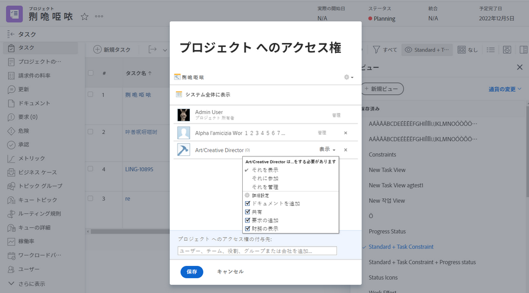

# プロジェクトの共有

プロジェクトに関係者や共同作業者を表示できるようにすることは、プロジェクト管理の重要な部分です。

プロジェクトを共有して、必要な情報をすべてのユーザーが確認できるようにします。 Workfrontでは、これは [!UICONTROL 共有] オプション。 これは、個々のプロジェクトから、 [!UICONTROL 詳細] 」メニューを使用します。

または、 [!UICONTROL プロジェクト] ページを開くには、プロジェクトを選択して [!UICONTROL 共有] 」ボタンをクリックします。

プロジェクトを共有すると、関係者全員が必要に応じてプロジェクト情報を確認できます。

<!---
Learn More Icon
Share permissions on objects
Share a project
--->
