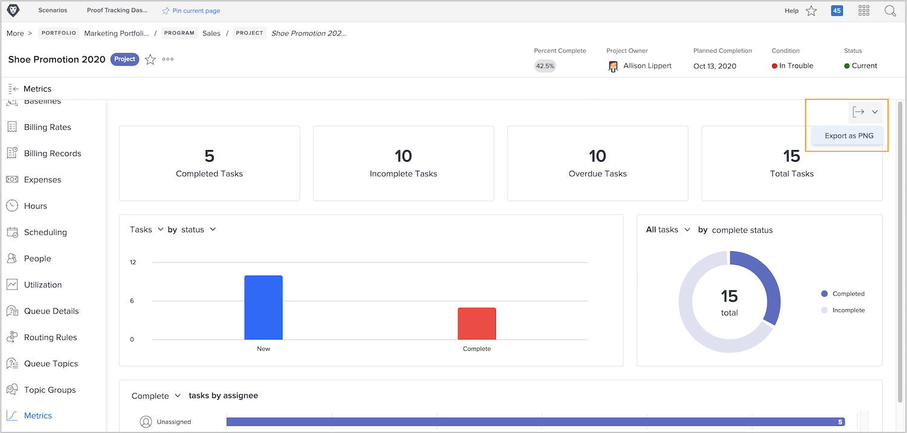

# プロジェクト指標を使用した作業の進捗の追跡

このビデオでは、次の方法を学習します：

* プロジェクト指標グラフへのアクセス
* グラフの情報のカスタマイズ

>[!VIDEO](https://video.tv.adobe.com/v/336667/?quality=12&learn=on)

「[!UICONTROL 書き出し]」ボタンを使用して、プロジェクト指標ダッシュボード全体を .png ファイルとして書き出すことができます。これにより、メールやプレゼンテーションを通じて他のユーザーとデータを簡単に共有できます。

<!---
Overview of project metrics
--->
