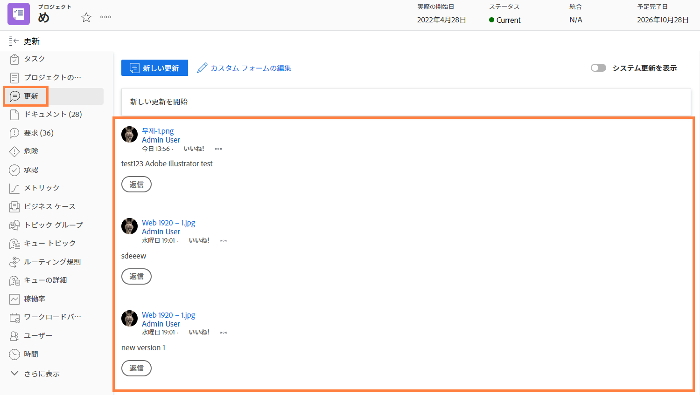

# プロジェクトの通信について

プロジェクトを運営する 90%はコミュニケーションです プロジェクトチーム、管理者、プロジェクト関係者とのコミュニケーション。

しかし、プロジェクトチームがメール、インスタントメッセージ、会議、ノート注釈をプロジェクトのコミュニケーションに使用すると、情報が散乱して…またはより悪い状態になり、忘れられてしまう。 のプロジェクト自体に関するプロジェクト作業に関するコミュニケーションを維持する [!DNL Workfront] アップデートを使用します。

プロジェクトチームメンバーが割り当てに取り組んでいる間は、 [!DNL Workfront] [!UICONTROL ホーム] 割り当てられたタスクに対して。

タスク、問題、ドキュメントからの更新は、プロジェクトレベルにまでロールアップされます [!UICONTROL 更新] タブを使用して、情報をすばやく簡単に表示できます。

次に、「 」ボタンをクリックするだけで、更新内容に返信できます。 これにより、すべての会話が 1 か所にまとめられ、後で参照できるようになります。

<!---
learn more urls
Communicate about work in Home
Subscribe to items in Workfront
Update work
--->
