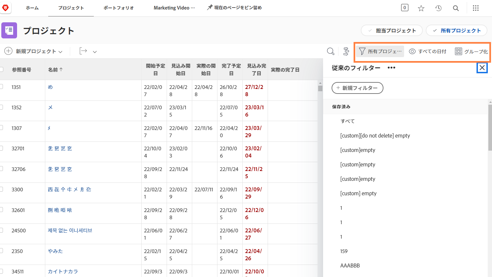
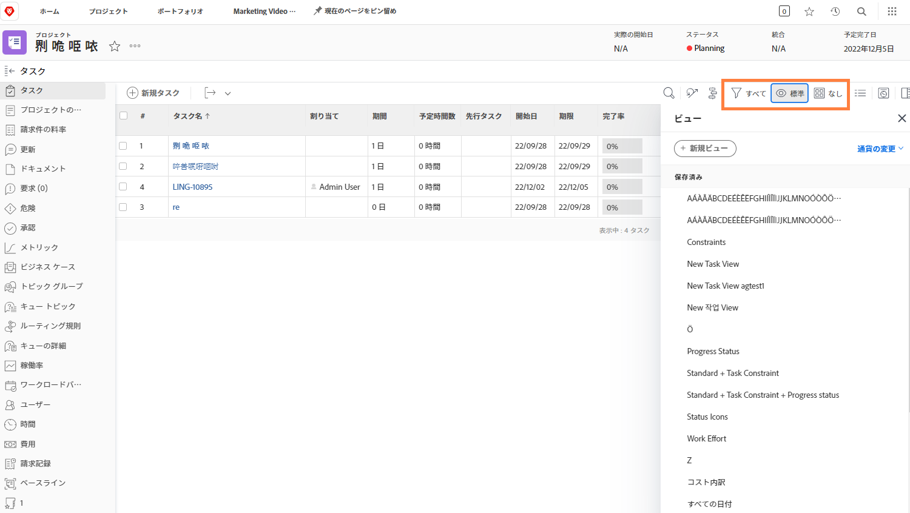

# プロジェクト情報の表示

メイン[!UICONTROL プロジェクト]ページを見ている場合でも、個々のプロジェクトを見ている場合でも、[!UICONTROL フィルター]、[!UICONTROL 表示]および[!UICONTROL グループ化]を使用して、必要な情報を表示するようにリストを微調整します。

[!UICONTROL プロジェクト]ページで、すべてのプロジェクトの進捗の概要を確認することができます。

[!UICONTROL フィルター]を使用して、特定の基準に基づいてリストを絞り込みます。[!UICONTROL 表示]を選択して、プロジェクトに関連する情報の列を表示します。最後に[!UICONTROL グループ化]を選択して、意味のある方法でプロジェクトを整理します。

プロジェクトの「[!UICONTROL タスク]」セクションにいるときは、[!UICONTROL フィルター]、[!UICONTROL 表示]および[!UICONTROL グループ化]を再び活用すると、実行中の作業を監視するのに役立ちます。プロジェクトではなくタスクを見ているので、まったく別の選択肢を持つことになります。

[!DNL Workfront] の多くの顧客は、カスタムフォーム情報や実行中の作業に関連するその他のフィールドを表示するカスタムビューを作成しています。

## このトピックに関する推奨チュートリアル

* [基本フィルターを作成](https://experienceleague.adobe.com/docs/workfront-learn/tutorials-workfront/reporting/basic-reporting/create-a-basic-filter.html?lang=ja)
* [基本ビューを作成](https://experienceleague.adobe.com/docs/workfront-learn/tutorials-workfront/reporting/basic-reporting/create-a-basic-view.html?lang=ja)
* [基本グループを作成](https://experienceleague.adobe.com/docs/workfront-learn/tutorials-workfront/reporting/basic-reporting/create-a-basic-grouping.html?lang=ja)

