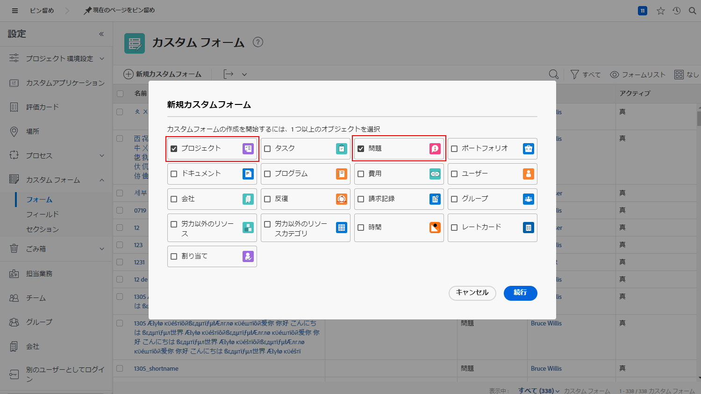
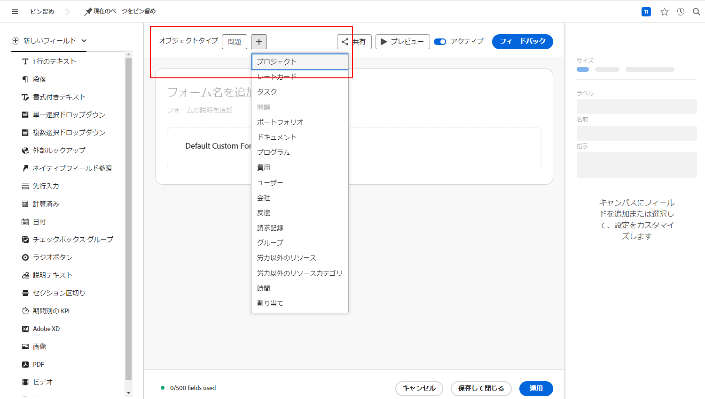

# リクエストキューに関するよくある質問へ回答

**私にはリクエストキューが表示されるのに、ユーザーには表示されないのはなぜですか。**

リクエストキューやプロジェクトの「[!UICONTROL キューの詳細]」タブで、そのユーザーが「このキューにリクエストを追加できるユーザー」の基準を満たしていることを確認します。フィールドの条件を満たしていることを確認します。

詳しくは、このビデオをご覧ください。

>[!VIDEO](https://video.tv.adobe.com/v/3434156/?quality=12&learn=on&enablevpops)

**キューへのアクセス権をユーザーに付与しましたが、リクエストキューのプロジェクトも表示できるようになりました。なぜでしょうか。**

「このキューにリクエストを追加できるユーザーは誰ですか？」リストで、「このプロジェクトへの表示アクセス権を持つユーザー」を選択した場合、リクエストキューを使用する表示権限を付与されたユーザーは誰でも、プロジェクトリストでリクエストキューを表示できるようになります。これを回避するには、「このプロジェクトの会社のユーザー」または「このプロジェクトのグループのユーザー」オプションを使用します。

**リクエストをプロジェクトに変換できますか？**

はい。必要に応じて、イシューをタスクまたはプロジェクトに変換できます。

これらのチュートリアルでは、次の方法を説明します。

* [イシュー／リクエストのプロジェクトへ変換](/help/manage-work/issues-requests/create-a-project-from-a-request.md)

* [イシュー／リクエストのタスクへ変換](/help/manage-work/issues-requests/convert-issues-to-other-work-items.md)

**編集するためのリクエストキューはどこで見つけられますか？**

ナビゲーションバーの「[!UICONTROL 検索]」フィールドを使用するか、[!UICONTROL プロジェクト]エリアに一覧表示されています。

リクエストキューからリクエストを開いた場合は、パンくずリストエリアのプロジェクト名をクリックできます。

**リクエストのカスタムフォームからプロジェクトのカスタムフォームに情報を転送できますか？**

はい。 カスタムフォームを作成するときは、[!UICONTROL プロジェクト]と[!UICONTROL イシュー]の両方をオブジェクトタイプとして選択します。また、プロジェクトのカスタムフォームを編集して、イシューのオブジェクトタイプを含めることも、その逆も可能です。

リクエストにカスタムフォームを添付します。 リクエストをプロジェクトに変換すると、カスタムフォームは新しいプロジェクトに自動的に添付され、フィールドに含まれる値はリクエストとプロジェクトのカスタムフォームの両方に表示されるようになります。

**プロジェクトまたはタスクレポートで、このオブジェクトの元となるリクエストを見つけるにはどうすればよいですか？**

**[!UICONTROL 変換済みイシュー]**&#x200B;および&#x200B;**[!UICONTROL 変換済みイシューの発信元]**&#x200B;フィールドソースのフィールドをアクセスして、その情報をプロジェクトおよびタスクレポートに追加します。

詳しくは、このビデオをご覧ください。

>[!VIDEO](https://video.tv.adobe.com/v/3434176/?quality=12&learn=on&enablevpops)

**レポートのリクエストキューをフィルタリングする最善の方法を教えてください。**

プロジェクトフィルターに&#x200B;**キュー／パブリック／が次に等しい／なし**&#x200B;が含まれている場合、レポートには、リクエストキューで&#x200B;**ない**&#x200B;プロジェクトのみが表示されます。

プロジェクトフィルターに&#x200B;**キュー／パブリック／等しくない (大文字と小文字を区別しない)／なし**&#x200B;が含まれている場合、レポートには、リクエストキューで&#x200B;**ある**&#x200B;プロジェクトのみが表示されます。

詳しくは、このビデオをご覧ください。

>[!VIDEO](https://video.tv.adobe.com/v/3434329/?quality=12&learn=on&enablevpops)

**リクエストキューのカスタムステータスを作成することをお勧めしますか？**

一部のお客様は、「現在」と同等のリクエストキューのカスタムステータスを作成します。その後、すべてのリクエストキューを表示するレポートを実行したり、リクエストキューをレポートから簡単に除外したりできます。これには、**キュー／パブリック／次と等しくない／なし**&#x200B;を使用するよりも使いやすいという利点がありますが、リクエストキューを作成するユーザーがリクエストキューの使用を忘れる可能性があるという欠点があります。「現在」のステータスは同様に機能し、ほとんどのトレーニング資料で表示されるからです。そのため、多くのお客様は、リクエストキューのカスタムステータスを使用しないことを選択しています。

ただし、組織で既にリクエストキューのステータスを使用していて、それが適切に使用されていることを確認する（または、適切に使用されていない場合は修正する）方法が必要な場合は、上記のビデオで説明されている&#x200B;**アクティブなリクエストキュー**&#x200B;のレポートを作成し、**プロジェクト／ステータスが次と等しい／次と等しい／現在**&#x200B;のフィルターを&#x200B;**プロジェクト／ステータス／次と等しい／現在**&#x200B;に変更できます。これにより、使用する「リクエストキュー」ステータスではなく、「現在」のステータスを使用しているアクティブなリクエストキューがすべて表示されます。表示されるすべてのプロジェクトを選択し、一括編集を行ってステータスを「リクエストキュー」に変更します。

## このトピックに関する推奨チュートリアル

* [リクエストキューについて](/help/manage-work/request-queues/understand-request-queues.md)
* [リクエストキューの作成](/help/manage-work/request-queues/create-a-request-queue.md)
* [リクエストフローの設定について](/help/manage-work/request-queues/understand-settings-for-a-flow-request.md)
* [リクエストフローの作成](/help/manage-work/request-queues/create-a-request-flow.md)
* [システム管理者のフィードバックリクエストキューの作成](/help/manage-work/request-queues/create-a-system-admin-feedback-request-queue.md)
