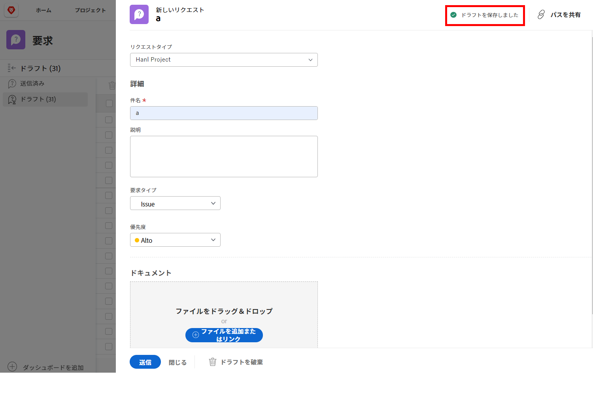

# リクエストキューについて

このビデオでは、次のことを学習します。

* [!DNL  Workfront] リクエストキューを通じてリクエストを送信する方法
* リクエストキューを構造化する方法

>[!VIDEO](https://video.tv.adobe.com/v/335220/?quality=12&learn=on)

## リクエストドラフトの自動保存

リクエストフォームへの入力を開始すると、「[!UICONTROL 件名]」フィールドに入力した後、[!DNL Workfront] は自動的にドラフトを保存します。つまり、[!UICONTROL リクエスト]領域から別の操作を行う必要がある場合や、リクエストの途中で一時停止して詳細情報を収集する必要がある場合でも、データが失われることはありません。

ウィンドウの上部にドラフトが保存されたことを示すメッセージが表示されます。[!DNL Workfront] は、必須フィールドがまだ入力されていない場合でも、リクエストのドラフトを保存します。

リクエストを送信する準備が整ったら、「[!UICONTROL ドラフト]」タブで検索します。名前をクリックして開き、フォームへの入力を完了します。完了したら、「[!UICONTROL リクエストを送信]」をクリックします。

## やってみよう

先ほど提示された情報を確認してみましょう。

**質問：** Workfront でリクエストを作成するには、どうすればよいですか？手順を説明します。

* 作成する必要があるリクエストタイプを選択します
* 「リクエストを送信」をクリックします
* フォームに関する情報を入力します
* 「新規リクエスト」をクリックします
* リクエストエリアに移動する

**回答：** リクエスト領域に移動して、新規リクエストをクリックし、作成する必要があるリクエストタイプを選択し、フォームの情報を入力し、「リクエストを送信」をクリックします

**質問：**&#x200B;リクエストは実際には何ですか？

**回答：**&#x200B;イシューです

<!---
You can also access request drafts from the [!UICONTROL Select a Request Type] menu at the top of the window. Select an option from the [!UICONTROL Recent Drafts] section, or start a new request by picking a queue from the [!UICONTROL New Requests] section. Fill everything out like normal, then submit the request.

<!---
image
--->

<!---
Let's take a minute to review the information you were just presented.

How do you make a request in Workfront? List the steps in order.
Choose the request type you need to make
Click Submit request
Fill out the information on the form
Click "New Request"
Navigate to the request area

Answer: Navigate to the request area>Click New Request>Choose the request type you need to make>Fill out the information on the form>Click Submit request

A request is really an......

Answer: Issue
--->
