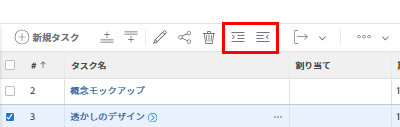
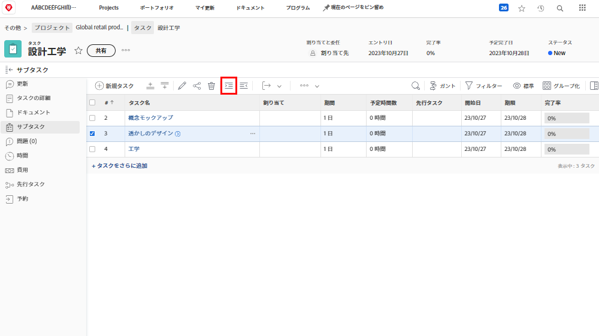
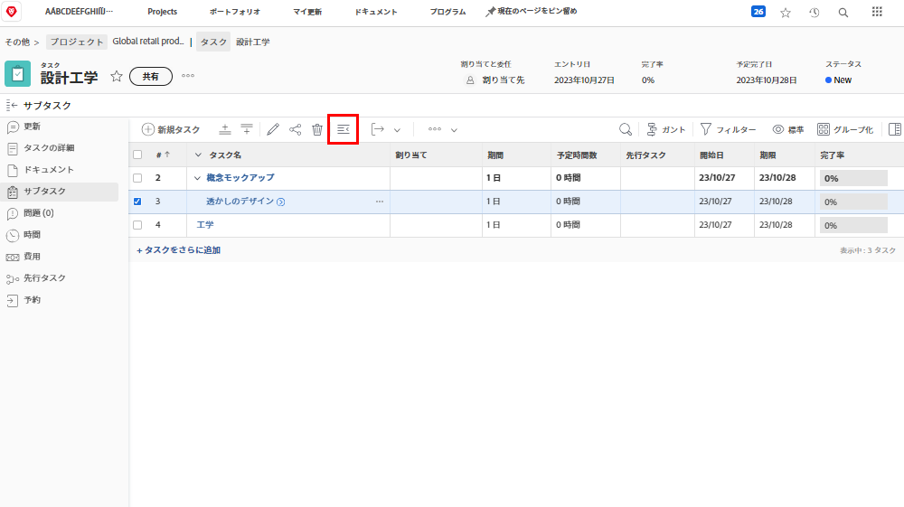

# 親子タスクについて

このビデオでは、次のことを学習します。

* [!DNL Workfront] プロジェクトでタスクを構造化する方法

>[!VIDEO](https://video.tv.adobe.com/v/335087/?quality=12&learn=on)

## タスクをサブタスクに変更してから元に戻す

**インデント**&#x200B;ボタンと&#x200B;**アウトデント**&#x200B;ボタンは、タスクをサブタスクに変更する場合や、サブタスクから非サブタスクに変更する場合に使用します。

「[!UICONTROL 透かしのデザイン]」を選択し、**インデント**&#x200B;ボタンをクリックします。「[!UICONTROL 透かしのデザイン]」は、親タスクとなる「[!UICONTROL 概念モックアップ]」の下のサブタスクになります。

サブタスクの場合は「[!UICONTROL 透かしのデザイン]」を選択し、**アウトデント**&#x200B;ボタンをクリックします。「[!UICONTROL 透かしのデザイン]」は、「[!UICONTROL 概念モックアップ]」と同じレベルの標準タスクになります。

