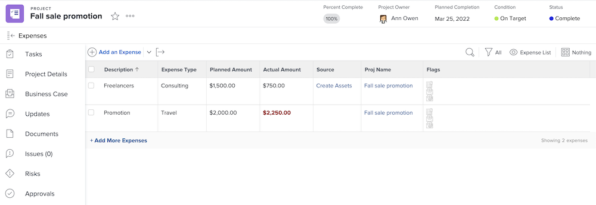

# 財務の更新とレビュー

組織が [!DNL Workfront] を使用してプロジェクト関連の財務情報を追跡している場合、費用のレビューと請求記録の作成は、プロジェクトを終了するためのプロセスの一部である可能性があります。

>[!NOTE]
>
>多くの [!DNL Workfront] の顧客は、[!DNL Workfront] ではなく、サードパーティシステムで費用とプロジェクトの財務を処理しています。したがって、プロジェクトを閉じる前に財務情報を更新し、確認するための様々なプロセスやガイドラインが存在する場合があります。

## 費用

費用は、個人のタスクまたはプロジェクト自体に対して記録できます。 費用が記録されている項目に関係なく、プロジェクト自体の[!UICONTROL 費用]セクションですべての費用を表示できます。

## 請求記録

請求記録は [!DNL Workfront] で使用され、請求可能な時間、請求可能な費用、請求可能な収益、および追加の請求可能な金額を 1 つのレコードと金額に収集します。多くの場合、これらは [!DNL Workfront] からサードパーティの請求システムまたは会計システムに書き出されます。

請求記録を作成および表示するには、[!DNL Workfront] の財務データにアクセスできる必要があります。

## 財務の詳細

「[!UICONTROL プロジェクトの詳細]」の[!UICONTROL 財務]情報を見ると、利益、収益、およびコストの実際の数値を確認できます。

![プロジェクトの[!UICONTROL プロジェクト詳細]ウィンドウの財務セクション](assets/finance-section-project-details.png)

[!UICONTROL プロジェクトの詳細]の財務情報のほとんどは、プロジェクトの作成中に設定され、ここに表示される数値はその情報に基づいています。そのため、プロジェクトを閉じる際に、財務の詳細では何も更新または追加する必要はありません。

<!--
learn more urls
Create billing records
Manage project expenses
Project finances
-->
