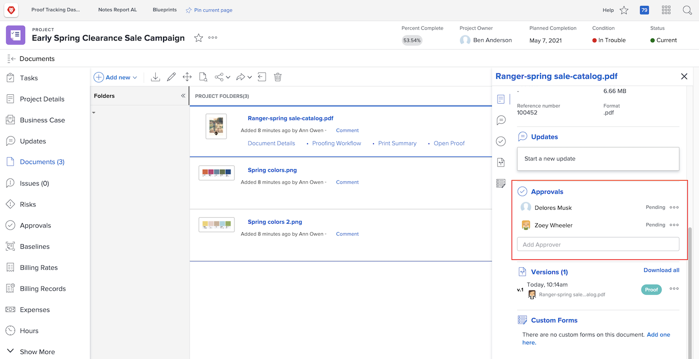

# アセットのアップロード

[!DNL Workfront] プロジェクトを閉じる前に必ず、関連するすべてのファイルを「[!UICONTROL ドキュメント]」セクションに入力します。 組織のガイドラインの規定に従って、これらのファイルをドキュメントまたはプルーフとしてアップロードします。

ドキュメントまたはプルーフを、既存のファイルのバージョンとしてアップロードする必要が生じる場合があります。

組織でプルーフの承認を使用している場合、「進捗状況」アイコンをすばやく確認して、そのすべてが完了していることを確認します。

また、組織がドキュメント承認を使用している場合は、リストの各項目を選択し、ドキュメントの詳細をチェックして承認が完了しているかどうかを確認します。

<!---
learn more urls
Create proofs
Add new documents to Workfront
--->
