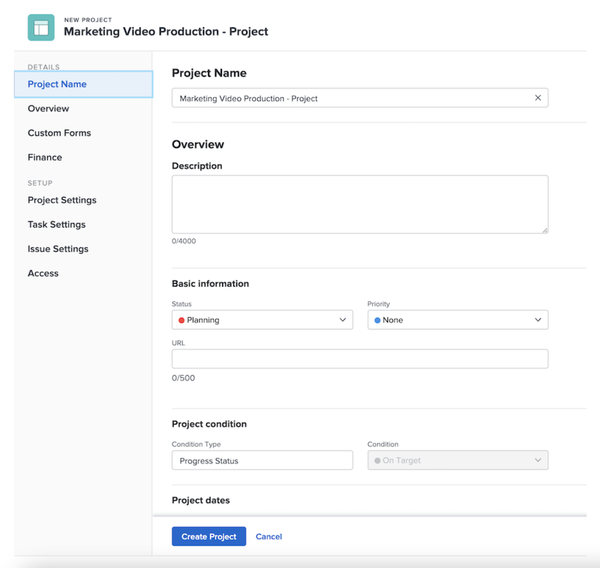

# プロジェクトをテンプレートから直接作成する

テンプレートで作業中に、そのテンプレートを使用してプロジェクトを作成する必要がある場合は、テンプレート名の横にある「...」メニューをクリックします。次に「プロジェクトを作成」を選択します。

詳細ウィンドウでは、新しいプロジェクトの設定を変更できます。

>[!NOTE]
>
>この方法でプロジェクトを作成するには、Workfront のテンプレートエリアにアクセスする必要があります。テンプレートにアクセスできない場合でも、プロジェクトエリアから、またはイシューやタスクを変換する際に、テンプレートを使用してプロジェクトを作成することができます。

>[!TIP]
>
>頻繁に使用するテンプレートがある場合は、お気に入りに追加します。お気に入りに追加したテンプレートは、ナビゲーションバーのお気に入りメニューの下に表示されるだけでなく、新規プロジェクトメニューにも表示されます。

