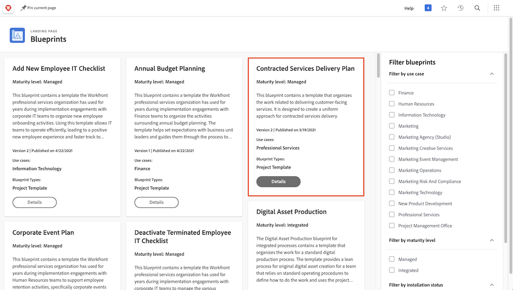
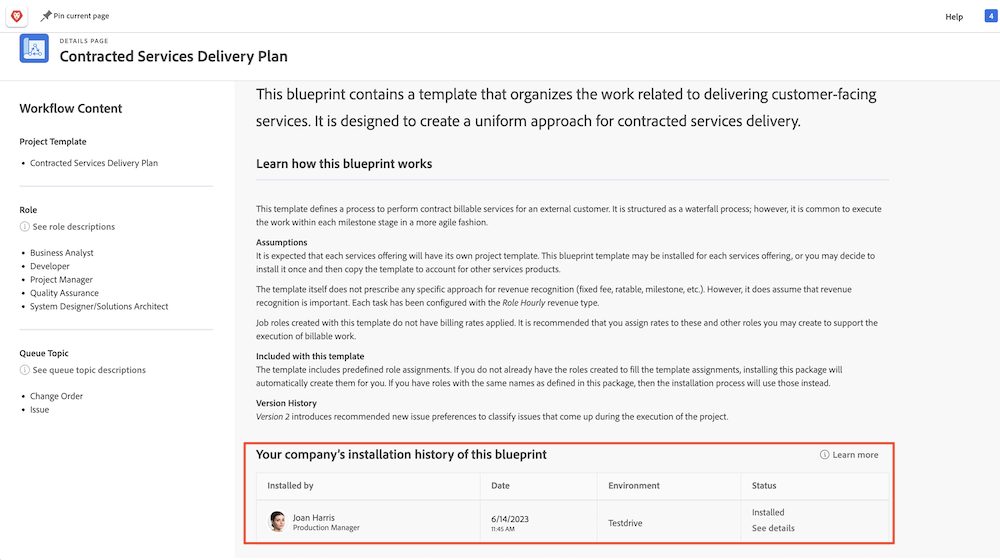

# プロジェクトテンプレートの作成と、[!UICONTROL ブループリント]の詳細

プロジェクトテンプレートを最初から作成する方法と、既存のプロジェクトから作成する方法を説明します。また、[!UICONTROL ブループリント]を使用して Workfront のエキスパートが作成した便利なプロジェクトテンプレートを利用する方法を紹介します。

## プロジェクトテンプレートの作成

このビデオでは、次の方法を学習します：

* テンプレートを最初から作成する
* テンプレートを既存のプロジェクトから作成する

>[!VIDEO](https://video.tv.adobe.com/v/335210/?quality=12&learn=on&enablevpops=1)

## [!UICONTROL ブループリント]で作成されたテンプレート

Workfront ユーザーは、[!UICONTROL ブループリント]を使用してプロジェクトテンプレートを作成できます。 この機能はメインメニューにあり、部門や特定の成熟度レベルをターゲットとした、すぐに使用できる事前定義済みのテンプレートにアクセスできます。 これらのテンプレートを使用すると、繰り返し可能なプロジェクトの作成を素早く開始でき、範囲が同じプロジェクト間で一貫性を維持できます。

ライセンスを付与されたユーザーは、Workfront で使用可能なブループリントのリストを参照できます。 プロジェクトを新規作成する場合（タスクやリクエストのプロジェクトへの変換など）は、ブループリントを直接適用できません。 ブループリントとプロジェクトテンプレートの主な違いは、ブループリントはテンプレートの作成に使用されるのに対し、テンプレートはプロジェクトの作成に使用される点です。 **対応するテンプレートを作成するには、システム管理者がブループリントをインストールする必要があります。**

関心のあるブループリントを見つけたら、「**[!UICONTROL 詳細]**」をクリックすると、詳細情報を確認できます。

[!UICONTROL 詳細]画面では、ブループリントがインストールされている場合は、インストール履歴などのブループリントの詳細が説明されます。

ブループリントがインストールされている場合は、「**[!UICONTROL 詳細を表示]**」をクリックすると、作成されたテンプレートおよびそのテンプレートをサポートするために作成されたその他のオブジェクトへのリンクを取得できます。

ブループリントがまだインストールされていない場合は、システム管理者にリクエストできます。

## このトピックに関する推奨チュートリアル

* [プロジェクトをテンプレートから直接作成](/help/manage-work/create-and-manage-project-templates/create-a-project-directly-from-a-template.md)
* [プロジェクトテンプレートの共有](/help/manage-work/create-and-manage-project-templates/share-a-project-template.md)
* [既存のプロジェクトのコピー](/help/manage-work/manage-projects/copy-an-existing-project.md)
* [プロジェクトテンプレートの非アクティブ化](/help/manage-work/create-and-manage-project-templates/deactivate-a-project-template.md)
* [プロジェクトテンプレートでのプロジェクトチームの編集](/help/manage-work/create-and-manage-project-templates/edit-the-project-team-in-a-project-template.md)
