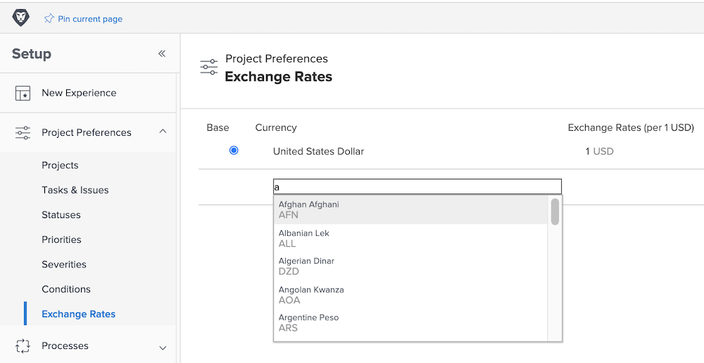

# 為替レートの設定

[!DNL Workfront] では、多国籍企業である顧客組織に対して様々な通貨をサポートしています。プロジェクトやレポートで為替レートを使用して、世界中の様々な通貨の財務情報を反映できます。

為替レートは、システム管理者が管理します。 追加の通貨は、組織の必要に応じて設定できます。

Workfront のデフォルトの基本通貨は、米国ドルです。これは、デフォルトで財務情報の計算に使用する通貨です。このデフォルトは、グローバルに変更することも、個々のプロジェクトで変更することもできます。

## 通貨と為替レートの設定

**メインメニューから「[!UICONTROL 設定]」を選択します。**

1. 左側のメニューパネルで「**[!UICONTROL プロジェクト環境設定]**」を展開します。
1. 「**[!UICONTROL 為替レート]**」をクリックします。
1. 「**[!UICONTROL 通貨を追加]**」ボタンをクリックします。
1. ドロップダウンから国の通貨を選択します。
1. 通貨の為替レートを入力します。
1. 米国ドル以外の通貨を [!DNL Workfront] システムの基本（デフォルト）通貨にする必要がある場合は、通貨名の横にあるボタンをクリックします。
1. すべての通貨を追加したら、「**[!UICONTROL 保存]**」をクリックします。

>[!NOTE]
>
>Workfront では、為替レートの現在のマーケット価値の更新や追跡は行いません。必要に応じて、手動で更新する必要があります。
