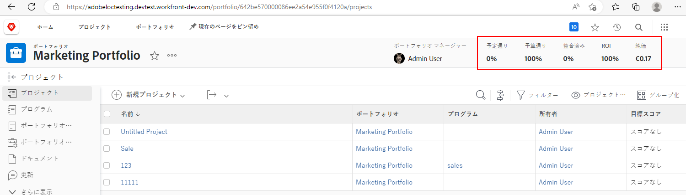
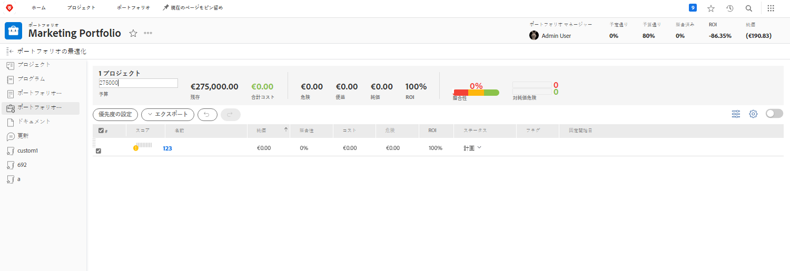

# ポートフォリオの概要

マネージャーは往々にして、企業がゴールや目標を達成するにはどのプロジェクトが最も役立つのかを見つけ出すという、難しい業務を抱えています。つまり、現在のプロジェクトや潜在的なプロジェクトを、それらの目標にとって重要な基準に基づいて判断している、ということです。この基準には、必要なリソースの数、プロジェクトのコストとリターンの比較、関連するリスクの理解などが含まれます。この情報を使用して、管理者は実行すべきプロジェクトとタイミングを決定できます。

プロジェクトについて検討したり計画を立てたりすることは、それほど難しい作業ではありません。ほとんどのマネージャーが慣れ親しんでいるプロセスです。本当に大変なのは、プロジェクトを他のプロジェクトに対して比較するときです。長く詳細なプロジェクトのリストを調べるのは時間がかかります。そこで、Workfront のポートフォリオが役に立ちます。

## ポートフォリオとは

ポートフォリオとは、同じリソース、予算、スケジュール、優先度に対して完了するプロジェクトの集まりです。例えば、マーケティング代理店はポートフォリオを使用することで、特定のクライアント向けにすべてのプロジェクトをグループ化できます。

[!UICONTROL メインメニュー]から「**[!UICONTROL ポートフォリオ]**」セクションに移動したら、ポートフォリオ名をクリックして開きます。

「**[!UICONTROL 新規プロジェクト]**」ボタンを使用して、既存のプロジェクトをポートフォリオに簡単に追加できます。または、ポートフォリオ内で直接新しいプロジェクトを作成できます。

![[!UICONTROL 新規プロジェクト]ボタンのドロップダウンメニューの画像](assets/01-portfolio-management3.png)

プロジェクトがポートフォリオに追加されたら、ページヘッダーの概要情報を使うことで、プロジェクトのこのコレクションがポートフォリオの目標全体に対してどのように貢献しているのか、プラスなのかマイナスなのか、その概要を把握できます。

ポートフォリオ最適化ツール（[!UICONTROL ポートフォリオオプティマイザー]）を使用すると、純価、調整、コスト、リスク、ROI に基づいてプロジェクトの優先順位を付けることができます。

## ポートフォリオへのアクセス

ポートフォリオを操作するには、Workfront でプランライセンスが割り当てられているのに加え、ポートフォリオを使用する権限を付与するアクセスレベルが必要です。

ポートフォリオが作成されたときは、ポートフォリオの作成者または管理者だけがポートフォリオにアクセスできます。ポートフォリオを共有することで、ポートフォリオへの他のアクセス権を付与できます。これにより、ポートフォリオ内のすべてのプログラムやプロジェクトへのアクセス権も付与されます。

ポートフォリオを開き、「...」メニューをクリックして、「**[!UICONTROL 共有]**」を選択します。アクセス権が必要なユーザー、チーム、職務上の役割、グループ、または会社を追加します。次に、それぞれに付与するアクセス権の種類（管理または表示）を判断します。

![[!DNL Workfront] のポートフォリオの「[!UICONTROL 共有]」オプションの画像](assets/04-portfolio-management11.png)

<!--
Pro-tips graphic
If a user can't access a specific portfolio, make sure it's shared with them. The Workfront access level determines that a user can access portfolios in general, but sharing makes sure they can see specific portfolios. 
-->

<!--
Learn more graphic and links to documentation articles
* Portfolio overview   
* Create a portfolio 
* Create and manage portfolios 
* Navigate within a portfolio 
* Share a portfolio   
-->
