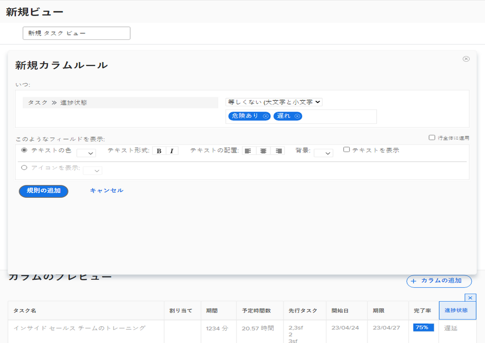

# ビューアクティビティへの基本的な条件付き書式の追加

ビューに基本的な条件付き書式を追加し、手順を追って説明する練習をします。

## 概要

条件付き形式を作成するには：

1. 形式を表示する列を選択します。
1. 形式を変更する条件を決定します。
1. どのような形式変更が最適かを決定します。

   * 背景色
   * テキストの色
   * 置換テキスト
   * アイコンを表示

## アクティビティ 1：ビューへの条件付き書式の追加

既存の標準ビューを使用し、この条件付き形式を[!UICONTROL 名前]列に追加して、「標準 + 進捗」という名前のタスクビューを作成します。

1. タスクの進捗ステータスが遅延の場合にフィールドの背景を赤くする段間罫線を追加します。
1. 進捗ステータスが遅れているまたはリスクありの場合にフィールドの背景を黄にする段間罫線を追加します。

これにより、ビューの一部として進捗ステータスの列を含めなくても、問題のあるタスクを見つけることができます。

## 回答 1

1. タスクリストレポートで、「**[!UICONTROL ビュー]**」ドロップダウンメニューに移動し、「**[!UICONTROL 新規ビュー]**」を選択します。
1. ビューに「標準 + 進捗」という名前を付けます。
1. 指定したデフォルトの列を使用します。
1. [!UICONTROL タスク名]列を選択します。これは条件付き書式を適用する列なので、タスクの進捗ステータスが時間どおりでない場合は赤または黄で表示されます。
1. Report Builder ウィンドウの右上隅にある「**[!UICONTROL 詳細オプション]**」をクリックします。
1. 「**[!UICONTROL この列にルールを追加]**」をクリックします。
1. ウィンドウの上部にある[!UICONTROL タスク]／[!UICONTROL 名前]を[!UICONTROL タスク]／[!UICONTROL 進捗ステータス]に変更して、段間罫線を開始します。[!UICONTROL タスク]／[!UICONTROL 名前]の横にある「**[!UICONTROL X]**」アイコンをクリックするだけで、フィールドから削除できます。
1. フィールドに「進捗」と入力し、[!UICONTROL タスク]フィールドソースで「[!UICONTROL 進捗ステータス]」を選択します。
1. [!UICONTROL 次と等しい]修飾子の右側にあるフィールドで「**[!UICONTROL 遅延]**」を選択します。
1. [!UICONTROL テキストのカラー]行で赤の背景を選択します。
1. 「**[!UICONTROL ルールを追加]**」をクリックして、段間罫線を保存します。
1. ここで、「**[!UICONTROL 段間罫線を追加]**」を再度クリックして、別のルールを追加します。
1. 前と同じように、条件フィールドから[!UICONTROL タスク]／[!UICONTROL 名前]を削除します。「[!UICONTROL タスク]」フィールドソースの下にある[!UICONTROL 進捗ステータス]に置き換えます。
1. 次と等しい修飾子の右側にあるフィールドで、「[!UICONTROL リスクあり]」と「[!UICONTROL 遅れている]」の両方を選択します。
1. [!UICONTROL テキストのカラー]行で黄の背景を選択します。
1. 「**[!UICONTROL ルールを追加]**」をクリックして、段間罫線を保存します。
1. 「**[!UICONTROL ビューを保存]**」をクリックしてビューを保存します。
