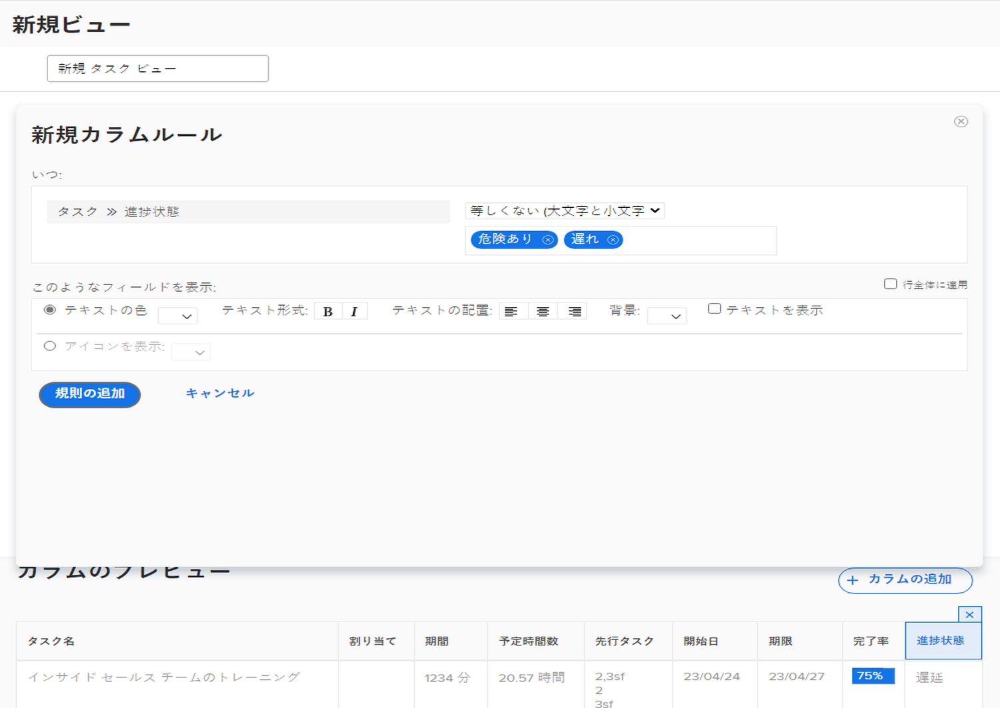

# ビューに基本的な条件付き書式を追加

条件付き書式は、段間罫線を作成して行います。段間罫線を使用すると、設定した条件に基づいて特定の方法で列を書式設定できます。

このビデオでは、次のことを学習します。

* ビューの条件付き書式とは
* 条件付き書式の作成および変更方法

>[!VIDEO](https://video.tv.adobe.com/v/335149/?quality=12&learn=on)

## 概要

条件付き書式を作成するには：

1. 書式を表示する列を選択します
1. 書式を変更する条件を決定します
1. どのような書式の変更が最適かを決定します

   * 背景色
   * テキストの色
   * 置換テキスト
   * アイコンを表示

## アクティビティ：ビューに条件付き書式を追加

既存の標準ビューを使用し、この条件付き書式を [!UICONTROL 名前] 列。

1. タスクの進捗ステータスが遅延の場合にフィールドの背景を赤くする段間罫線を追加します。
1. 進捗ステータスが遅れているまたはリスクありの場合にフィールドの背景を黄にする段間罫線を追加します。

これにより、ビューの一部として進捗ステータスの列を含めなくても、問題のあるタスクを見つけることができます。

## 回答

1. タスクリストレポートで、「**[!UICONTROL ビュー]**」ドロップダウンメニューに移動し、「**[!UICONTROL 新規ビュー]**」を選択します。
1. ビューに「Standard + Progress」と名前を付けます。
1. 指定したデフォルトの列を使用します。
1. [!UICONTROL タスク名]列を選択します。これは条件付き書式を適用する列なので、タスクの進捗ステータスが時間どおりでない場合は赤または黄で表示されます。
1. Report Builder ウィンドウの右上隅にある「**[!UICONTROL 詳細オプション]**」をクリックします。
1. 「**[!UICONTROL この列にルールを追加]**」をクリックします。
1. ウィンドウの上部にある[!UICONTROL タスク]／[!UICONTROL 名前]を[!UICONTROL タスク]／[!UICONTROL 進捗ステータス]に変更して、段間罫線を開始します。[!UICONTROL タスク]／[!UICONTROL 名前]の横にある「**[!UICONTROL X]**」アイコンをクリックするだけで、フィールドから削除できます。
1. フィールドに「進行状況」を入力し、「 」を選択します。 [!UICONTROL 進捗状況ステータス] の下に [!UICONTROL タスク] フィールドソース。
1. [!UICONTROL 次と等しい]修飾子の右側にあるフィールドで「**[!UICONTROL 遅延]**」を選択します。
1. [!UICONTROL テキストのカラー]行で赤の背景を選択します。
1. 「**[!UICONTROL ルールを追加]**」をクリックして、段間罫線を保存します。
1. ここで、「**[!UICONTROL 段間罫線を追加]**」を再度クリックして、別のルールを追加します。
1. 前と同じように、条件フィールドから[!UICONTROL タスク]／[!UICONTROL 名前]を削除します。「[!UICONTROL タスク]」フィールドソースの下にある[!UICONTROL 進捗ステータス]に置き換えます。
1. 次と等しい修飾子の右側にあるフィールドで、「[!UICONTROL リスクあり]」と「[!UICONTROL 遅れている]」の両方を選択します。
1. [!UICONTROL テキストのカラー]行で黄の背景を選択します。
1. 「**[!UICONTROL ルールを追加]**」をクリックして、段間罫線を保存します。
1. 「**[!UICONTROL ビューを保存]**」をクリックしてビューを保存します。
