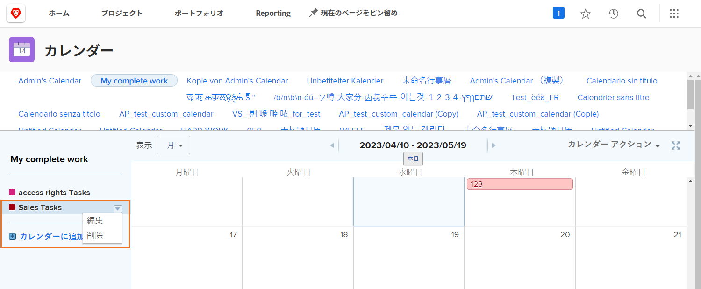

# その他のカレンダーオプションについて

この節では、以下の方法について説明します。

* カレンダーのグループ化の編集
* カレンダーのグループ化の削除
* カレンダーの共有

## カレンダーのグループ化の編集

グループを編集するには、カレンダー上の名前の上にマウスポインターを置きます。 右側に表示される下矢印をクリックし、「 」を選択します。 **[!UICONTROL 編集]**.

## カレンダーのグループ化の削除

グループを削除するには、カレンダー上の名前の上にマウスポインターを置きます。 右側に表示される下矢印をクリックし、「 」を選択します。 **[!UICONTROL 削除]**.

## カレンダーの共有

プロジェクトマネージャーは、他のユーザーと共有する予定表を作成できます（プロジェクトマネージャー、チームメンバーなど）。

1. 次の **[!UICONTROL メインメニュー]**&#x200B;を選択し、 **[!UICONTROL カレンダー]** 領域
1. 共有するカレンダーを選択します。
1. 選択 **[!UICONTROL 共有]** から **[!UICONTROL カレンダーアクション]** ドロップダウンメニュー。
1. カレンダーを共有するユーザー、役割、チーム、グループまたは会社の名前を入力します。
1. ユーザーが [!UICONTROL 表示] または [!UICONTROL 管理] カレンダーレポートにアクセスします。
1. クリック **[!UICONTROL 保存]**.

カレンダーを共有する際に注意すべき点を次に示します。

* 次をクリック： **[!UICONTROL 歯車アイコン]** 共有ウィンドウの右上隅に、カレンダーをシステム全体で表示したり、外部ユーザーに公開したりできます。
* [!UICONTROL 表示] ユーザーはカレンダーを見ることはできますが、グループを制御するフィルターは変更できません。
* [!UICONTROL 管理] ユーザーは、カレンダーを参照し、グループを制御するフィルターを変更できます。

## 共有可能なリンク

カレンダーを他のユーザーと共有できます [!DNL Workfront] ユーザーがプライベートリンクを使用した場合。 これにより、 [!DNL Workfront].

これは、 **[!UICONTROL カレンダーアクション]** メニュー、選択 **[!UICONTROL 共有可能なリンクを取得]**. そこから、 **[!UICONTROL リンクをコピー]** ボタンをクリックし、他のユーザーとの電子メールまたはインスタントメッセージに URL を貼り付けます。

![画像： [!UICONTROL 共有可能なリンクを取得] screen](assets/calendar-3-1.png)
