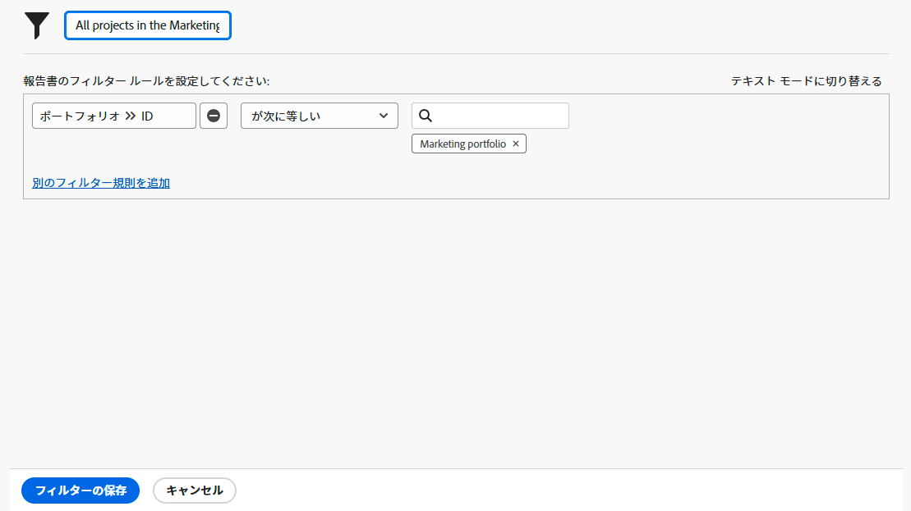
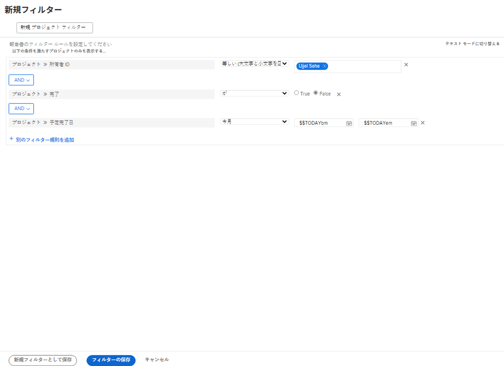

# 基本フィルターの作成アクティビティ

## アクティビティ 1 - マーケティングポートフォリオ内のすべてのプロジェクト

このアクティビティでは、[!UICONTROL 従来のフィルター]エクスペリエンスに「マーケティングポートフォリオ内のすべてのプロジェクト」という名前のプロジェクトフィルターを作成します。これにより、ステータスに関係なく、「マーケティングポートフォリオ」という名前のポートフォリオ内のすべてのプロジェクトが表示されます。

詳細な手順の説明がページの後半にあります。

### アクティビティ 1 に対する回答

1. [!UICONTROL メインメニュー]から[!UICONTROL プロジェクト]エリアに移動します。プロジェクトのリストが表示されます。
1. **[!UICONTROL フィルター]**&#x200B;メニューをクリックして、「[!UICONTROL 従来のフィルター]」を選択します。
1. 「**[!UICONTROL 新規フィルター]**」を選択します。
1. フィルターに「マーケティングポートフォリオ内のすべてのプロジェクト」という名前を付けます。
1. 「**[!UICONTROL フィルタールールを追加]**」をクリックします。
1. 「[!UICONTROL フィールド名の入力を開始]」フィールドで「[!UICONTROL ポートフォリオ名]」と入力します。それから、「[!UICONTROL ポートフォリオ]」フィールドソースの下にある「[!UICONTROL 名前]」を選択します。
1. 「[!UICONTROL 次と等しい]」演算子はそのままにしておきます。
1. 「[!UICONTROL 名前の入力を開始]」フィールドに「[!UICONTROL マーケティング]」と入力します。
1. フィルタリングする名前のポートフォリオがあると想定して、「[!UICONTROL マーケティングポートフォリオ]」を選択します。そうでない場合は、先行入力機能を使用して必要なポートフォリオを見つけます。
1. 「**[!UICONTROL フィルターを保存]**」をクリックします。

## アクティビティ 2 - 今月終了する自分のプロジェクト

このビデオでは、[!UICONTROL 従来のフィルター]エクスペリエンスに「今月終了する自分のプロジェクト」という名前のプロジェクトフィルターを作成します。多くのプロジェクトを監視している場合は、このフィルターを使用すると、まもなく完了する予定のプロジェクトに注目するのに役立ちます。

詳細な手順の説明がページの後半にあります。

>[!VIDEO](https://video.tv.adobe.com/v/336807/?quality=12&learn=on&enablevpops)

### アクティビティ 2 に対する回答

1. [!UICONTROL メインメニュー]から[!UICONTROL プロジェクト]エリアに移動します。プロジェクトのリストが表示されます。
1. **[!UICONTROL フィルター]**&#x200B;メニューをクリックして、「[!UICONTROL 従来のフィルター]」を選択します。
1. 「**[!UICONTROL 新規フィルター]**」を選択します。
1. フィルターに「今月終了する自分のプロジェクト」という名前を付けます。
1. 「**[!UICONTROL フィルタールールを追加]**」をクリックします。
1. 「[!UICONTROL フィールド名の入力を開始]」フィールドに「所有者」と入力します。それから、「[!UICONTROL プロジェクト]」フィールドソースの下にある「[!UICONTROL 所有者 ID]」を選択します。
1. 「[!UICONTROL 次と等しい]」演算子はそのままにしておきます。
1. 「[!UICONTROL 名前の入力を開始]」フィールドに「$$」と入力します。
1. 「[!UICONTROL $$USER.ID]」を選択します。これは、ログイン中のユーザーに対するワイルドカードです。
1. もう一度「[!UICONTROL フィルタールールを追加]」をクリックします。
1. 「[!UICONTROL フィールド名の入力を開始]」フィールドに「完了」と入力します。それから、「プロジェクト」フィールドソースの下にある「[!UICONTROL 完了]」を選択します。
1. 「[!UICONTROL 次と等しい]」演算子はそのままにしておきます。
1. 「False」を選択します。
1. もう一度「[!UICONTROL フィルタールールを追加]」をクリックします。
1. 「[!UICONTROL フィールド名の入力を開始]」フィールドに「予定」と入力し、「[!UICONTROL プロジェクト]」フィールドソースの下にある「[!UICONTROL 予定完了日]」を選択します。
1. 「[!UICONTROL 次と等しい]」演算子を「[!UICONTROL 今月]」に変更します。
1. 「**[!UICONTROL フィルターを保存]**」をクリックします。
