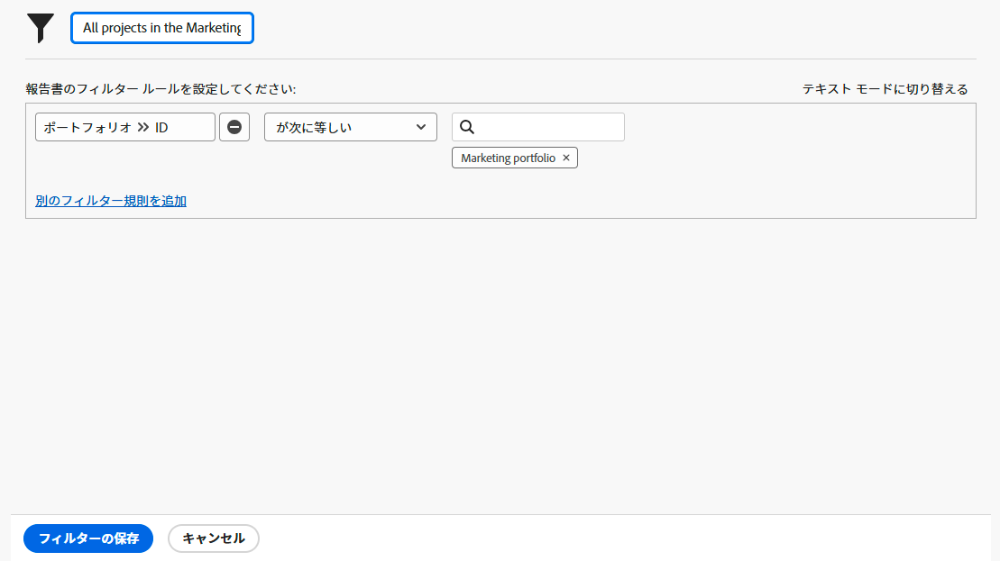
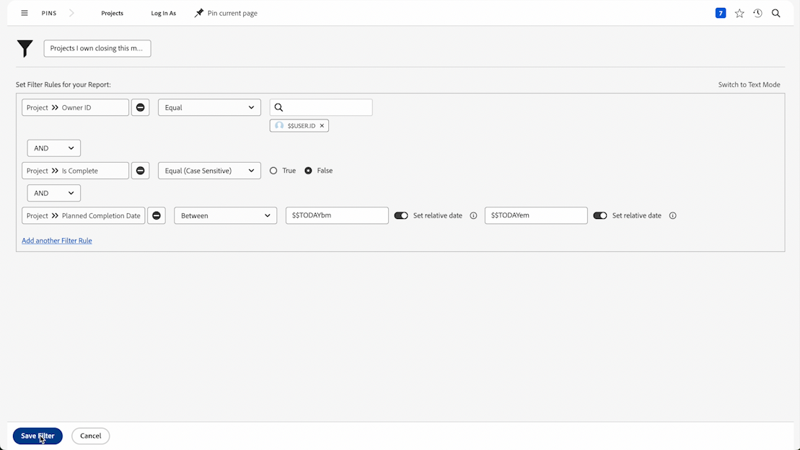

# 基本フィルターの作成アクティビティ

## アクティビティ 1 - マーケティングポートフォリオ内のすべてのプロジェクト

このアクティビティでは、[!UICONTROL 従来のフィルター]エクスペリエンスに「マーケティングポートフォリオ内のすべてのプロジェクト」という名前のプロジェクトフィルターを作成します。 これにより、ステータスに関係なく、「マーケティングポートフォリオ」という名前のポートフォリオ内のすべてのプロジェクトが表示されます。

詳細な手順の説明がページの後半にあります。

## アクティビティ 1 に対する回答

1. [!UICONTROL メインメニュー]から[!UICONTROL プロジェクト]エリアに移動します。 プロジェクトのリストが表示されます。
1. **[!UICONTROL フィルター]**&#x200B;メニューをクリックし、「[!UICONTROL 従来のフィルター]」が選択されていない場合は選択します。
1. 「**[!UICONTROL 新規フィルター]**」を選択します。
1. フィルターに「マーケティングポートフォリオ内のすべてのプロジェクト」という名前を付けます。
1. 「**[!UICONTROL フィルタールールを追加]**」をクリックします。
1. 「**フィールドを選択**」フィールドをクリックし、「[!UICONTROL ポートフォリオ名]」という単語の入力を開始します。 それから、「[!UICONTROL ポートフォリオ]」フィールドソースの下にある「[!UICONTROL 名前]」を選択します。
1. 「[!UICONTROL 次と等しい]」演算子はそのままにしておきます。
1. 検索フィールドに「[!UICONTROL マーケティング]」と入力します。
1. フィルタリングする名前のポートフォリオがあると想定して、「[!UICONTROL マーケティングポートフォリオ]」を選択します。 そうでない場合は、先行入力機能を使用して必要なポートフォリオを見つけます。
1. 「**[!UICONTROL フィルターを保存]**」をクリックします。

## アクティビティ 2 - 今月終了する自分のプロジェクト

このビデオでは、[!UICONTROL 従来のフィルター]エクスペリエンスに「今月終了する自分のプロジェクト」という名前のプロジェクトフィルターを作成します。 多くのプロジェクトを監視している場合は、このフィルターを使用すると、まもなく完了する予定のプロジェクトに注目するのに役立ちます。

詳細な手順の説明がページの後半にあります。

>[!VIDEO](https://video.tv.adobe.com/v/336807/?quality=12&learn=on&enablevpops=1)

## アクティビティ 2 に対する回答

1. [!UICONTROL メインメニュー]から[!UICONTROL プロジェクト]エリアに移動します。 プロジェクトのリストが表示されます。
1. **[!UICONTROL フィルター]**&#x200B;メニューをクリックし、「[!UICONTROL 従来のフィルター]」が選択されていない場合は選択します。
1. 「**[!UICONTROL 新規フィルター]**」を選択します。
1. フィルターに「今月終了する自分のプロジェクト」という名前を付けます。
1. 「**[!UICONTROL フィルタールールを追加]**」をクリックします。
1. 「**フィールドを選択**」フィールドをクリックし、「所有者」という単語の入力を開始します。 次に、「[!UICONTROL プロジェクト]」フィールドソースの下にある「所有者 ID」をクリックします。
1. 「[!UICONTROL 次と等しい]」演算子はそのままにしておきます。
1. 検索フィールドに「$$」と入力します。
1. 「[!UICONTROL $$USER.ID]」を選択します。 これは、ログイン中のユーザーに対するワイルドカードです。
1. 「別のフィルタールールを追加」をクリックします。
1. 「**フィールドを選択**」フィールドをクリックし、「完了」という単語の入力を開始します。 次に、「[!UICONTROL プロジェクト]」フィールドソースの下にある「完了」をクリックします。
1. 「[!UICONTROL 次と等しい]」演算子はそのままにしておきます。
1. 「False」を選択します。
1. 「別のフィルタールールを追加」を再度クリックします。
1. 「**フィールドを選択**」フィールドをクリックし、「予定」という単語の入力を開始します。 次に、「[!UICONTROL プロジェクト]」フィールドソースの下にある「予定完了日」をクリックします。
1. 「[!UICONTROL 次と等しい]」演算子を「[!UICONTROL 今月]」に変更します。
1. 「**[!UICONTROL フィルターを保存]**」をクリックします。
