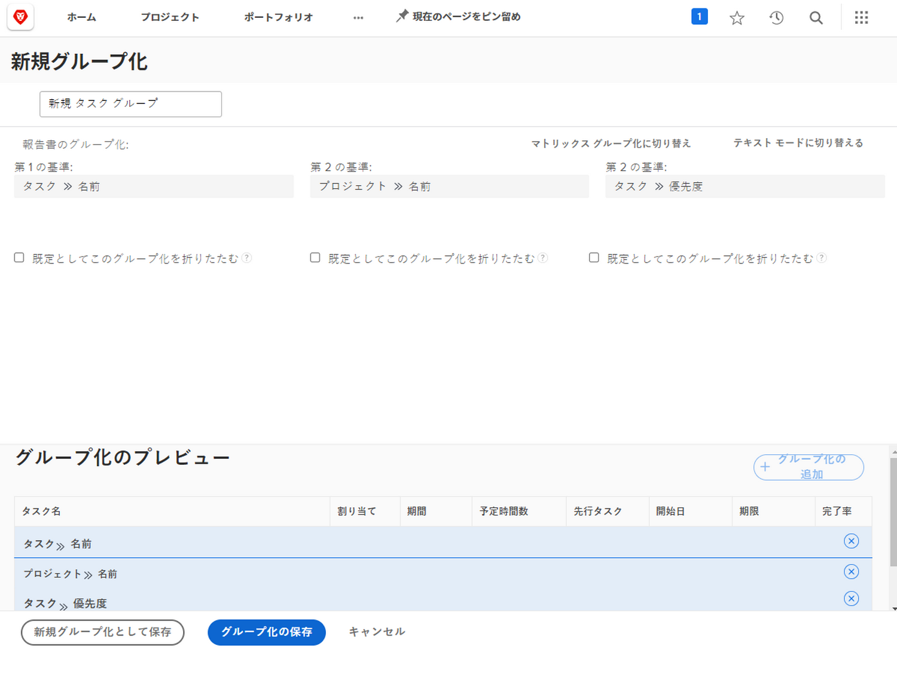

# 基本グループの作成

このビデオでは、Workfrontでグループ化を作成および管理し、プロジェクトリストを効果的に整理する方法を説明します。 &#x200B; グループ化は、フィルターやビューと並ぶ3つの主要なレポート要素の1つであり、共有された情報に基づいて結果を整理するのに役立ちます。 &#x200B;
このチュートリアルでは、日々の作業と共同作業を効率化するために、プロジェクトリストを整理するための実践的な手順を説明します。 &#x200B;

>[!VIDEO](https://video.tv.adobe.com/v/335147/?quality=12&learn=on&enablevpops=0)

## 重要な留意点

* **グループ化の目的：** グループ化は、Workfrontの主要なレポート要素で、完了日、ポートフォリオ、プログラムなどの共有情報に基づいてプロジェクトリストを整理します。 &#x200B;
* **グループ化の作成：**&#x200B;最大3つのレベルの基準を持つカスタムグループ化を作成できます。 &#x200B;例えば、プロジェクトをポートフォリオ別にグループ化し、次にプログラム別にグループ化して、より優れた編成を実現できます。 &#x200B;
* **グループ化の編集と保存：**&#x200B;組み込みのグループ化は上書きできませんが、編集内容を新しいグループ化として保存できます。 &#x200B; カスタムのグループ化には、わかりやすい名前を付ける必要があります。 &#x200B;
* **グループ化の共有：**&#x200B;グループ化は他のユーザーと共有できます。デフォルトの「表示」権限では、グループ化を使用および共有できますが、編集することはできません。 「&#x200B;管理」権限を使用すると、編集と削除が可能になります。 &#x200B;
* **グループ化の削除：**&#x200B;作成したグループ化を削除すると、そのグループを共有したユーザーのリストからも削除されます。 &#x200B;共有グループは、他のユーザーの「自分と共有」セクションに表示されます。 &#x200B;

## 「基本グループ化の作成」アクティビティ

### アクティビティ 1：基本グループ化の作成

リクエストキューを通過するリクエストを追跡するためにレポートで使用するイシューのグループ化を作成します。 このグループ化により、優先度別にグループ化された、類似したタイプのイシュー／リクエストを簡単に確認できます。 グループ化に「リクエストキュー、キューのトピック、優先度」という名前を付けます。

次の項目に基づいてイシューレポートをグループ化します。

1. リクエストキューの名前（これがプロジェクト名になります）
1. キューのトピック
1. リクエストの優先度

### 回答 1

1. イシューリストレポートで、**[!UICONTROL グループ化]**&#x200B;メニューに移動し、「**[!UICONTROL 新しいグループ化]**」を選択します。
1. グループ化に「リクエストキュー、キューのトピック、優先度」という名前を付けます。
1. 「**[!UICONTROL グループ化を追加]**」をクリックします。
1. 「[!UICONTROL グループ化]」フィールドに移動します。 「プロジェクト名」と入力し、「プロジェクト」フィールドソースの下にある「**[!UICONTROL 名前]**」を選択します。
1. 「**[!UICONTROL 別のグループ化を追加]**」をクリックし、「キュー」と入力して、「[!UICONTROL キューのトピック]」フィールドソースの下にある「**[!UICONTROL 名前]**」を選択します。
1. 「**[!UICONTROL 別のグループ化を追加]**」をクリックし、「優先度」と入力して、「[!UICONTROL イシュー]」フィールドソースの下にある「**[!UICONTROL 優先度]**」を選択します。
1. 「**[!UICONTROL グループ化を保存]**」をクリックします。
