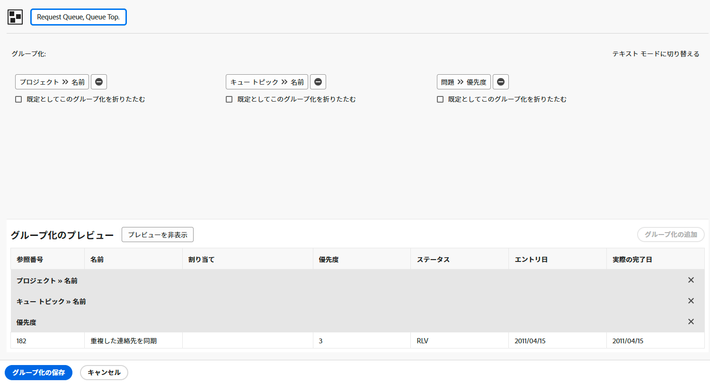

# 基本グループの作成

このビデオでは、Workfront でグループ化を作成および管理して、プロジェクトリストを効果的に整理する方法について説明します。グループ化は、フィルターやビューと共に 3 つの主なレポート要素の 1 つで、共有情報に基づいて結果を整理するのに役立ちます。
このチュートリアルでは、プロジェクトリストを整理して日常の作業と共同作業を効率化するための実用的な手順について説明します。

>[!VIDEO](https://video.tv.adobe.com/v/3449816/?captions=jpn&quality=12&learn=on&enablevpops=0)

## 主な要点

* **グループ化の目的：**&#x200B;グループ化は、完了日、ポートフォリオ、プログラムなどの共有情報に基づいてプロジェクトリストを整理する Workfront の主なレポート要素です。
* **グループの作成：**&#x200B;最大 3 つのレベルの条件を使用してカスタムグループを作成できます。例えば、プロジェクトを最初にポートフォリオ別にグループ化し、次にプログラム別にグループ化すると、より適切に整理できます。
* **グループ化の編集と保存：**&#x200B;ビルトイングループ化は上書きできませんが、編集を新しいグループ化として保存できます。カスタムグループ化では、簡単に識別できるように、明確でわかりやすい名前を付ける必要があります。
* **グループ化の共有：**&#x200B;グループ化は他のユーザーと共有できます。デフォルトの「表示」権限では、グループ化を使用および共有できますが、編集することはできません。「管理」権限では、編集と削除が可能です。
* **グループ化の削除：**&#x200B;作成したグループ化を削除すると、そのグループを共有したユーザーのリストからも削除されます。共有したグループ化は、他のユーザーの「自分と共有」セクションに表示されます。

## 「基本グループ化の作成」アクティビティ

### アクティビティ 1：基本グループ化の作成

リクエストキューを通過するリクエストを追跡するためにレポートで使用するイシューのグループ化を作成します。このグループ化により、優先度別にグループ化された、類似したタイプのイシュー／リクエストを簡単に確認できます。グループ化に「リクエストキュー、キューのトピック、優先度」という名前を付けます。

次の項目に基づいてイシューレポートをグループ化します。

1. リクエストキューの名前（これがプロジェクト名になります）
1. キューのトピック
1. リクエストの優先度

### 回答 1

1. イシューリストレポートで、**[!UICONTROL グループ化]**&#x200B;メニューに移動し、「**[!UICONTROL 新しいグループ化]**」を選択します。
1. グループ化に「リクエストキュー、キューのトピック、優先度」という名前を付けます。
1. 「**[!UICONTROL グループ化を追加]**」をクリックします。
1. 「[!UICONTROL グループ化]」フィールドに移動します。「プロジェクト名」と入力し、「プロジェクト」フィールドソースの下にある「**[!UICONTROL 名前]**」を選択します。
1. 「**[!UICONTROL 別のグループ化を追加]**」をクリックし、「キュー」と入力して、「[!UICONTROL キューのトピック]」フィールドソースの下にある「**[!UICONTROL 名前]**」を選択します。
1. 「**[!UICONTROL 別のグループ化を追加]**」をクリックし、「優先度」と入力して、「[!UICONTROL イシュー]」フィールドソースの下にある「**[!UICONTROL 優先度]**」を選択します。
1. 「**[!UICONTROL グループ化を保存]**」をクリックします。
