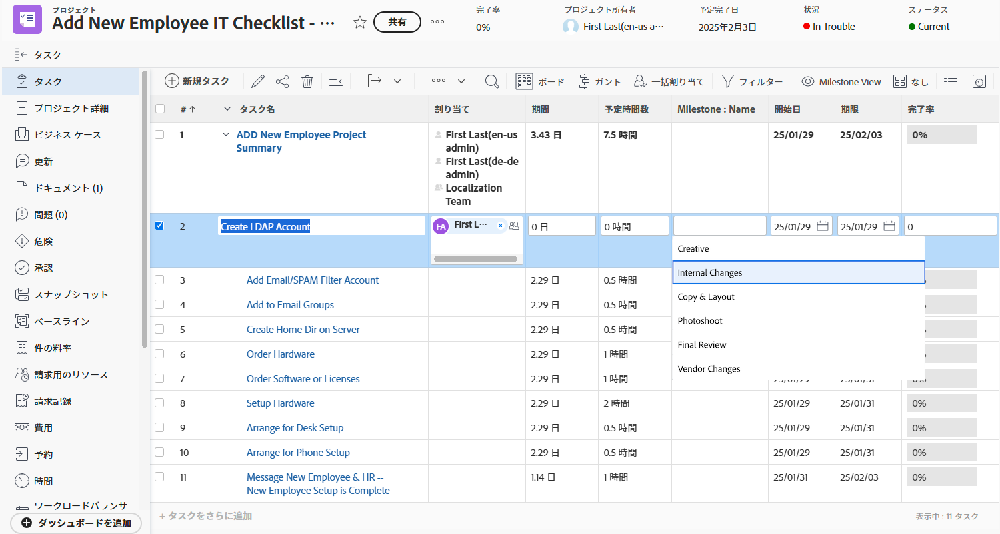

# 基本ビューの作成

このビデオでは、次のことを学習します。

* Workfront のビューとは
* ビューの作成および変更方法
* 他の Workfront ユーザーとビューを共有する方法

>[!VIDEO](https://video.tv.adobe.com/v/335148/?quality=12&learn=on)

## アクティビティ 1:タスクステータスビューの作成

プロジェクトマネージャー、チームリード、またはリソースマネージャーとして、タスク作業の進行状況を追跡する必要があります。このビューでは、1 つのタスクの複数のステータスインジケーターがリストまたはレポートの 1 行に表示されます。

次の列を持つ「Task Status View」という名前のタスクビューを作成します。

* [!UICONTROL タスク名]
* [!UICONTROL 割り当て]
* [!UICONTROL 期間]
* [!UICONTROL 完了率]
* [!UICONTROL ステータス]
* [!UICONTROL 進捗状態]
* [!UICONTROL 状態アイコン]

## アクティビティ 1 回答

1. タスクリストレポートで、「**[!UICONTROL ビュー]**」ドロップダウンメニューに移動し、「**[!UICONTROL 新規ビュー]**」を選択します。
1. ビューに「Task Status View」という名前を付けます。
1. 次の列（[!UICONTROL 予定時間]、[!UICONTROL 先行タスク]、[!UICONTROL 開始日]、および[!UICONTROL 期限]）を削除します。 
1. 「**[!UICONTROL 列を追加]**」をクリックします。 
1. 内 [!UICONTROL この列に表示] フィールドに「status」と入力し、「Status」を選択します。 [!UICONTROL タスク] フィールドソース。
1. 「**[!UICONTROL 列を追加]**」を再度クリックします。
1. 内 [!UICONTROL この列に表示] フィールドに「status」と入力し、「Progress Status」を [!UICONTROL タスク] フィールドソース。
1. 「**[!UICONTROL 列を追加]**」を再度クリックします。
1. 内 [!UICONTROL この列に表示] 「 」フィールドに「status」と入力し、「Task」フィールドのソースで「Status Icons」を選択します。
1. 「**[!UICONTROL 保存]**」をクリックします。

[!UICONTROL ステータスアイコン]列の各アイコンにポインタを合わせると、それらが何を表しているかが表示されます。グレー表示されている場合は、タスクにメモ、ドキュメント、承認プロセスなどが含まれていないことを意味します。 アイコンがカラーで表示される場合は、タスクに関連付けられた項目が 1 つ以上あります。メモまたはドキュメントのアイコンをクリックすると、そのアイテムに移動できます。

## アクティビティ 2:マイルストーンビューの作成

マイルストーンを使用する場合、このビューを使用すると、名前別にマイルストーンを表示し、インライン編集を使用してマイルストーンを追加または編集する最も簡単な方法です。

次の列を持つ「マイルストーンビュー」という名前のタスクビューを作成します。

* [!UICONTROL タスク名]
* [!UICONTROL 割り当て]
* [!UICONTROL 期間]
* [!UICONTROL 予定時間数]
* [!UICONTROL マイルストーン：名前]
* [!UICONTROL 開始日]
* [!UICONTROL 期限]
* [!UICONTROL 完了率]

## アクティビティ 2 回答

1. プロジェクトタスクリストで、 **[!UICONTROL 表示]** ドロップダウンメニューで「 」を選択します。 **[!UICONTROL 新しいビュー]**.
1. ビューに「マイルストーンビュー」という名前を付けます。
1. をクリックします。 [!UICONTROL 先行タスク] 列を使用して選択します。
1. 内 [!UICONTROL この列に表示] フィールドで、 [!UICONTROL タスク >> 先行タスク] フィールドに「[!UICONTROL マイルストーン名]」をクリックし、「[!UICONTROL 名前]」と入力します。
1. 「**[!UICONTROL 保存]**」をクリックします。

