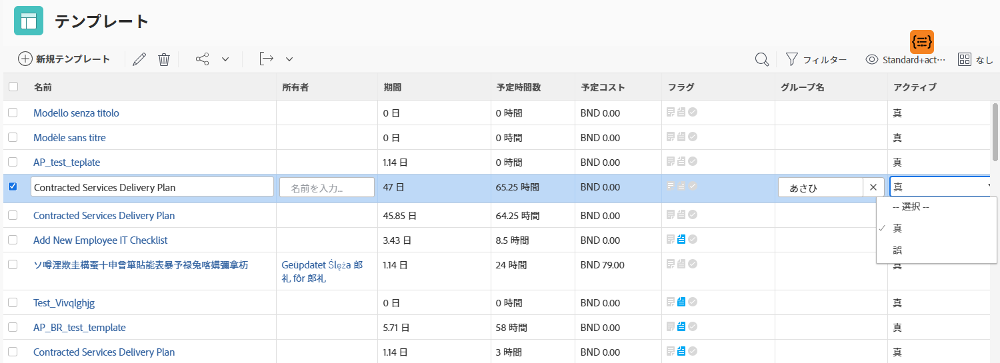

# 基本ビューの作成

このビデオでは、Workfront でビューを作成およびカスタマイズして、プロジェクト、タスク、イシュー、ドキュメントなど、リスト内のアイテムに関する特定の情報を表示する方法を説明します。ビューを使用すると、名前、説明、ステータス、アイテムに関連するその他のフィールドなどの詳細を表示できます。

このビデオでは、Workfront のビューの柔軟性に重点を置き、ビューの作成、カスタマイズ、管理の手順を説明します。

>[!VIDEO](https://video.tv.adobe.com/v/335148/?quality=12&learn=on)

## 主な要点

* **ビューのカスタマイズ**：ユーザーは、列を追加、削除または並べ替えて、プロジェクトのステータスや予算などの特定の情報を表示することで、既存のビューを編集したり、新しいビューを作成したりできます。
* **インライン編集**：リストビューの一部のフィールドは、個々のアイテムを開かずに直接更新できるので、迅速に変更を加えることができます。
* **ビューを一から作成**：ユーザーは、予算、実際のコスト、進捗ステータスなどの関連する列を追加することで、プロジェクトの正常性の追跡などの特定のニーズを満たすようにビューを設計できます。
* **ビューの共有と管理**：カスタムビューは、チームメンバーと共有して共同作業したり、不要になったら削除したりできます。

## 「基本ビューの作成」アクティビティ

### アクティビティ 1：タスクのステータスビューを作成

プロジェクトマネージャー、チームリード、またはリソースマネージャーとして、タスク作業の進行状況を追跡する必要があります。このビューでは、1 つのタスクの複数のステータスインジケーターがリストまたはレポートの 1 行に表示されます。

次の列を持つ「タスクのステータスビュー」という名前のタスクビューを作成します。

* [!UICONTROL タスク名]
* [!UICONTROL 割り当て]
* [!UICONTROL 期間]
* [!UICONTROL 完了率]
* [!UICONTROL ステータス]
* [!UICONTROL 進捗状態]
* [!UICONTROL 状態アイコン]

### 回答 1

1. タスクリストレポートで、「**[!UICONTROL ビュー]**」ドロップダウンメニューに移動し、「**[!UICONTROL 新規ビュー]**」を選択します。
1. ビューに「タスクのステータスビュー」という名前を付けます。
1. 次の列（[!UICONTROL 予定時間]、[!UICONTROL 先行タスク]、[!UICONTROL 開始日]、および[!UICONTROL 期限]）を削除します。 
1. 「**[!UICONTROL 列を追加]**」をクリックします。 
1. 「[!UICONTROL このカラムに表示]」フィールドに「ステータス」と入力し、[!UICONTROL タスク]フィールドソースの下の「ステータス」を選択します。
1. 「**[!UICONTROL 列を追加]**」を再度クリックします。
1. 「[!UICONTROL このカラムに表示]」フィールドに「ステータス」と入力し、[!UICONTROL タスク]フィールドソースの下の「進捗ステータス」を選択します。
1. 「**[!UICONTROL 列を追加]**」を再度クリックします。
1. [!UICONTROL このカラムに表示]フィールドで「ステータス」と入力し、タスクフィールドソースで「ステータスアイコン」を選択します。
1. 「**[!UICONTROL 保存]**」をクリックします。

[!UICONTROL ステータスアイコン]列の各アイコンにポインタを合わせると、それらが何を表しているかが表示されます。グレー表示されている場合は、タスクにメモ、ドキュメント、承認プロセスなどが含まれていないことを意味します。 アイコンがカラーで表示される場合は、タスクに関連付けられた項目が 1 つ以上あります。メモまたはドキュメントのアイコンをクリックすると、そのアイテムに移動できます。

### アクティビティ 2：マイルストーンビューを作成

マイルストーンを使用する場合、このビューは、タスクリストで名前別にマイルストーンを表示し、インライン編集を使用してタスクからマイルストーンを追加または削除する最も簡単な方法です。

次の列を持つ「マイルストーンビュー」という名前のタスクビューを作成します。

* [!UICONTROL タスク名]
* [!UICONTROL 割り当て]
* [!UICONTROL 期間]
* [!UICONTROL 予定時間数]
* [!UICONTROL マイルストーン：名前]
* [!UICONTROL 開始日]
* [!UICONTROL 期限]
* [!UICONTROL 完了率]

### 回答 2

1. プロジェクトタスクのリストで、「**[!UICONTROL ビュー]**」ドロップダウンメニューに移動し、「**[!UICONTROL 新規ビュー]**」を選択します。
1. ビューに「マイルストーンビュー」と名前を付けます。
1. [!UICONTROL 先行タスク]列をクリックして選択します。
1. 「[!UICONTROL このカラムに表示]」フィールドで、「[!UICONTROL タスク／先行タスク]」フィールドの「-」アイコンをクリックして、「[!UICONTROL マイルストーン名]」を入力し、リストの「[!UICONTROL 名前]」をクリックします。
1. 「**[!UICONTROL 保存]**」をクリックします。

### アクティビティ 3：期間タイプとタスク制約ビューを作成

このビューでは、プロジェクト内のすべての期間のタイプとタスクの制約を調べ、編集できます。

次の列を持つ「期間タイプとタスク制約ビュー」という名前のタスクビューを作成します。

* [!UICONTROL タスク名]
* [!UICONTROL 割り当て]
* [!UICONTROL 期間]
* [!UICONTROL 予定期間]
* [!UICONTROL 予定時間数]
* [!UICONTROL 先行タスク]
* [!UICONTROL 開始日]
* [!UICONTROL 期限]
* [!UICONTROL 期間タイプ]
* [!UICONTROL タスクの制約]
* [!UICONTROL 制約の指定日]

[!UICONTROL 開始日]列および[!UICONTROL 期限]列で「[!UICONTROL フィールド形式]」を変更して、日付と時刻の両方を表示します。

### 回答 3

1. プロジェクトタスクのリストで、「**[!UICONTROL ビュー]**」ドロップダウンメニューに移動し、「**[!UICONTROL 新規ビュー]**」を選択します。
1. ビューに「期間タイプとタスク制約ビュー」という名前を付けます。
1. [!UICONTROL 完了率]列を削除します。
1. 「**[!UICONTROL 列を追加]**」をクリックします。 
1. 「[!UICONTROL このカラムに表示]」フィールドに「[!UICONTROL 期間]」と入力し、[!UICONTROL タスク]フィールドソースの下の「[!UICONTROL 予定期間]」を選択します。
1. この列を[!UICONTROL 期間]列と[!UICONTROL 予定時間数]列の間に移動します。
1. 「**[!UICONTROL 列を追加]**」を再度クリックします。
1. 「[!UICONTROL このカラムに表示]」フィールドに[!UICONTROL 「期間タイプ」]と入力し、[!UICONTROL タスク]フィールドソースの下の[!UICONTROL 「期間タイプ」]を選択します。
1. 「**[!UICONTROL 列を追加]**」を再度クリックします。
1. 「[!UICONTROL このカラムに表示]」フィールドに[!UICONTROL 「制約」]と入力し、タスクフィールドソースで[!UICONTROL 「タスク制約」]を選択します。
1. 「**[!UICONTROL 列を追加]**」を再度クリックします。
1. 「[!UICONTROL このカラムに表示]」フィールドに[!UICONTROL 「制約」]と入力し、タスクフィールドソースで[!UICONTROL 「制約の指定日」]を選択します。
1. [!UICONTROL 開始日]列を選択して、「[!UICONTROL 詳細オプション]」をクリックします。
1. [!UICONTROL フィールド形式]ドロップダウンで、「[!UICONTROL 10/17/60 3:00 AM]」を選択します。
1. [!UICONTROL 期限]列を選択し、「[!UICONTROL 詳細オプション]」をクリックします。
1. [!UICONTROL フィールド形式]ドロップダウンで、「[!UICONTROL 10/17/60 3:00 AM]」を選択します。
1. 「**[!UICONTROL 保存]**」をクリックします。

### アクティビティ 4：プロジェクトテンプレートのアクティブなステータスビューを作成

プロジェクトテンプレートを管理するユーザーは全員、各テンプレートのアクティブなステータス（True または False）をリストで確認できます。さらに優れた機能 - フィールドはインラインで編集可能です。

次の列を持つ「標準 + アクティブなステータス」という名前のプロジェクトテンプレートビューを作成します。

* [!UICONTROL 名前]
* [!UICONTROL 所有者]
* [!UICONTROL 期間]
* [!UICONTROL 予定時間数]
* [!UICONTROL 予定コスト]
* [!UICONTROL フラグ]
* [!UICONTROL グループ名]
* [!UICONTROL アクティブ]

### 回答 4

1. プロジェクトテンプレートのリストで、「**[!UICONTROL ビュー]**」ドロップダウンメニューに移動し、「**[!UICONTROL 新規ビュー]**」を選択します。
1. ビューに「標準 + アクティブなステータス」という名前を付けます。
1. 「**[!UICONTROL 列を追加]**」をクリックします。 
1. 「[!UICONTROL この列に表示]」フィールドに「is」と入力し、[!UICONTROL テンプレート]フィールドソースの下の「is Active」を選択します。
1. 「**[!UICONTROL ビューの保存]**」をクリックします。
