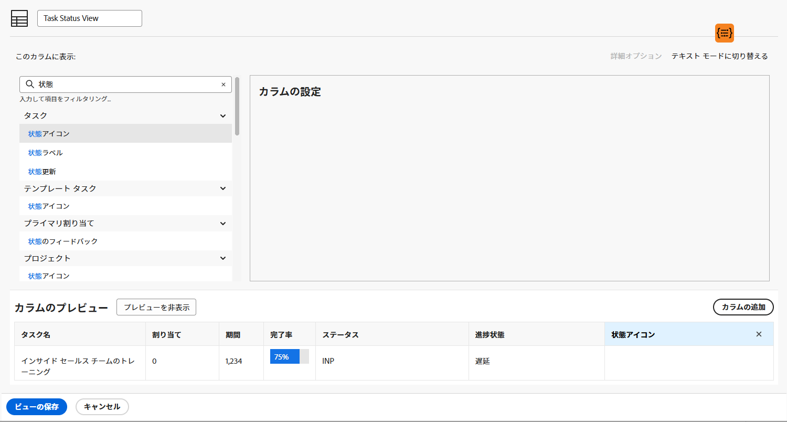

# 基本ビューの作成

このビデオでは、次のことを学習します。

* Workfrontのビュー
* ビューの作成および変更方法
* 他のWorkfrontユーザーとビューを共有する方法

>[!VIDEO](https://video.tv.adobe.com/v/335148/?quality=12)

## アクティビティ：基本ビューの作成

プロジェクトマネージャ、チームリード、またはリソースマネージャとして、タスクの作業の進行状況を追跡する必要があります。 この表示では、1 つのタスクの複数のステータスインジケーターがリストまたはレポートの 1 行に表示されます。

次の列を持つ「Task Status View」という名前のタスクビューを作成します。

* [!UICONTROL タスク名]
* [!UICONTROL 割り当て]
* [!UICONTROL 期間]
* [!UICONTROL 完了率]
* [!UICONTROL ステータス]
* [!UICONTROL 進捗状態]
* [!UICONTROL 状態アイコン]

## 回答

1. タスクリストレポートで、 **[!UICONTROL 表示]** ドロップダウンメニューで「 」を選択します。 **[!UICONTROL 新しいビュー]**.
1. ビューに「Task Status View」という名前を付けます。
1. 次の列を削除します。 [!UICONTROL プラン時間], [!UICONTROL 先行タスク], [!UICONTROL 開始日]、および [!UICONTROL 期限].
1. クリック **[!UICONTROL 列を追加]**.
1. 内 [!UICONTROL この列に表示] フィールドに「status」と入力し、「Status」を選択します。 [!UICONTROL タスク] フィールドソース。
1. クリック **[!UICONTROL 列を追加]** 再び
1. 内 [!UICONTROL この列に表示] フィールドに「status」と入力し、「Progress Status」を [!UICONTROL タスク] フィールドソース。
1. クリック **[!UICONTROL 列を追加]** 再び
1. 内 [!UICONTROL この列に表示] 「 」フィールドに「status」と入力し、「Task」フィールドのソースで「Status Icons」を選択します。
1. 「**[!UICONTROL 保存]**」をクリックします。

の各アイコンの上にマウスポインターを置きます。 [!UICONTROL ステータスアイコン] 列を参照して、表す内容を確認します。 灰色表示の場合は、タスクにメモ、ドキュメント、承認プロセスなどが含まれていないことを意味します。 アイコンが色で表示される場合は、タスクに関連付けられた項目の 1 つ以上が存在します。 メモまたはドキュメントのアイコンをクリックすると、そのアイテムに移動できます。
