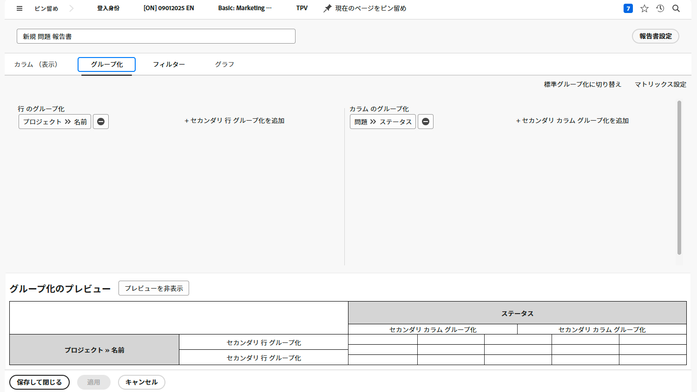
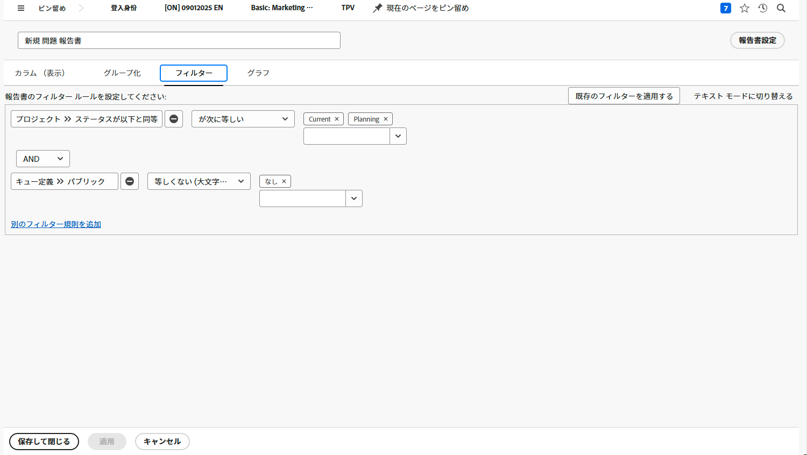

# マトリックスレポートの作成

このビデオでは、次のことを学習します。

* マトリックスレポートが役立つ場面
* マトリックスレポートの作成方法

>[!VIDEO](https://video.tv.adobe.com/v/335156/?quality=12&learn=on&enablevpops=0)

## 重要な留意点

* **行列レポートの構造：**&#x200B;行列レポートは、行と列のデータを整理し、行と列の合計を自動的に表示します。 &#x200B;作業時間、コスト、収益などの指標を追跡するのに最適です。 &#x200B;
* **フィルター設定：** フィルターを使用して、特定のホームチームのユーザーが前四半期に作業した時間など、特定のデータに焦点を当てます。 &#x200B; 「所有者フィールドソース」は、関連するチームメンバーを特定するのに役立ちます。 &#x200B;
* **グループ化オプション：**&#x200B;この例では、行は「所有者の名前」（時間を作業した人物）でグループ化され、列は「時間入力日」（月と週）でグループ化されます。 &#x200B;
* **集計データ：**&#x200B;時間、実際のコスト、収益などの列は、デフォルトで集計され、合計がマトリックスに表示されます。 必要に応じて、これらのデフォルトをオフにすることができます。 &#x200B;
* **グラフの統合：**&#x200B;同じグループ化情報を使用して、マトリックスレポートを代替データビジュアライゼーション用のグラフで補完できます。 「行列」タブまたは「グラフ」タブをデフォルトのビューとして設定できます。 &#x200B;

## 「マトリックスレポートの作成」アクティビティ

### アクティビティ 1：マトリックスレポートの作成

各ステータスのリクエスト数をリクエストキューで並べ替えたマトリックスレポートを作成します。 これにより、流入する作業量と、それに対してどの程度対応できているかをスナップショットで簡単に把握できます。

リクエストキューをレコードのグループ化に表示します。 ステータスを、列のグループ化として表示します。 レポートに「ステータスとリクエストキュー別のリクエスト」という名前を付けます。

### 回答 1

1. **[!UICONTROL メインメニュー]**&#x200B;から「**[!UICONTROL レポート]**」を選択します。
1. 「**[!UICONTROL 新しいレポート]**」オプションをクリックし、「**[!UICONTROL イシュー]**」を選択します。
1. 「**[!UICONTROL グループ化]**」タブに移動し、「**[!UICONTROL マトリックスグループ化に切り替え]**」をクリックします。
1. [!UICONTROL レコードのグループ化]の場合は、**[!UICONTROL プロジェクト]**／**[!UICONTROL 名前]**&#x200B;を選択します。
1. [!UICONTROL 列のグループ化]の場合は、**[!UICONTROL イシュー]**／**[!UICONTROL ステータス]**&#x200B;を選択します。

   

1. 「**[!UICONTROL フィルター]**」タブに移動します。
1. アクティブなリクエストキューのリクエストのみが表示されるようにするには、次のフィルタールールを追加します。

   * [!UICONTROL プロジェクト]／[!UICONTROL ステータスが次と等しい]／[!UICONTROL 次と等しい]／[!UICONTROL 現在]
   * [!UICONTROL キュー定義]／[!UICONTROL 公開済み]／[!UICONTROL 等しくない]／[!UICONTROL なし]（このようにして、プロジェクトが実際にはリクエストキューであることがわかります。キュー定義は、公開オプションの 1 つに割り当てられます）。

1. 「**[!UICONTROL 保存して閉じる]**」をクリックします。 レポート名の入力を求められたら、「ステータスとリクエストキュー別のリクエスト」と入力します。

   
