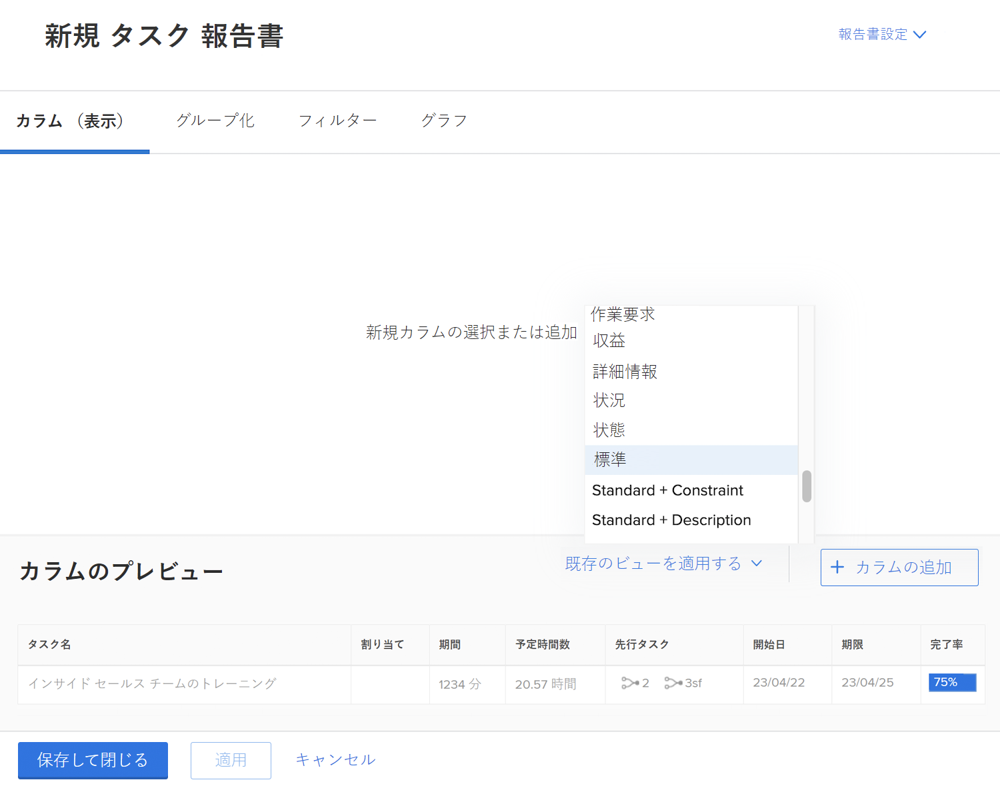
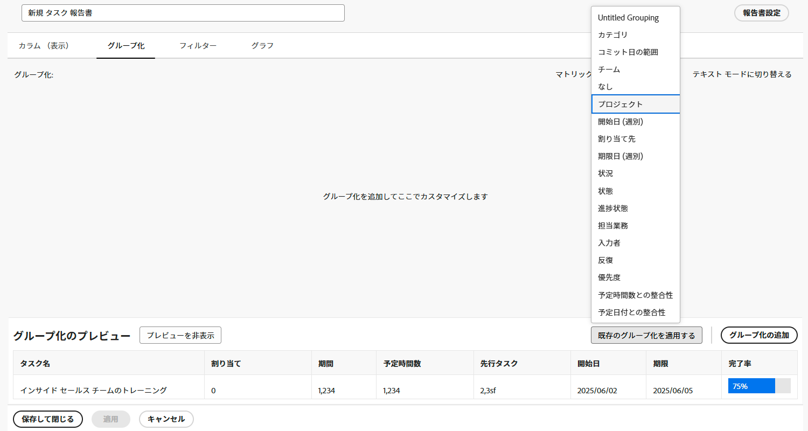
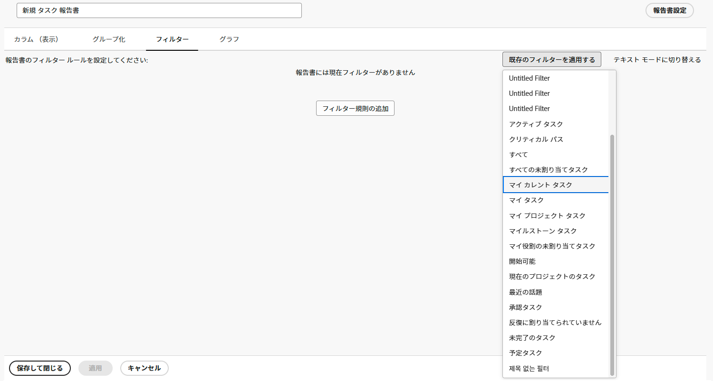
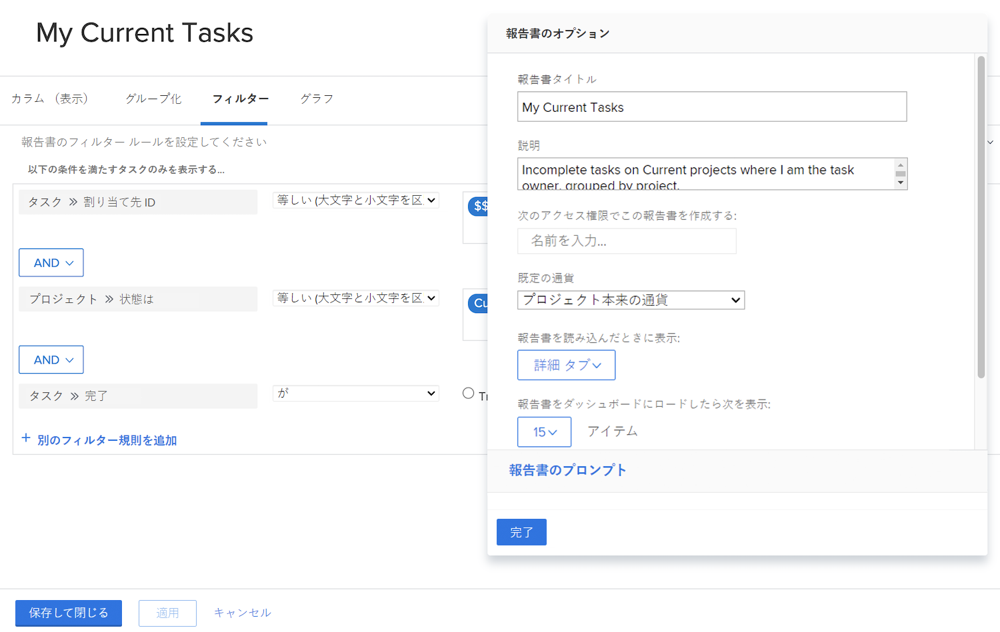

# シンプルなレポートの作成

このビデオでは、次の方法を学習します：

* 既存のフィルター、表示、グループ化を使用してシンプルなレポートを作成します

>[!VIDEO](https://video.tv.adobe.com/v/335153/?quality=12)

## アクティビティ：シンプルなタスクレポートの作成

1 つのレポート内のすべてのアクティブなタスクを追跡したいと考えています。次の手順を使用して、「現在のマイタスク」という名前のタスクレポートを作成します。

* 列（表示）= 標準
* グループ化 = プロジェクト
* フィルター = 現在の自分のタスク
* 説明 = 自分がタスク責任者である、現在のプロジェクトの未完了タスク（プロジェクト別にグループ化）。

## 回答

1. **[!UICONTROL メインメニュー]**&#x200B;に移動し、「**[!UICONTROL レポート]**」を選択します。
1. 「**[!UICONTROL 新しいレポート]**」ドロップダウンメニューをクリックし、「**[!UICONTROL タスクレポート]**」を選択します。
1. [!UICONTROL 列（表示）]で「**[!UICONTROL 既存のビューを適用]**」メニューをクリックし、「**[!UICONTROL 標準]**」を選択します。

   

1. 「**[!UICONTROL グループ化]**」タブで「**[!UICONTROL 既存のグループ化を適用]**」メニューをクリックし、「**[!UICONTROL プロジェクト]**」を選択します。

   

1. 「**[!UICONTROL フィルター]**」タブで「**[!UICONTROL 既存のフィルターを適用]**」メニューをクリックし、「現在の自分のタスク」を選択します。

   

1. 「**[!UICONTROL レポート設定]**」を開き、レポートに「現在のマイタスク」という名前を付けます。
1. 「説明」フィールドに、「自分がタスク責任者である、現在のプロジェクトの未完了タスク（プロジェクト別にグループ化）」と入力します。

   

1. レポートを保存して閉じます。
