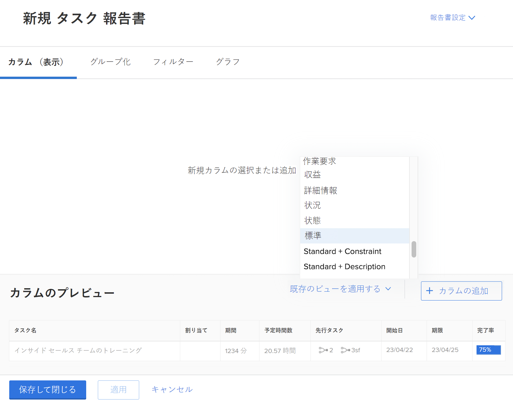
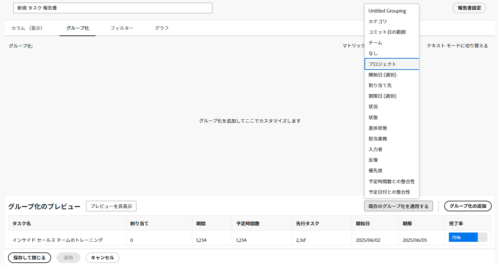
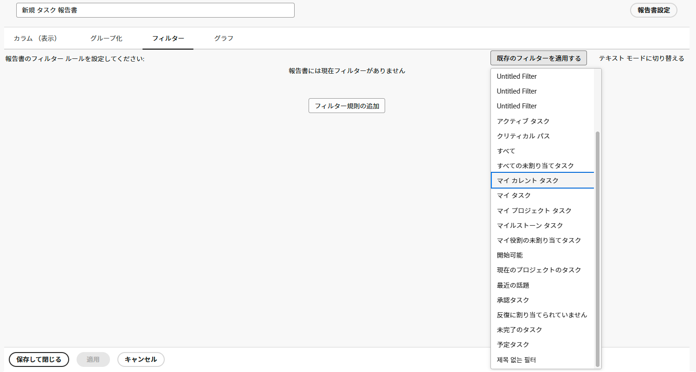
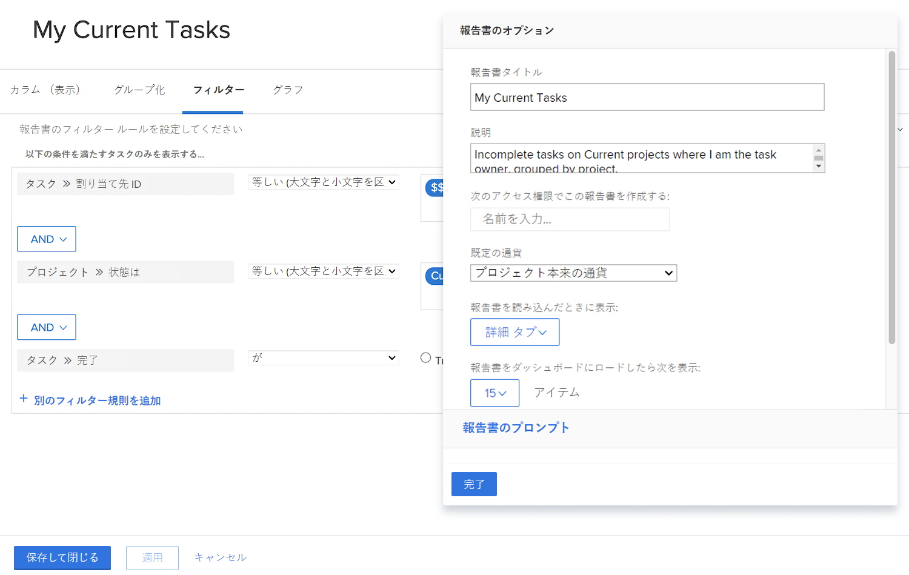

# シンプルなレポートの作成

このビデオでは、効果的にデータを分析するためにプロジェクトレポートを作成およびカスタマイズする方法を説明します。 &#x200B; プロジェクトの進捗状況、タスクの完了、予算の遵守、問題の特定におけるレポートの重要性を強調することから始まります。 このビデオでは、プロジェクト リスト レポートの作成方法、フィルター、ビュー、グループ化の調整方法、およびカスタムレポートの作成方法を説明します。 &#x200B; &#x200B;

このビデオでは、カスタムレポートがデフォルトの設定を維持することを強調していますが、表示する際に一時的な変更を行うことができます。 &#x200B; レポートは「マイレポート」セクションに保存され、共有レポートは「自分と共有」に表示されます。 &#x200B;頻繁に使用されるレポートは、簡単にアクセスできるように、ピン留めやお気に入りにマークすることができます。 &#x200B;

>[!VIDEO](https://video.tv.adobe.com/v/335153/?quality=12&learn=on&enablevpops=0)

## 重要な留意点

* **レポートの目的：**&#x200B;レポートは、プロジェクトの進捗、タスクの完了、予算の遵守、問題の特定に役立ち、効果的なプロジェクト管理に不可欠です。
* **カスタムレポートの作成：** カスタムレポートを使用すると、特定のフィルター、ビュー、グループ化を保存して簡単にアクセスでき、設定を繰り返し調整する必要がなくなります。 &#x200B;
* **レポートを作成する手順：**&#x200B;適切なオブジェクトタイプを選択し、レポートに名前を付け、フィルター、ビュー、グループ化を適用し、列をカスタマイズして、レポートを保存します。 &#x200B;
* **一時的な設定と&#x200B;デフォルト設定：** ビューアはフィルター、ビュー、グループ化を一時的に変更できますが、レポートは再び開くたびにデフォルト設定に戻ります。 &#x200B;
* **レポートの整理：** カスタムレポートは「自分のレポート」に保存され、「自分と共有」で共有されたレポートに保存されます。頻繁に使用されるレポートは、ピン留めしたり、お気に入りにマークしたりして、すばやくアクセスできます。 &#x200B;

## 「シンプルなレポートの作成」アクティビティ

### アクティビティ 1：シンプルなタスクレポートの作成

1 つのレポート内のすべてのアクティブなタスクを追跡したいと考えています。 次の手順を使用して、「現在のマイタスク」という名前のタスクレポートを作成します。

* 列（表示）= 標準
* グループ化 = プロジェクト
* フィルター = 現在の自分のタスク
* 説明 = 自分がタスク責任者である、現在のプロジェクトの未完了タスク（プロジェクト別にグループ化）。

### 回答 1

1. **[!UICONTROL メインメニュー]**&#x200B;に移動し、「**[!UICONTROL レポート]**」を選択します。
1. 「**[!UICONTROL 新しいレポート]**」ドロップダウンメニューをクリックし、「**[!UICONTROL タスクレポート]**」を選択します。
1. [!UICONTROL 列（表示）]で「**[!UICONTROL 既存のビューを適用]**」メニューをクリックし、「**[!UICONTROL 標準]**」を選択します。

   

1. 「**[!UICONTROL グループ化]**」タブで「**[!UICONTROL 既存のグループ化を適用]**」メニューをクリックし、「**[!UICONTROL プロジェクト]**」を選択します。

   

1. 「**[!UICONTROL フィルター]**」タブで「**[!UICONTROL 既存のフィルターを適用]**」メニューをクリックし、「現在の自分のタスク」を選択します。

   

1. 「**[!UICONTROL レポート設定]**」を開き、レポートに「現在のマイタスク」という名前を付けます。
1. 「説明」フィールドに「未完了」と入力します
自分がタスクである現在のプロジェクトのタスク
所有者、プロジェクト別にグループ化。」

   

1. レポートを保存して閉じます。
